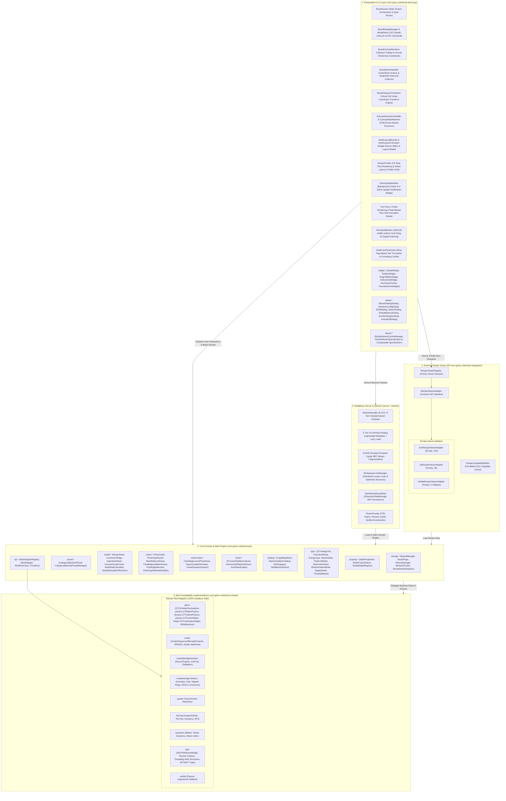

# GregTech Calculator Board - Architecture & Developer Guide

  <b>English</b> | <a href="ARCHITECTURE_KR.md">한국어</a>

> 📘 **Detailed Technical Specification Series**:
> * 🇰🇷 **Korean Edition**: [docs/ko_kr/CODE_SPECIFICATION.md](ko_kr/CODE_SPECIFICATION.md)
> * 🇺🇸 **English Edition**: [docs/en_us/CODE_SPECIFICATION.md](en_us/CODE_SPECIFICATION.md)
> The complete v2.2.1 architecture specifications, 5 graph algorithms, Gauss-Jordan mass balance linear solver, `CategoryCapabilityMatrix`, and 2-tier on-demand streaming protocol are documented in the links above.

This document describes the internal architecture, mathematical solver engine, canvas rendering pipeline, and multi-mod compatibility layer (SPI) of **GregTech Calculator Board**.

---

## 1. System Overview

GTCalcBoard is architected into 5 strictly isolated layers following **Clean Architecture** and **Service Provider Interface (SPI)** principles:

The Core Domain Engine (`com.gtceu.calcboard.api`) and Common Mod Adapters (`com.gtceu.calcboard.compat`) maintain **0% dependency on Minecraft client GUI classes**, guaranteeing independent execution and 100% test pass rates under standard headless JVM environments.

---

## 2. Core Architectural Principles

### 2.1 Pure Domain Model (`RecipeNode`)
`RecipeNode` is an engine-level **pure domain data entity** representing all machines, generators, and compound modules on the canvas:
* **Zero Mod Coupling**: Contains no hardcoded mod branches or third-party classes.
* **Lifecycle & Physical Delegation**: Icon changes (`setMachineIcon`), energy types (`getEnergyType`), power calculations (`getSingleMachineEUt`), operational validation (`validateNode`), and multiblock BOM construction (`buildMultiblockBOM`) are delegated dynamically via `ModAdapterRegistry.getAdapterForNode(node)`.
* **Type-Safe Dynamic Properties**: Mod-specific metadata is encapsulated in `NodePropertyStore` using `NodeProperties`.
* **Immutable View Encapsulation (`FlowGraph`)**: Graph topologies are protected via `Collections.unmodifiableList` and indexed via an internal $O(1)$ `nodeMap`.

### 2.2 Mathematical Solver & Gauss-Jordan Mass Balance (`MassBalanceSolver`)
* **Gauss-Jordan Linear System ($A\mathbf{x} = \mathbf{b}$)**: Solves closed-loop recycling circuits with partial pivoting to guarantee exact mass conservation across complex chemical loops.
* **10-Pass Fixed-Point Relaxation**: Iteratively converges machine steady-state utilization efficiencies ($\eta \in [0.0, 1.0]$) under upstream supply limits.

### 2.3 High-Performance Rendering & Virtual Viewport Scaling Engine
* **Two-Pass Z-Order Rendering & `glClear` Depth Buffer Isolation**: Eliminates 3D item model and 2D background Z-clipping through per-node depth buffer clearing, rendering active/selected nodes in a deferred pass to guarantee strict visual layering.
* **Virtual Viewport Scaling Engine (`BoardViewportTransform`)**: Provides decoupled board-specific virtual GUI scaling ($S = \text{BoardScale} / \text{GameScale}$) to optimize workspace canvas real-estate across both low-DPI and high-DPI displays.
* **$128 \times 128$ AABB Uniform Grid (`WireSpatialIndex`)**: Accelerates wire hover and hit testing from $O(E)$ down to **$O(\log E)$** spatial search.
* **$O(1)$ Port Flow Caching & Text Memoization (`NodeCardTextCache`)**: Protects per-frame rendering operations through precomputed caching, sustaining 60+ FPS frame rates even on large graphs.

### 2.4 Multiplayer Streaming & Distributed Locks
* **2-Tier On-Demand Paging**: Open boards synchronize lightweight metadata (`S2CSyncWorkspaceMetaPacket`) first, loading detailed graph NBTs only upon tab activation.
* **512KB Chunked Streaming (`S2CChunkedDataPacket`)**: Splits large payloads into 512KB chunks, eliminating Netty 2MB buffer overflow crashes.
* **Distributed Lease Locks (`WorkspaceLockManager`)**: Prevents concurrent editing conflicts via 300s lease timeouts and optimistic revision validation.

### 2.5 Deductive Analysis Policy (Rule 5)
* **Zero Heuristics**: String matching, item names, and tooltip parsing (`id.getPath().contains(...)`) are strictly prohibited.
* **3-Step Deterministic Deduction**:
  1. Official APIs & Java Reflection.
  2. Physics Simulations & Internal Objects.
  3. Deterministic NBT numerical data structures & official `TagKey` lookups.

### 2.6 Hierarchical Modal Dialog Stack & Canvas Interaction FSM (ADR-026 & ADR-027)
* **LIFO Modal Stack (`ModalStack` & `IBoardModal`)**: Manages 26 workspace overlay dialogs with strict LIFO ordering, sequential ESC dismissal, and input isolation against ghost clicks.
* **Finite State Machine (`CanvasStateMachine`)**: Enforces mutually exclusive interaction states (IDLE, DRAGGING_NODES, WIRING, BOX_SELECTING, RESIZING, PANNING) with clean rollback on abort.

### 2.7 Composable Recipe Search & Extension Object SPI (ADR-028 & ADR-029)
* **Specification Pattern Query Engine (`RecipeSearchQueryEngine`)**: Decomposes recipe search into composable predicates (`@mod`, `#tag`, `tier:`, `eut:`) with memoized token indexing.
* **Interface Segregation & Extension Object Pattern (`IModAdapter`)**: Core lifecycle reduced to 86 lines; domain capabilities partitioned into 6 modular SPI providers (`IEnergySimulationProvider`, `ICompoundRecipeProvider`, `IHardwareAddonProvider`, `IMultiblockBOMProvider`, `IBoosterProvider`, `ICapabilityMatrixProvider`) with 100% backward compatibility.

### 2.8 Single-Source Node Layout Bounds Model (`NodeLayoutBounds`, ADR-030)
* **Decoupled Renderer & Hit Testing**: Hardcoded coordinates and offsets shared between card renderers and hit detection are consolidated into an immutable `NodeLayoutBounds` and `NodeLayoutCalculator` single source of truth.
* **Slim Mode Layout Integrity**: Guarantees exact coordinate parity for ports, drag handles, and hitboxes across Standard and Slim modes with $O(1)$ hit testing.

### 2.9 Shared Machine Pool Capacity Scaling & Stability Matrix (ADR-031 ~ ADR-033)
* **Shared Machine Pool Scaling (`CanvasGroupFrame`)**: Scales all connected processes proportionally ($S = M_{\text{target}} / D_{\text{current}}$) to match physical machine capacity ($M_{\text{target}}$, default 1.0) on multi-process frame setups.
* **Comprehensive Stability Defense Matrix (`ProcessStabilityAnalyzer`)**: Protects closed loops, positive feedback growth, catalyst decay, and conflicting anchors against infinite scaling runaway, presenting contextual warning badges (`[⚠ Loop]`, `[⚠ Growth]`) and actionable 5-line diagnostic tooltips via `NodeBadgeRegistry`.

### 2.10 Two-Stage Linear Flow Balance Solver & Junction Anchoring (ADR-034 & ADR-035)
* **Two-Stage Linear Flow Solver (`TwoStageLinearFlowSolver`)**: Combines continuous Gauss-Jordan flow solving with integer ceiling quantization to achieve single-click deterministic mass balance convergence across complex cyclic networks.
* **Junction Buffer Wiring & Anchoring**: Enables port context dragging for 1-click creation of surplus drain, deficit supply, and void sink junctions, alongside pinning fixed junction nodes as anchors to drive upstream/downstream rate calculations.

### 2.11 Domain Purity & SPI Separation (`com.gtceu.calcboard.api.spi`, ADR-037)
* **SPI Decoupling**: Relocated `ModAdapterRegistry` and `IModAdapter` to `api.spi` to eliminate reverse architectural dependencies between API and compat layers.
* **Pure Domain Models**: Completely stripped third-party mod field artifacts from `RecipeNode`, managing mode states, validation, and energy models strictly through SPI adapters and `NodePropertyStore`.

### 2.12 Simulation Purity & Invariant Protection (ADR-038)
* **Zero Side-Effect Solvers**: Guarantees mathematical calculation purity with 0 mutation of node ports or topology during graph evaluation.
* **Compound Module Scale Preservation**: Restores sub-process node scaling factors deterministically across module collapse and expand lifecycles.

### 2.13 Precision Cache Invalidation & Rendering Lifecycle (ADR-039)
* **Isolated Invalidation Boundaries**: Dragging, resizing, or recoloring sticky notes and group frames updates local visual bounds without triggering global flow balance recalculation or node card text cache eviction.
* **Cached Reflection & Search Acceleration**: Eliminates per-frame keyboard focus reflection overhead in recipe viewers (JEI/EMI) and leverages pre-indexed spatial bounds for immediate frame and auto-connect lookups.

### 2.14 Split Modes & Hierarchical Priority Flow Allocation (ADR-041)
* **Tri-State Split Modes (`FlowSplitMode`)**: Supports `PROPORTIONAL` (demand-weighted), `EQUAL` ($1/N$ uniform division), and `WEIGHTED` (user-defined explicit branch weights) split modes on junction nodes.
* **Hierarchical Priority Cascades (`FlowEdgeAllocator`)**: Wires carry an integer `priority` tier; higher-priority consumers are satisfied first, while residual flow within each priority tier is distributed according to the junction's split mode.

### 2.15 Shared Machine Pool In-Place Folding & Ratio Preservation (ADR-042)
* **Topology-Preserving In-Place Folding**: Collapses multi-recipe shared machine pool frames into a single compact virtual machine card without removing or modifying internal nodes or connections.
* **Proportional Scaling & Deficit Gating**: Preserves internal recipe duty ratios during machine count adjustments, while aggregating boundary I/O ports via `FlowGraphTopologyAnalyzer` and signaling upstream supply deficits.

### 2.16 Dedicated Sub-Page Composite Modules & Boundary I/O Pins (ADR-043)
* **1:1 Dedicated Sub-Page Isolation**: Upgrades compound modules to independent sub-pages (`PageType.MODULE`) accessible via double-click with breadcrumb and Escape navigation.
* **Boundary Pin Domain Contracts (`BoundaryPinNode`)**: Defines explicit `ModuleInputPin` and `ModuleOutputPin` boundary interface nodes for sub-pages, eliminating ambiguous topological inferences.

### 2.17 Damped Recirculation Loop Closed-Form Solver & Steady-State Visualization (ADR-044)
* **Infinite Geometric Series Closed-Form Convergence**: Solves steady-state recirculating supply via $S_{\text{steady}} = \frac{S_{\text{ext}}}{1 - r}$ in $O(1)$ without artificial deficit warnings.
* **Steady-State Operational Visualization**: Displays cyan circulating indicators for balanced recirculation loops and provides 1-click machine scaling to steady-state capacity.

### 2.18 RecipeNode Role Composition Decomposition (ADR-045)
* **INodeRole Composition**: Decomposes `RecipeNode` into a slim canvas entity composing specialized operational roles (`MachineNodeRole`, `SubPageModuleNodeRole`, `JunctionNodeRole`, `BoundaryPinNodeRole`).
* **Dual-Write NBT Backward Compatibility**: Maintains full read/write serialization compatibility with legacy blueprints and storage tags without data loss.
* **Immutable Calculation Snapshots**: Captures lock-free `NodeCalculationSnapshot` and `FlowGraphSnapshot` records to decouple background math calculations from canvas rendering.

### 2.19 Deterministic Spec Deduction & Compat Normalization (ADR-047)
* **Zero String Heuristics (Rule 5 Compliance)**: Eliminates legacy `contains` substring lookups across Create sequenced assembly, threading helix modifiers, offline energy hatch tiers, and Thermal dynamos.
* **Exact-Match Mapping & Strong Types**: Employs immutable identifier lookup tables (`Map<ResourceLocation, T>`) and static reflection caches (`Class.isAssignableFrom`) for deterministic behavior across custom modpacks.

### 2.20 Page Target Voltage Tier & Multiblock Auto-Provisioning (ADR-048)
* **Page-Level Target Voltage (`defaultVoltageTier`)**: Enables per-page default operating tiers, automatically upgrading singleblock machines and auto-equipping matching energy hatches on multiblock structures upon recipe insertion.
* **Transactional Batch Application**: Supports 1-click page-wide tier synchronization via `BatchChangeTierCommand` with full atomic Undo/Redo integration.

### 2.21 Machine & Recipe Transition Hardware Reconciler (ADR-049)
* **Idempotent Transition Pipeline (`NodeHardwareReconciler`)**: Standardizes hardware adaptation when switching recipes or machine models, purging incompatible addons, clamping voltage tiers, and maintaining lifecycle parity.
* **Complete Hardware Mementos**: Extends `SwitchRecipeCommand` to capture full snapshots of machine icons, multiblock state, parallel values, and installed addons for lossless Undo/Redo restoration.

### 2.22 Immutable Recipe Specification & Dynamic Port Projection (ADR-050)
* **Immutable Recipe Spec (`RecipeSpec`)**: Preserves pristine base recipe inputs and outputs, preventing loss of original ingredients when toggling machine models or addons.
* **Dynamic Hardware Port Projection (`IPortProjectionProvider`)**: Dynamically projects auxiliary fluid ports (steam, oxidizer, coolant) via pure derivation while isolating core recipe port indices (0..N-1) to protect existing wire topologies.

### 2.23 Star Technology Modular Combustion Complex (MCF) Integration (ADR-013)
* **Single Macro Node Model**: Models Star Technology's Modular Combustion Frame and up to 8 docked combustion/rocket modules within a unified macro node.
* **Centralized Coolant Consumption**: Derives common coolant demand proportionally across active module slots into a single external port, while aggregating complete frame and module blocks in the Multiblock BOM.

---

> 📑 **Detailed Specifications**:
> * [[00] System Overview](en_us/spec/00_OVERVIEW.md)
> * [[01] Core Domain Models](en_us/spec/01_CORE_DOMAIN_AND_MODELS.md)
> * [[02] Mathematical Engine & Algorithms](en_us/spec/02_MATH_AND_ALGORITHMS.md)
> * [[03] UI & Rendering Pipeline](en_us/spec/03_UI_AND_RENDERING_PIPELINE.md)
> * [[04] Multiplayer & Network Protocol](en_us/spec/04_MULTIPLAYER_AND_NETWORK_PROTOCOL.md)
> * [[05] External Integration & i18n](en_us/spec/05_INTEGRATION_AND_I18N.md)
