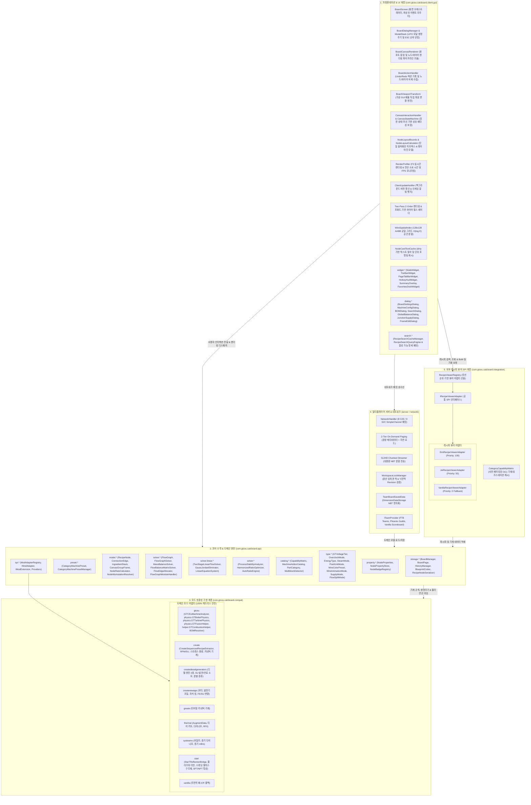

# GregTech Calculator Board - 아키텍처 및 개발자 가이드

  <a href="ARCHITECTURE.md">English</a> | <b>한국어</b>

> 📘 **상세 코드 명세서 시리즈**:
> * 🇰🇷 **한국어 에디션**: [docs/ko_kr/CODE_SPECIFICATION.md](ko_kr/CODE_SPECIFICATION.md)
> * 🇺🇸 **영문 에디션**: [docs/en_us/CODE_SPECIFICATION.md](en_us/CODE_SPECIFICATION.md)
> 전체 v2.2.1 아키텍처 명세서, 5대 그래프 알고리즘, 폐루프 질량 보존 가우스-요르단 선형 솔버, `CategoryCapabilityMatrix`, 및 2계층 온디맨드 멀티플레이어 스트리밍 프로토콜은 위 링크에서 확인할 수 있습니다.

본 문서는 **GregTech Calculator Board (그렉텍 계산기 보드)**의 내부 시스템 아키텍처, 수학적 솔버 엔진, 캔버스 렌더링 파이프라인, 및 멀티 모드 호환성 계층(SPI)을 설명합니다.

---

## 1. 시스템 개요 (System Overview)

본 프로젝트는 **클린 아키텍처(Clean Architecture)** 및 **SPI(Service Provider Interface)** 원칙에 따라 엄격히 격리된 5개의 계층으로 구성되어 있습니다:

코어 연산 엔진(`com.gtceu.calcboard.api`)과 공용 어댑터 계층(`com.gtceu.calcboard.compat`)은 마인크래프트 클라이언트 GUI 및 렌더링 클래스에 대한 의존성이 전혀 없으므로, 헤드리스(Headless) 전용 서버 환경에서도 단독 실행 및 JUnit 단위 테스트 100% 독립 통과가 보장됩니다.

---

## 2. 핵심 아키텍처 원칙 (Core Architectural Principles)

### 2.1 순수 도메인 모델 (`RecipeNode`)
`RecipeNode`는 캔버스 상의 모든 가공 기계, 발전기, 복합 공정 모듈을 대변하는 엔진 레벨의 **순수 도메인 데이터 모델**입니다:
* **모드 종속성 일체 배제**: `RecipeNode` 내부에는 특정 모드(GTCEu, Create, Thermal 등)의 규칙이 하드코딩되지 않습니다.
* **생명주기 및 동작 위임**: 기계 아이콘 교체(`setMachineIcon`), 에너지 형태 판별(`getEnergyType`), 단일 기계 소비/발전량(`getSingleMachineEUt`), 가동 유효성 검증(`isOperational`), BOM 추가 부품 산출(`buildMultiblockBOM`) 등 모든 모드 특화 동작은 `ModAdapterRegistry.getAdapterForNode(node)`를 통해 해당 모드의 `IModAdapter` 구현체로 위임됩니다.
* **타입 세이프 동적 속성 관리**: 특정 모드나 피처 전용 메타데이터(반사판 티어, 터빈 로터 효율, 클린룸 레벨 등)는 클래스 필드로 확장하지 않고, `NodePropertyStore`와 `NodeProperties`를 통해 타입 안전하게 캡슐화됩니다.
* **불변 뷰 캡슐화 (`FlowGraph`)**: 그래프 토폴로지는 `Collections.unmodifiableList` 불변 뷰로 보호되며, 내부 `nodeMap`을 통해 $O(1)$ 빠른 색인을 지원합니다.

### 2.2 수학 엔진 및 가우스-요르단 폐루프 질량 보존 솔버 (`MassBalanceSolver`)
* **가우스-요르단 선형 연립방정식 해 도출 ($A\mathbf{x} = \mathbf{b}$)**: 화학 공정의 순환 재활용 폐루프 사이클에서 질량 보존 법칙을 만족하는 기계 대수 벡터 $\mathbf{x}$를 부분 피보팅 기반의 엄밀한 선형대수학 수치해석으로 계산합니다.
* **10-Pass Fixed-Point Relaxation**: 상류 원자재 공급 제약 하에서 모든 기계의 정상 상태 가동률($\eta \in [0.0, 1.0]$)을 수치적으로 수렴 연산합니다.

### 2.3 고성능 렌더링 파이프라인 및 가상 뷰포트 배율 독립 엔진
* **Two-Pass Z-Order 렌더링 및 `glClear` 깊이 버퍼 격리**: 3D 아이템 모델과 2D 배경 간의 Z-clipping 간섭을 방지하기 위해 노드 단위의 깊이 버퍼 격리를 수행하며, 선택 및 조작 중인 노드를 지연 렌더링하여 Z-순서를 안전하게 유지합니다.
* **가상 뷰포트 배율 독립 엔진 (`BoardViewportTransform`)**: 마인크래프트 전역 GUI Scale과 독립적으로 보드 전용 가상 해상도($S = \text{BoardScale} / \text{GameScale}$)를 산출하여 저해상도/고해상도 디스플레이 모두에서 최적의 작업 공간을 제공합니다.
* **$128 \times 128$ AABB 균일 그리드 공간 분할 (`WireSpatialIndex`)**: 1,000개 이상의 복잡한 와이어 네트워크에서 마우스 호버 및 클릭 감지를 $O(E)$에서 **$O(\log E)$ 공간 분할 색인**으로 가속합니다.
* **$O(1)$ 포트 플로우 캐싱 및 텍스트 메모이제이션 (`NodeCardTextCache`)**: 노드 카드의 포트 통계와 타이틀 텍스트 렌더링 연산을 사전 연산 캐시로 보호하여 60 FPS 이상의 프레임 레이트를 보장합니다.

### 2.4 멀티플레이어 스트리밍 및 분산 락
* **2계층 온디맨드 페이징**: 보드 오픈 시 경량 메타데이터(`S2CSyncWorkspaceMetaPacket`)만 동기화하고, 활성 탭 클릭 시에만 세부 그래프 NBT를 온디맨드로 지연 로드합니다.
* **512KB 청킹 스트리밍 (`S2CChunkedDataPacket`)**: $512\text{KB}$ 초과 대용량 데이터를 안전하게 분할 스트리밍하여 Netty $2\text{MB}$ 버퍼 오버플로우 크래시를 방지합니다.
* **분산 임차권 락 (`WorkspaceLockManager`)**: 300초 임차권(Lease) 기반 소프트 락과 낙관적 Revision 번호 검증을 통해 실시간 동시 편집 충돌을 방지합니다.

### 2.5 애드온 및 스펙 연역적 분석 원칙 (Rule 5)
* **휴리스틱 문자열 추론 금지**: 툴팁 텍스트, 아이템 이름, 아이템 ID 경로(`id.getPath().contains(...)`)를 매칭하여 기계 티어나 애드온 수치를 추측하는 것을 엄격히 금지합니다.
* **결정론적 3단계 연역 체계**:
  1. 공식 API 및 런타임 Java 리플렉션을 통한 기능적 연역.
  2. 모드 내부 객체/물리 시뮬레이션 직접 실행.
  3. 결정론적 NBT 수치 데이터 구조(`AugmentData` Float/Int 태그) 및 공식 `TagKey` 직접 검사.

### 2.6 계층형 모달 다이얼로그 스택 및 캔버스 인터랙션 유한 상태 머신 (ADR-026 & ADR-027)
* **LIFO 모달 스택 (`ModalStack` 및 `IBoardModal`)**: 캔버스 내 26개 모달 다이얼로그를 LIFO 역순으로 관리하여, `ESC` 키 또는 외부 클릭 시 최상위 모달부터 순차적으로 닫히도록 제어하고 하위 캔버스로의 고스트 클릭 및 입력 누수를 차단합니다.
* **유한 상태 머신 (`CanvasStateMachine`)**: 상호작용 상태(IDLE, DRAGGING_NODES, WIRING, BOX_SELECTING, RESIZING, PANNING) 간의 상호 배타성을 보장하며, 조작 중 `ESC`나 우클릭 시 임시 버퍼를 정리하고 안전하게 이전 상태로 롤백합니다.

### 2.7 합성 가능 레시피 검색 명세 패턴 및 Extension Object SPI (ADR-028 & ADR-029)
* **명세 패턴 쿼리 엔진 (`RecipeSearchQueryEngine`)**: 다중 필터 조건(`@mod`, `#tag`, `tier:`, `eut:`)을 선언적 Predicate로 합성하고 토큰 인덱스를 메모이제이션하여 대규모 레시피 검색 성능을 극대화합니다.
* **인터페이스 분리 및 Extension Object 패턴 (`IModAdapter`)**: 코어 생명주기 인터페이스를 86줄로 슬림화하고, 6대 도메인 Provider(`IEnergySimulationProvider`, `ICompoundRecipeProvider`, `IHardwareAddonProvider`, `IMultiblockBOMProvider`, `IBoosterProvider`, `ICapabilityMatrixProvider`)로 역할을 분리하여 100% 하위 호환성을 유지하면서 높은 확장성을 확보했습니다.

### 2.8 단일 출처 노드 레이아웃 바운즈 모델 (`NodeLayoutBounds`, ADR-030)
* **렌더러와 상호작용 간 결합도 해소**: 노드 카드 렌더링 코드와 마우스 히트박스 판정 코드 사이에 중복 존재하던 좌표/오프셋 하드코딩을 제거하고, `NodeLayoutBounds` 및 `NodeLayoutCalculator` 불변 모델을 단일 진실 공급원(Single Source of Truth)으로 구축했습니다.
* **슬림 카드 모드 조작 무결성**: 표준 카드와 슬림 카드 간 전환, 사용자 정의 세로 리사이징 시 히트박스와 포트 연결 지점이 수학적으로 정확히 일치하여 $O(1)$ 빠른 히트 테스트를 수행합니다.

### 2.9 공유 기계 풀 스케일링 & 공정 발산 방어 매트릭스 (ADR-031 ~ ADR-033)
* **공유 기계 풀 용량 스케일링 (`CanvasGroupFrame`)**: 단일 기계에서 여러 공정을 순차 처리하는 공유 기계 풀 프레임에서, 물리적 기계 용량($M_{\text{target}}$, 기본 1.0대)을 기준으로 연결된 전체 공정을 비례 스케일링($S = M_{\text{target}} / D_{\text{current}}$)합니다.
* **포괄적 공정 발산 방어 매트릭스 (`ProcessStabilityAnalyzer`)**: 외부 원료 공급이 부족한 폐순환 루프, 자원 증식 루프, 촉매 감쇠 루프, 복수 앵커 충돌, 극미세 수율 등 7대 발산 시나리오를 자동 감지하여 기계 대수 폭주를 방어하고, `NodeBadgeRegistry`를 통해 상황별 진단 뱃지(`[⚠ Loop]`, `[⚠ Growth]` 등)와 액션 가이드 툴팁을 제공합니다.

### 2.10 2단계 선형 연립방정식 유량 솔버 & 정션 앵커링 (ADR-034 & ADR-035)
* **2단계 선형 연립방정식 유량 솔버 (`TwoStageLinearFlowSolver`)**: 복합 순환 및 분기 공정에서 1단계 연속 유량 균형 연산(가우스-요르단 소거법)과 2단계 정수 양자화(천장 함수 및 비례 스케일링)를 통해 단 1회의 클릭으로 결정론적 수렴을 보장합니다.
* **정션 완충 배선 및 유량 앵커 시스템**: 포트 드래그를 통한 잉여 배출, 결핍 공급, 보이드 싱크 원클릭 생성과, 고정 정션 노드를 기준 앵커로 설정하여 목표 유량에 맞춘 상·하류 기계 대수 연쇄 자동 역산을 지원합니다.

### 2.11 도메인 순수성 및 SPI 계층 분리 (`com.gtceu.calcboard.api.spi`, ADR-037)
* **SPI 패키지 완전 이전**: `ModAdapterRegistry` 및 `IModAdapter`를 `api.spi`로 이전하여 API와 호환 계층 간의 역방향 순환 참조를 0건으로 근절했습니다.
* **순수 도메인 엔티티 확립**: `RecipeNode` 내부의 모드 특화 필드를 전면 제거하고, 모드별 상태와 유효성 검증 및 에너지 모델을 오직 SPI 어댑터와 `NodePropertyStore`를 통해 관리합니다.

### 2.12 시뮬레이션 순수성 및 불변식 보호 (ADR-038)
* **부수 효과 없는 순수 연산**: 유량 균형 연산 과정에서 노드 포트나 토폴로지를 임의로 변조하지 않는 순수 함수성을 보장합니다.
* **복합 모듈 스케일 보존**: 모듈 축소 및 펼침 생명주기 전반에서 내부 서브 프로세스 노드들의 축소 배율을 결정론적으로 보존합니다.

### 2.13 정밀 캐시 무효화 및 렌더링 생명주기 최적화 (ADR-039)
* **무효화 격리 경계 구축**: 스티키 메모나 그룹 프레임의 이동, 크기 조절, 색상 변경 시 전역 유량 재계산이나 노드 카드 텍스트 캐시 무효화가 격리되어 불필요한 프레임 낭비를 방지합니다.
* **리플렉션 캐싱 및 공간 색인 검색 가속**: 레시피 뷰어(JEI/EMI)의 키보드 포커스 리플렉션 오버헤드를 1회 캐싱으로 제거하고, 사전 색인된 바운즈를 활용하여 프레임 감지 및 자동 연결을 가속합니다.

### 2.14 분할 모드 및 계층형 우선순위 유량 분배 (ADR-041)
* **3대 분할 모드 (`FlowSplitMode`)**: 정션 노드에서 하류 수요 가중치 기반 비례 분할(`PROPORTIONAL`), 기계적 균등 분할(`EQUAL`, 1/N), 및 사용자 지정 가중치 분할(`WEIGHTED`)을 지원합니다.
* **계층형 우선순위 연쇄 분배 (`FlowEdgeAllocator`)**: 연결선에 정수형 `priority`를 부여하여 상위 우선순위 라인부터 먼저 충족하고, 각 우선순위 계층 내부의 잔여 유량은 정션의 분할 방식에 따라 분배합니다.

### 2.15 공유 기계 풀 비파괴 인플레이스 접기 및 비율 보존 (ADR-042)
* **토폴로지 비파괴형 인플레이스 접기**: 다중 레시피 공유 기계 풀 프레임을 내부 노드나 연결선의 삭제 없이 단일 가상 기계 카드로 압축/복원합니다.
* **비례 스케일링 및 결손 차단**: 기계 대수 조작 시 내부 레시피 가동 비율을 온전히 보존하며, `FlowGraphTopologyAnalyzer`를 통해 경계 입출력 포트를 집계하고 상류 공급 결손을 감지합니다.

### 2.16 전용 서브페이지 복합 공정 모듈 및 경계 I/O 핀 (ADR-043)
* **1:1 전용 서브페이지 격리**: 복합 공정 모듈을 독립 서브페이지(`PageType.MODULE`)로 격리하여 더블클릭 및 브레드크럼/Esc 키로 부드럽게 탐색합니다.
* **경계 핀 도메인 규격 (`BoundaryPinNode`)**: 서브페이지 내부에 명시적인 `ModuleInputPin` 및 `ModuleOutputPin` 인터페이스 노드를 배치하여 토폴로지 추론의 모호성을 제거합니다.

### 2.17 감쇠 순환 공정 닫힌 형태 해석적 솔버 및 정상 상태 시각화 (ADR-044)
* **무한 등비급수 닫힌 형태 수렴**: 외부 보충 공급 기반 감쇠 순환 공정의 유량을 $S_{\text{steady}} = \frac{S_{\text{ext}}}{1 - r}$ 공식을 통해 오경고(결손) 없이 $O(1)$로 해석 수렴합니다.
* **정상 상태 연속 가동 시각화**: 수급 균형이 맞는 순환 루프에 청록색 순환 기호를 표시하고 정상 상태 용량으로의 원클릭 기계 대수 맞춤을 지원합니다.

### 2.18 RecipeNode 역할 컴포지션 분해 (ADR-045)
* **INodeRole 컴포지션**: `RecipeNode`를 캔버스 엔티티로 슬림화하고 4대 역할(`MachineNodeRole`, `SubPageModuleNodeRole`, `JunctionNodeRole`, `BoundaryPinNodeRole`)을 조합하는 컴포지션 구조로 분해했습니다.
* **듀얼 라이트 NBT 역호환성**: 기존 청사진 및 저장 태그와의 양방향 직렬화 호환성을 유지하여 데이터 유실을 방지합니다.
* **불변 계산 스냅샷**: `NodeCalculationSnapshot` 및 `FlowGraphSnapshot` 불변 레코드를 도입하여 백그라운드 유량 연산과 캔버스 렌더링을 락-프리로 분리했습니다.

### 2.19 결정론적 스펙 연역 및 호환 계층 정규화 (ADR-047)
* **Rule 5 준수 (문자열 휴리스틱 배제)**: Create 시퀀스 조립, 스레딩 헬릭스 모디파이어, 오프라인 에너지 해치 티어, 서멀 다이내모 판별에서 레거시 `contains` 부분 일치를 완전 제거했습니다.
* **완전 일치 매핑 테이블 및 강타입 검사**: 불변 식별자 테이블(`Map<ResourceLocation, T>`)과 정적 리플렉션 캐시(`Class.isAssignableFrom`)를 통해 모드팩 커스텀 환경에서도 결정론적 동작을 보장합니다.

### 2.20 페이지별 목표 전압 티어 및 멀티블록 자동 프로비저닝 (ADR-048)
* **페이지 단위 기본 목표 전압 (`defaultVoltageTier`)**: 페이지별 기본 전압을 지정하여 레시피 노드 추가 시 단일 기계 전압 상향과 멀티블록 에너지 해치 자동 장착이 즉시 수행됩니다.
* **트랜잭션 기반 일괄 적용**: `BatchChangeTierCommand`를 통해 페이지 내 전체 노드의 전압을 1클릭으로 동기화하며, 완전한 원자적 실행 취소/다시 실행(Undo/Redo)을 지원합니다.

### 2.21 기계 및 레시피 전환 하드웨어 정합성 조정자 (ADR-049)
* **멱등성 보정 파이프라인 (`NodeHardwareReconciler`)**: 기계나 레시피를 전환할 때 비호환 부품 자동 정리, 전압 티어 상향 클램핑, 모드 어댑터 생명주기 통지를 단일 표준 파이프라인으로 일원화했습니다.
* **완전한 하드웨어 메멘토**: `SwitchRecipeCommand`에 기계 아이콘, 멀티블록 상태, 병렬 수치 및 장착 부품의 완전한 스냅샷을 보존하여 무손실 실행 취소/다시 실행을 보장합니다.

### 2.22 불변 레시피 명세 및 동적 포트 프로젝션 (ADR-050)
* **불변 레시피 명세 (`RecipeSpec`)**: 원본 레시피의 재료 입출력 정보를 절대 변조되지 않는 불변 레코드로 보존하여 기계나 부품을 변경해도 기본 레시피가 유실되지 않습니다.
* **동적 하드웨어 포트 프로젝션 (`IPortProjectionProvider`)**: 스팀, 산화제, 냉각수 등 하드웨어 부착 보조 포트를 지연 평가 방식으로 동적 투영하며, 기본 공정 포트 인덱스(0..N-1)를 분리 보존하여 기존 연결선 배선 꼬임을 방지합니다.

### 2.23 Star Technology 모듈러 연소 복합체(MCF) 매크로 노드 통합 (ADR-013)
* **단일 매크로 노드 모델**: Star Technology의 모듈러 연소 프레임과 최대 8대의 결합 모듈을 단일 노드로 통합 모델링했습니다.
* **중앙 냉각수 단일 포트 소모**: 활성 모듈 수에 비례한 공통 냉각수 요구량을 단일 외부 포트로 도출하고, 프레임 및 결합 모듈의 전체 건축 자재(BOM)를 일괄 산출합니다.

---

> 📑 **세부 사양서 바로가기**:
> * [[00] 시스템 아키텍처 개요](ko_kr/spec/00_OVERVIEW.md)
> * [[01] 코어 도메인 모델](ko_kr/spec/01_CORE_DOMAIN_AND_MODELS.md)
> * [[02] 수학 엔진 및 알고리즘](ko_kr/spec/02_MATH_AND_ALGORITHMS.md)
> * [[03] UI 및 렌더링 파이프라인](ko_kr/spec/03_UI_AND_RENDERING_PIPELINE.md)
> * [[04] 멀티플레이어 및 네트워크](ko_kr/spec/04_MULTIPLAYER_AND_NETWORK_PROTOCOL.md)
> * [[05] 외부 연동 및 다국어](ko_kr/spec/05_INTEGRATION_AND_I18N.md)