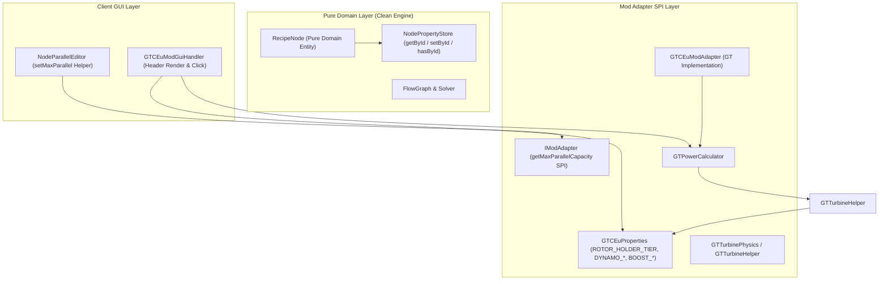

# ADR-006: 터빈 발전기 소모품 모델링·독립 티어 분리 및 기계 가용 병렬 산출 명세
# (Turbine Consumables, Decoupled Hatch Tiers & Dynamic Machine Parallel Estimation Specification)

- **문서 번호**: ADR-006
- **대상 버전**: `v2.1.0-alpha.3`
- **상태**: `IMPLEMENTED`
- **결정/완료일**: 2026-09-01
- **주관 계층**: Pure Domain Layer (`api.model`, `api.property`), Mod Adapter SPI Layer (`compat.gtceu`, `compat.create`, `compat.thermal`), Client GUI Layer (`client.gui.compat.gtceu`, `client.gui.editor`)

---

## 1. 개요 및 배경 (Motivation)

### 1.1 현황 및 당면 과제
1. **터빈 로터 소모율(Wear Rate) 및 수명 모델링 부재**:
   - 인게임 GregTech Modern 환경에서 대형 터빈 로터(Turbine Rotor)는 효율과 출력 계수를 제공하는 동시에 가동 시 내구도가 점진적으로 마모되는 대표적인 소모품(Consumable)입니다.
   - 기존 시스템은 로터의 정적 효율(%) 및 출력(%)에 따른 발전량 계산만을 수행하며, 가동률에 따른 **초당/시간당 내구도 소모율($\text{loss/s}$), 로터 수명 주기($T_{\text{lifespan}}$), 시간당 교체 요구량**을 제공하지 못했습니다.
2. **로터 홀더 티어와 다이나모 해치 티어의 결합**:
   - 기존 `RecipeNode`는 `targetTier` 단일 속성으로 로터 홀더(Rotor Holder) 티어와 전력 출력 해치(Dynamo / Laser Hatch) 티어를 동시에 처리했습니다.
   - 그러나 실제 인게임 터빈은 **로터 홀더(예: UV 티어)**와 **다이나모/레이저 해치(예: LuV 4A 또는 EV 1A)**를 서로 다른 전압 규격으로 조합하여 구축할 수 있으므로, 두 물리적 파라미터가 독립적으로 분리 관리되어야 합니다.
3. **윤활유/냉각수 부스트 제어의 조작 뎁스**:
   - 플라즈마/가스 터빈의 윤활유(+25%) 및 냉각수(+50%) 부스트 설정이 우측 상단 애드온 팝업 내부에만 위치하여 빠른 발전 시뮬레이션 및 비교에 불필요한 조작 비용이 발생했습니다.
4. **기계별 최대 가용 병렬($P_{\max}$) 도출 부재**:
   - 전력 공급 한도, 병렬 해치 규격, 하드웨어 수용량에 따른 **최대 가용 병렬($P_{\max}$)**을 계산기가 도출하지 못해 사용자가 수동 계산에 의존해야 했습니다.

---

## 2. 세부 설계 및 결정 사항 (Architecture Decision)

### 2.1 클린 아키텍처 및 SPI 분리 구조

Rule 6(도메인 모델의 순수성) 및 ArchUnit 아키텍처 규칙을 준수하여, `RecipeNode`에 모드 종속 필드를 추가하지 않고 `NodePropertyStore`의 문자열 ID 기반 타입 안전 키 분리 및 `IModAdapter` SPI 메서드를 통해 구현했습니다.

### 2.2 모드별 속성 키 분리 및 SPI 캡슐화

1. **`GTCEuProperties` 분리 정의**:
   - `ROTOR_HOLDER_TIER` (`NodePropertyKey<GTVoltageTier>`): 터빈 내부 로터 홀더 전압 티어.
   - `DYNAMO_HATCH_TIER` (`NodePropertyKey<GTVoltageTier>`): 터빈 전력 출력 다이나모/레이저 해치 전압 티어.
   - `DYNAMO_AMPERAGE` (`NodePropertyKey<Integer>`): 출력 다이나모 해치 전류 규격 (1A, 2A, 4A, 16A).
   - `LUBRICANT_BOOST` (`NodePropertyKey<Boolean>`): 윤활유 부스트(+25%) 가동 플래그.
   - `COOLANT_BOOST` (`NodePropertyKey<Boolean>`): 냉각수 부스트(+50%) 가동 플래그.
   - `ROTOR_WEAR_PER_SEC` (`NodePropertyKey<Double>`): 초당 로터 내구도 마모율 파생 속성.
2. **`IModAdapter.getMaxParallelCapacity(RecipeNode node)` SPI 메서드 추가**:
   - 각 모드 어댑터가 기계의 전력/해치/하드웨어 제약 조건에 따른 $P_{\max}$를 산출하여 반환.

---

## 3. 물리 연산 및 수학 공식 명세 (Physics Specifications)

### 3.1 터빈 로터/블레이드 소모율 및 수명 모델링

#### 1. 초당 내구도 소모율 ($\text{Loss}_{\text{sec}}$)
$$\text{Loss}_{\text{sec}} = 20.0 \times \min\left(1.0, \frac{\text{ActualEUt}}{\text{Cap}_{\text{holder}}}\right)$$

#### 2. 로터 수명 시간 ($T_{\text{lifespan}}$, 시간 단위)
$$T_{\text{lifespan}} = \frac{\text{Durability}}{\text{Loss}_{\text{sec}} \times 3600}$$

#### 3. 가동 대수 기준 시간당 로터 교체 요구량 ($\text{Items}_{\text{hour}}$)
$$\text{Items}_{\text{hour}} = \frac{1.0}{T_{\text{lifespan}}} \times \text{MachineCount}$$

### 3.2 독립 티어 분리 기반 대형 터빈 발전량 및 실효 병렬

#### 1. 로터 홀더 처리 한도 ($\text{Cap}_{\text{holder}}$)
$$\Delta T_{\text{holder}} = \text{ord}(T_{\text{holder}}) - \text{ord}(T_{\text{base}})$$
$$\text{BaseCap} = \text{TurbineBaseProd} \times 2^{\Delta T_{\text{holder}}}$$
$$\text{Cap}_{\text{holder}} = \left\lfloor \text{BaseCap} \times \frac{\text{RotorPower}}{100} \right\rfloor$$

#### 2. 다이나모/레이저 해치 출력 상한 ($\text{Cap}_{\text{dynamo}}$)
$$\text{Cap}_{\text{dynamo}} = \text{Voltage}(T_{\text{dynamo}}) \times \text{Amperage}$$

#### 3. 최종 가용 발전 상한 ($\text{Cap}_{\text{final}}$)
$$\text{Cap}_{\text{final}} = \min(\text{Cap}_{\text{holder}}, \text{Cap}_{\text{dynamo}})$$

#### 4. 터빈 실효 가동 병렬 ($P_{\text{eff}}$)
$$P_{\text{eff}} = \min\left( P_{\text{configured}}, \left\lceil \frac{\text{Cap}_{\text{final}}}{\text{RecipeEUt}} \right\rceil \right) \times \text{ModelMultiplier}$$

#### 5. 최종 발전 출력 ($P_{\text{gen}}$)
$$P_{\text{raw}} = \text{RecipeEUt} \times P_{\text{eff}} \times \frac{\text{TotalEfficiency}}{100}$$
$$P_{\text{gen}} = \min(P_{\text{raw}}, \text{Cap}_{\text{final}}) \times \text{BoostMultiplier}$$

### 3.3 전력 소비 기계의 조건별 최대 가용 병렬 ($P_{\max}$) 도출

$$P_{\max} = \min\left( P_{\text{hatch\_limit}}, P_{\text{energy\_limit}}, P_{\text{hardware\_limit}} \right)$$

* $P_{\text{hatch\_limit}}$: 설치된 병렬 해치(Parallel Hatch / Control Block)의 물리적 최대 병렬 한도.
* $P_{\text{energy\_limit}}$: 공급 가능한 최대 인입 전력($\text{MaxSupplyEUt}$)을 단일 오버클럭 가공 전력($\text{EUt}_{\text{single}}$)으로 나눈 값.
* $P_{\text{hardware\_limit}}$: 멀티스멜터 코일 수용량 또는 단일블록 기계 제약.

---

## 4. UI / UX 제어 인터페이스

1. **머신 설정 다이얼로그 헤더 (MachineConfigDialog)**:
   - **Row 1**: 로터 스펙(이름, 효율, 파워, 홀더 보너스), 로터 기대 수명($\text{Lifespan}_{\text{hours}}$), 로터 리셋 버튼(`↺`), 및 최대 가용 병렬 버튼(`⚡ Pmax: [Pmax]`).
   - **Row 2**:
     - `Holder: [Tier]`: 클릭 시 로터 홀더 전압 티어 순환 (좌클릭 올림, 우클릭 내림).
     - `Dynamo: [Tier] [Amps]A`: 좌클릭 시 전압 티어 순환, 우클릭 시 전류 규격 순환 (1A -> 2A -> 4A -> 16A).
     - `Lubricant (+25%)`: 윤활유 부스트 가동 상태 토글 버튼.
2. **다국어 리소스 (i18n)**:
   - `ko_kr.json`, `en_us.json`, `zh_cn.json`에 `boost_lubricant_active`, `boost_coolant_active`, `turbine_holder_tier`, `turbine_dynamo_tier`, `pmax_btn`, `rotor_lifespan` 100% 동기화.

---

## 5. 결과 및 파급 효과 (Consequences)

1. **아키텍처 무결성 보존**:
   - `RecipeNode` 및 도메인 모델이 외부 모드 클래스(`compat.*`)를 일체 참조하지 않는 순수 도메인 상태를 유지하면서, `NodePropertyStore`와 SPI 어댑터를 통해 완전한 기능 확장을 달성했습니다.
2. **정확한 전력망 시뮬레이션**:
   - 로터 홀더와 다이나모 해치의 독립 구성(예: UV 로터 홀더 + EV 1A 다이나모 해치 병목) 및 소모품 수명 주기가 물리 공식에 기반하여 정확하게 시뮬레이션됩니다.
3. **단위 테스트 검증 완료**:
   - `GTTurbineEnhancementTest`를 포함한 전체 467개 단위 테스트(`.\gradlew.bat test`)를 100% 무결하게 통과하였습니다.
