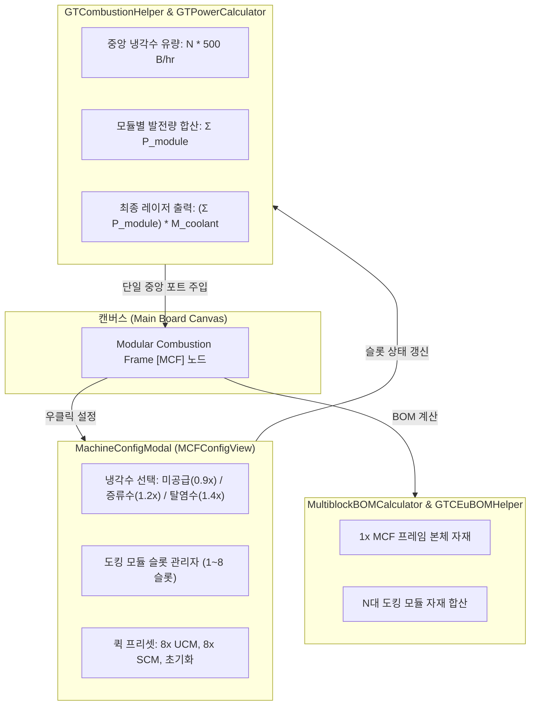

# [ADR-013] Star Technology 모듈러 연소 복합체 및 프레임 부스팅 발전 시스템 통합 명세
# (Star Technology Modular Combustion Complex & Frame Boosting Integration Specification)

| 메타데이터 항목 | 내용 |
| :--- | :--- |
| **문서 번호** | `ADR-013` |
| **상태 (Status)** | 🟢 `IMPLEMENTED` |
| **결정/완료일** | 2026-09-13 |
| **대상 버전** | `v2.2.1` |
| **관련 ADR** | [ADR-004](ADR_004_CLEAN_ARCHITECTURE_AND_DOMAIN_DECOMPOSITION.md), [ADR-006](ADR_006_TURBINE_AND_MACHINE_PARALLEL_ENHANCEMENT.md), [ADR-029](ADR_029_MOD_ADAPTER_INTERFACE_SEGREGATION_AND_EXTENSIONS.md), [ADR-043](ADR_043_DEDICATED_SUBPAGE_COMPOSITE_MODULE_AND_BOUNDARY_IO.md), [ADR-045](ADR_045_RECIPE_NODE_COMPOSITION_DECOMPOSITION.md) |
| **영향 범위** | `MCFSlotConfiguration`, `MCFModuleSlot`, `MCFModuleType`, `MCFFuel`, `GTCEuProperties`, `GTCombustionHelper`, `GTPowerCalculator`, `GTAddonCompatibilityHandler`, `MCFConfigView`, `MachineConfigDialog`, `GTCEuBOMHelper`, `IMultiblockBOMProvider`, `GTCEuModAdapter`, `MultiblockBOMCalculator` |

---

## 1. 맥락 및 배경 (Context)

Star Technology 모드팩 환경에서 대규모 전력 생산의 핵심 인프라인 **모듈러 연소 프레임 (Modular Combustion Frame [MCF], `start_core:modular_combustion_frame`)** 및 4종의 **모듈러 연소/로켓 모듈 (Modular Combustion/Rocket Modules)** 멀티블록 발전 시스템은 다음과 같은 복합 구조로 구동됩니다:

1. **허브-노드 결합형 물리 아키텍처**:
   - MCF 프레임 본체는 $25\times 11\times 27$ 크기의 초거대 멀티블록으로, 자체 발전 레시피를 실행하지 않고 하위 모듈 멀티블록(UCM, SCM, SRM, NRM)과 도킹 해치(`MODULAR_NODE` <-> `MODULAR_TERMINAL`)를 통해 최대 8대까지 결합하여 각 모듈에서 생산된 전력을 수집·출력합니다.
   - 모듈 본체에는 냉각수 입력 해치가 존재하지 않으며(연료, 윤활유, 산화제 해치만 존재), **냉각수 입력 해치(최대 4개)와 레이저/에너지 출력 해치는 오직 MCF 프레임 본체에만 장착**됩니다.
2. **연결 모듈 수($N$)에 비례하는 중앙 단일 풀 냉각수 소모**:
   - MCF 프레임은 연결된 모듈 1대당 시간당 $500\text{ B}$ ($500,000\text{ mB/hr} = 138.889\text{ mB/s}$)의 냉각수를 중앙에서 일괄 소모합니다.
   - 예: 8대 모듈 전체 도킹 시 시간당 **$4,000\text{ B}$ ($1,111.11\text{ mB/s}$)**의 냉각수를 프레임 단일 포트로 투입받습니다.
3. **2단계 중첩 부스팅(Dual-Tier Boosting) 물리 메커니즘**:
   - **1단계 (모듈 자체 산화제 부스팅)**: 각 모듈은 고유 윤활유와 발연질산/초산화물 계열 산화제를 $3.6\text{초}(72\text{틱})$ 주기로 소모하여 출력 전류를 기본 $1\text{A}\sim 2\text{A}$에서 $5\text{A}\sim 12\text{A}$로 증폭하고 병렬 수를 $2\times$ 확장합니다.
   - **2단계 (MCF 프레임 중앙 냉각 부스팅)**: 프레임은 공급된 냉각수 등급에 따라 수집된 총 발전량에 일괄 승수를 적용하여 단일 레이저 해치로 방출합니다:
     - 탈염수(De-Ionized Water) 공급: $+40\%$ ($1.4\times$)
     - 증류수(Distilled Water) 공급: $+20\%$ ($1.2\times$)
     - 냉각수 미공급 (No Coolant): $-10\%$ ($0.9\times$ 페널티)

### 레거시 구현의 결함
- **결함 1 (포트 난립 및 배관 왜곡)**: 냉각수 트레이트가 개별 UCM/SCM 모듈 노드에 부착되어 모듈 8대 배치 시 캔버스에 8개의 개별 증류수 입력 포트가 난립했습니다.
- **결함 2 (MCF 프레임 노드 고립)**: MCF 프레임 노드를 배치해도 연결 모듈을 인식하지 못해 고정 $500\text{ B/hr}$만 소모하는 고립 노드로 동작했습니다.
- **결함 3 (Multiblock BOM 자재 누락)**: 개별 모듈만 배치할 경우 초거대 MCF 프레임 본체 자재가 통째로 누락되었습니다.

---

## 2. 아키텍처 결정 사항 (Architecture Decision)

### 2.1 하이브리드 아키텍처: 매크로 단일 노드 모델 채택

도메인 모델의 순수성을 지키면서 플레이어의 조작 편의성을 극대화하기 위해 **MCF 매크로 단일 노드 모델**을 기본으로 채택하고, 세부 배관 설계를 원하는 고급 사용자를 위해 [ADR-043](ADR_043_DEDICATED_SUBPAGE_COMPOSITE_MODULE_AND_BOUNDARY_IO.md) 전용 서브페이지 호환 구조를 병행 지원합니다.

### 2.2 슬롯 구성 및 결정론적 직렬화 모델 (`MCFSlotConfiguration`)
- `MCFModuleType`: 4대 모듈 타입(`UCM`, `SCM`, `SRM`, `NRM`)의 기본 전압, 베이스/부스트 Amps, 윤활유 및 산화제 규격을 상수로 캡슐화.
- `MCFFuel`: 모듈별 지원 연료 레시피(Cetane Diesel, Gasoline, High Octane Gasoline, Rocket Fuels 등) 및 EU/t, 소모량 정의.
- `MCFModuleSlot`: 슬롯 활성화 여부, 모듈 타입, 선택 연료, 산화제 부스트 토글 상태 관리.
- `MCFSlotConfiguration`: 8개 슬롯 고정 배열, 빠른 프리셋 생성(`create8xUCM`, `create8xSCM`), 불변 복사(`copy`), JSON 직렬화/역직렬화 지원.
- `NodePropertyStore` 연동: `GTCEuProperties.MCF_COOLANT_TYPE` ("none", "distilled_water", "deionized_water") 및 `GTCEuProperties.MCF_SLOTS_DATA` (JSON 배열).

### 2.3 물리 연산 및 중앙 냉각수 단일 풀 주입 (`GTCombustionHelper`, `GTPowerCalculator`)
- **개별 모듈 전력 산출**:
  $$P_{\text{module}, i} = \text{RecipeEU/t}_i \times P_{\text{base}, i} \times M_{\text{amp}, i}$$
  $$P_{\text{base}, i} = \max\left(1, \left\lfloor \frac{V_{\text{tier}}}{\text{RecipeEU/t}_i} \right\rfloor\right), \quad M_{\text{amp}, i} = \text{IsOxidizerBoosted}_i \,?\, A_{\text{boost}, i} : A_{\text{base}, i}$$
- **중앙 냉각수 단일 풀 소모**:
  $$Q_{\text{coolant}} = N \times \frac{500,000\text{ mB}}{3600\text{ 초}} \approx N \times 138.889\text{ mB/s}$$
  MCF 프레임 노드의 입력 포트 목록에 중앙 냉각수 포트를 단일 항목으로 동기화 주입 (`syncMCFInputs`).
- **최종 전력 및 레이저 해치 권장 규격 산출**:
  $$P_{\text{total}} = \left( \sum_{i=1}^N P_{\text{module}, i} \right) \times M_{\text{coolant}}$$
  `LaserHatchRecommendation`: 총 전력을 바탕으로 적정 전압 티어와 레이저 Amps(예: UV Laser Hatch, 3.5A) 계산.
- `GTPowerCalculator`: MCF 노드인 경우 `GTCombustionHelper.computeMCFTotalPower`를 호출하여 발전량을 결정론적으로 반환.

### 2.4 단독 모듈 운전 정규화 및 독립성 보장 (`GTAddonCompatibilityHandler`)
- `GTAddonCompatibilityHandler`에서 MCF 프레임 노드는 `AddonCategory.MCF_MODULE` 전용 카테고리를 반환하고 일반 멀티블록 트레이트를 거부합니다.
- UCM, SCM 등 개별 모듈 노드가 캔버스에 단독 배치된 경우 냉각수 트레이트 장착을 엄격히 거부하여 로컬 냉각수 입력 포트 생성을 원천 차단하고 $1.0\times$ 베이스 운전으로 정규화합니다.

### 2.5 반응형 GUI 및 퀵 프리셋 인터랙션 (`MCFConfigView`)
- `MachineConfigDialog` 내 `MCFConfigView` 탭 탑재:
  1. 냉각수 부스팅 라디오 칩 (미공급, 증류수, 탈염수) 및 실시간 총 소모량($N \times 500\text{ B/hr}$) 표시.
  2. 퀵 프리셋 바 (`[8x UCM (LuV)]`, `[8x SCM (ZPM)]`, `[Clear All]`).
  3. 8개 모듈 슬롯 행 (체크박스, 모듈 타입 순환 버튼, 연료 순환 버튼, 산화제 부스트 토글 칩, 동적 전류 표기).
  4. 발전량 및 BOM 실시간 요약 (순 발전량 EU/t, 권장 레이저 해치, 총 멀티블록 수).
  5. 마우스 휠 스크롤 및 클릭 경계 분기 안전 처리.

### 2.6 복합 멀티블록 BOM 자재 및 컨트롤러/해치 일괄 집계
- `IMultiblockBOMProvider` 및 `GTCEuModAdapter`:
  - `getMultiblockCount(node, baseCount)`를 확장하여 기본 $1\text{대}$에 활성 모듈 $N\text{대}$를 가산한 $(1 + N) \times \text{baseCount}$ 반환.
- `GTCEuBOMHelper.appendMCFModuleParts`:
  - 1x MCF 프레임 본체 블록 및 권장 레이저 해치 자재 추가.
  - $N$대의 도킹 모듈 컨트롤러 및 케이싱, 산화제/연료 해치 자재를 중복 없이 누적 집계.
  - Rule 1 및 Rule 5를 엄격히 준수하여 얕은 메서드(`appendModuleDefParts`, `appendModuleFallbackParts`)로 분해.

---

## 3. 결과 및 파급 효과 (Consequences)

### 긍정적 효과
1. **인게임 배관 완벽 일치**: 캔버스에 난립하던 개별 냉각수 입력 포트가 제거되고, 실제 인게임과 동일하게 MCF 프레임에 단일 중앙 냉각수 포트만 표시되어 플로우 솔버가 완벽한 유량 수지를 연산합니다.
2. **원클릭 복합 공정 설계**: 퀵 프리셋을 통해 대규모 전력 발전소를 단 1회 클릭으로 구성할 수 있어 설계 생산성이 대폭 향상되었습니다.
3. **완전한 BOM 산출**: 9대(프레임 1 + 모듈 8)의 초대형 발전 설비 자재와 레이저 해치 규격이 누락 없이 산출됩니다.
4. **도메인 순수성 및 SPI 격리**: `RecipeNode` 도메인 엔티티는 일체 오염되지 않았으며, 모든 모드 종속 로직이 `compat.gtceu` 계층과 `NodePropertyStore` 내부에 안전하게 캡슐화되었습니다.

### 단위 테스트 검증 결과
`MCFComplexIntegrationTest`를 통해 다음 8대 항목을 100% 검증하였습니다:
1. `testSlotConfigurationSerialization`: 8슬롯 JSON 직렬화 및 역직렬화 무손실성 검증.
2. `testQuickPresets`: 8x UCM 및 8x SCM 프리셋 생성 및 초기화 무결성 검증.
3. `testPhysicsCalculationExact`: 8x UCM + Cetane Diesel + Ox Boost + De-Ionized Water 시 $1,835,008\text{ EU/t}$ 및 UV Laser Hatch 3.5A 정확도 검증.
4. `testCentralCoolantCalculation`: 모듈 $N$대에 비례한 유량($N \times 138.889\text{ mB/s}$) 및 포트 주입 동기화 검증.
5. `testStandaloneModuleIsolation`: 단독 모듈 배치 시 로컬 냉각수 거부 및 $1.0\times$ 베이스 운전 검증.
6. `testAddonCategoryRouting`: MCF 프레임 노드의 `MCF_MODULE` 전용 카테고리 라우팅 검증.
7. `testMultiblockCountAggregation`: 8대 모듈 활성화 시 총 9대의 멀티블록 수 합산 검증.
8. `testBOMAggregation`: MCF 프레임 컨트롤러, 레이저 해치, 모듈 컨트롤러 및 케이싱 일괄 집계 무결성 검증.
