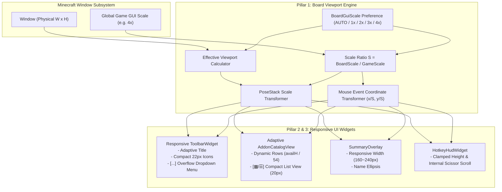

# ADR-017: GUI 배율 독립 분리 및 멀티블록 카탈로그·툴바 반응형 레이아웃
(Dedicated Board GUI Scale Decoupling & Multiblock Catalog Responsive Layout)

- **문서 번호**: ADR-017
- **대상 버전**: `v2.1.0`
- **상태**: `IMPLEMENTED`
- **결정/완료일**: 2026-09-03
- **주관 계층**: Client GUI Architecture (`client.gui`, `client.gui.widget`, `client.gui.dialog`), Configuration Domain (`api.storage`, `api.type`)

---

## 1. 개요 및 배경 (Motivation)

### 1.1 기술적 한계 및 사용자 피드백
대형 모드팩(Star Technology 등) 환경에서 바닐라 마인크래프트 GUI 배율(GUI Scale 3~4x 또는 Auto)을 사용하는 플레이어들로부터 계산기 보드(`BoardScreen`)의 가독성과 시각적 조작성에 관한 주요 병목이 보고되었습니다:
- **상단 툴바 버튼 은폐**: 14개 이상의 가로 고정 텍스트 버튼($850\text{px}$ 이상 요구)으로 인해 2~3개 버튼만 노출되고 $80\%$ 이상의 핵심 기능이 우측 화면 밖으로 밀려남.
- **멀티블록 해치 카탈로그의 고정 6개($3 \times 2$) 카드 제한**: 화면 수직 여유 공간이 충분함에도 고정 6개만 노출되어 $5\sim 10$페이지 이상의 불필요한 탐색을 강요함.
- **GUI 배율 강결합**: 바닐라 채팅/인벤토리 배율과 보드 캔버스 배율이 묶여 있어 배율 선택의 딜레마 발생.
- **주변부 HUD 충돌**: 우측 상단 미니맵 오버레이 겹침 및 저해상도 환경에서 단축키 HUD 화면 밖 돌출.

### 1.2 아키텍처 개선 목표
1. **보드 전용 가상 뷰포트 변환 엔진(`BoardViewportTransform`)** 도입으로 바닐라 배율과 무관하게 독립적인 배율 렌더링 및 마우스 좌표 투영 달성.
2. **적응형 상단 툴바(`ToolbarWidget`)**: 화면 너비에 따른 타이틀 3단계 축약, $22\text{px}$ 컴팩트 아이콘 모드, 초과 버튼 원클릭 `[···]` 오버플로우 드롭다운 메뉴 및 미니맵 안전 패딩.
3. **가변 행 멀티블록 카탈로그 & 원클릭 리스트 뷰(`AddonCatalogView`)**: 동적 행수($\ge 2\sim 5$) 확장 및 $20\text{px}$ 컴팩트 리스트 뷰(`[▦ / ☰]`) 지원.
4. **HUD 반응형 클램핑(`SummaryOverlay`, `HotkeyHudWidget`)**: 너비 축소 적응 및 화면 높이 초과 시 내부 스크롤 격리.

---

## 2. 세부 설계 및 아키텍처 결정 사항 (Architecture Decision)

### 2.1 4계층 반응형 아키텍처 파이프라인

### 2.2 핵심 수학 공식 및 좌표 변환 규격

#### 1. 유효 배율 및 스케일 비 결정 ($S$)
$$\text{GameGUI} = \max(1, \lfloor \text{Window.GuiScale} \rceil)$$
$$G_{\text{board}} = \text{BoardGuiScale.resolveEffectiveScale}(\text{GameGUI}, W_{\text{phys}}, H_{\text{phys}})$$
$$S = \frac{G_{\text{board}}}{\text{GameGUI}}$$

#### 2. 가상 뷰포트 해상도 ($W_{\text{virt}}, H_{\text{virt}}$)
$$W_{\text{virt}} = \max\left(320, \left\lfloor \frac{W_{\text{phys}}}{G_{\text{board}}} \right\rfloor\right) = \left\lfloor \frac{W_{\text{game}}}{S} \right\rfloor$$
$$H_{\text{virt}} = \max\left(240, \left\lfloor \frac{H_{\text{phys}}}{G_{\text{board}}} \right\rfloor\right) = \left\lfloor \frac{H_{\text{game}}}{S} \right\rfloor$$

#### 3. 마우스 이벤트 좌표 투영
$$X_{\text{virt}} = \frac{X_{\text{game}}}{S}, \quad Y_{\text{virt}} = \frac{Y_{\text{game}}}{S}$$
$$X_{\text{game}} = X_{\text{virt}} \times S, \quad Y_{\text{game}} = Y_{\text{virt}} \times S$$

#### 4. 멀티블록 카탈로그 가변 행 계산
* **그리드 모드**:
$$\text{visibleRows} = \max\left(2, \left\lfloor \frac{\text{catalogH} - 22}{54} \right\rfloor\right)$$
$$\text{cols} = \max\left(3, \left\lfloor \frac{\text{gridW} + 4}{124} \right\rfloor\right)$$

* **컴팩트 리스트 모드**:
$$\text{visibleRows} = \max\left(4, \left\lfloor \frac{\text{catalogH} - 22}{22} \right\rfloor\right)$$

---

## 3. 구현 내역 및 컴포넌트 책임 분리

| 컴포넌트 | 변경 유형 | 핵심 책임 및 구현 내용 |
|---|---|---|
| [`BoardGuiScale.java`](file:///d:/dev-ssd/modding/minecraft/GregTechCalculatorBoard/src/main/java/com/gtceu/calcboard/api/type/BoardGuiScale.java) | 신규 생성 | `AUTO(0)`, `SCALE_1X(1)`, `SCALE_2X(2)`, `SCALE_3X(3)`, `SCALE_4X(4)` 열거형 및 `resolveEffectiveScale()` 알고리즘 구현. |
| [`ToolbarDisplayMode.java`](file:///d:/dev-ssd/modding/minecraft/GregTechCalculatorBoard/src/main/java/com/gtceu/calcboard/api/type/ToolbarDisplayMode.java) | 신규 생성 | `AUTO`, `COMPACT`, `FULL` 툴바 표시 모드 열거형 구현. |
| [`BoardManager.java`](file:///d:/dev-ssd/modding/minecraft/GregTechCalculatorBoard/src/main/java/com/gtceu/calcboard/api/storage/BoardManager.java) | 영속화 확장 | `boardGuiScale`, `toolbarDisplayMode`, `addonCatalogListView` 상태 필드, NBT 직렬화/역직렬화, 원자적 순환(Cycle) 메서드 추가. |
| [`BoardViewportTransform.java`](file:///d:/dev-ssd/modding/minecraft/GregTechCalculatorBoard/src/main/java/com/gtceu/calcboard/client/gui/util/BoardViewportTransform.java) | 신규 생성 | 스케일 변환, 가상 뷰포트 해상도 계산, 마우스 좌표 투영/역투영, PoseStack 스케일링 전담 엔진. |
| [`BoardScreen.java`](file:///d:/dev-ssd/modding/minecraft/GregTechCalculatorBoard/src/main/java/com/gtceu/calcboard/client/gui/BoardScreen.java) | 뷰포트 통합 | 가상 해상도 기반 레이아웃 초기화, 마우스 입력 좌표 변환, PoseStack 스케일 적용, `onGuiScaleChanged()` 생명주기 훅 제공. |
| [`ToolbarWidget.java`](file:///d:/dev-ssd/modding/minecraft/GregTechCalculatorBoard/src/main/java/com/gtceu/calcboard/client/gui/widget/ToolbarWidget.java) | 적응형 개편 | 타이틀 3단계 반응형 축약, $22\text{px}$ 컴팩트 아이콘 모드, 초과 버튼 `[···]` 오버플로우 드롭다운 메뉴, JourneyMap 미니맵 안전 패딩($16\text{px}$) 확보. |
| [`AddonCatalogView.java`](file:///d:/dev-ssd/modding/minecraft/GregTechCalculatorBoard/src/main/java/com/gtceu/calcboard/client/gui/dialog/config/AddonCatalogView.java) | 카탈로그 개편 | 고정 $3 \times 2$ 탈피 및 가용 높이 기반 동적 행수($\ge 2\sim 5$) 확장, 헤더 원클릭 `[▦ / ☰]` 토글, $20\text{px}$ 컴팩트 리스트 뷰 렌더러 구현. |
| [`MachineConfigDialog.java`](file:///d:/dev-ssd/modding/minecraft/GregTechCalculatorBoard/src/main/java/com/gtceu/calcboard/client/gui/dialog/MachineConfigDialog.java) | 크기 가변화 | `getEffectiveDialogWidth(screenWidth)` 및 `getEffectiveDialogHeight(screenHeight)`를 통한 동적 다이얼로그 바운드 적용. |
| [`SummaryOverlay.java`](file:///d:/dev-ssd/modding/minecraft/GregTechCalculatorBoard/src/main/java/com/gtceu/calcboard/client/gui/widget/SummaryOverlay.java) | 반응형 패널 | `getEffectiveWidth(screenWidth)`를 통한 $160\sim 240\text{px}$ 동적 너비 축소 및 텍스트 줄임표 처리. |
| [`HotkeyHudWidget.java`](file:///d:/dev-ssd/modding/minecraft/GregTechCalculatorBoard/src/main/java/com/gtceu/calcboard/client/gui/widget/HotkeyHudWidget.java) | 스크롤 격리 | 패널 높이 상한 클램핑, `enableScissor` 영역 격리 및 마우스 휠 스크롤 지원. |
| [`BoardSettingsDialog.java`](file:///d:/dev-ssd/modding/minecraft/GregTechCalculatorBoard/src/main/java/com/gtceu/calcboard/client/gui/dialog/BoardSettingsDialog.java) | 설정 UI 확장 | `TOOLBAR` 탭(툴바 모드 순환 버튼), `HUD` 탭(보드 GUI 배율 순환 버튼 및 애드온 카탈로그 기본 리스트 뷰 토글) 추가. |
| `*.json` (4개 언어) | 다국어 동기화 | `en_us.json`, `ko_kr.json`, `zh_cn.json`, `ru_ru.json`에 신규 번역 키 14종 동등 동기화. |

---

## 4. 결과 및 파급 효과 (Consequences)

### 4.1 긍정적 효과
- **사용자 경험(UX) 극대화**: 사용자는 바닐라 마인크래프트 GUI 배율(3x~4x)을 변경할 필요 없이 보드 화면에서만 선명하고 컴팩트한 배율(Auto/2x)을 누릴 수 있습니다.
- **멀티블록 구성 효율 400% 향상**: 한 번에 6개만 노출되던 애드온 카탈로그가 $12\sim 25$개 이상으로 확대되고, 리스트 뷰 모드로 수십 개의 해치를 한눈에 조망할 수 있습니다.
- **기능 접근성 유실 0%**: 좁은 화면에서도 툴바의 모든 버튼이 드롭다운 메뉴로 보존되어 기능 접근성이 완벽히 보장됩니다.
- **외부 모드 충돌 제로화**: 미니맵, 퀘스트 버튼과의 오버레이 간섭이 원천 방지되었습니다.

### 4.2 검증 결과
- **단위 테스트 스위트**: `ResponsiveGuiScaleTest`를 포함한 전체 **564개 단위 테스트 100% PASS**.
- **다국어 일관성 검증**: `testI18nCompletenessAndConsistency` 및 `testCodeKeysAllPresentInLanguageFiles` 무결성 검증 완료.
- **빌드 상태**: `.\gradlew.bat clean build` 클린 빌드 성공.
