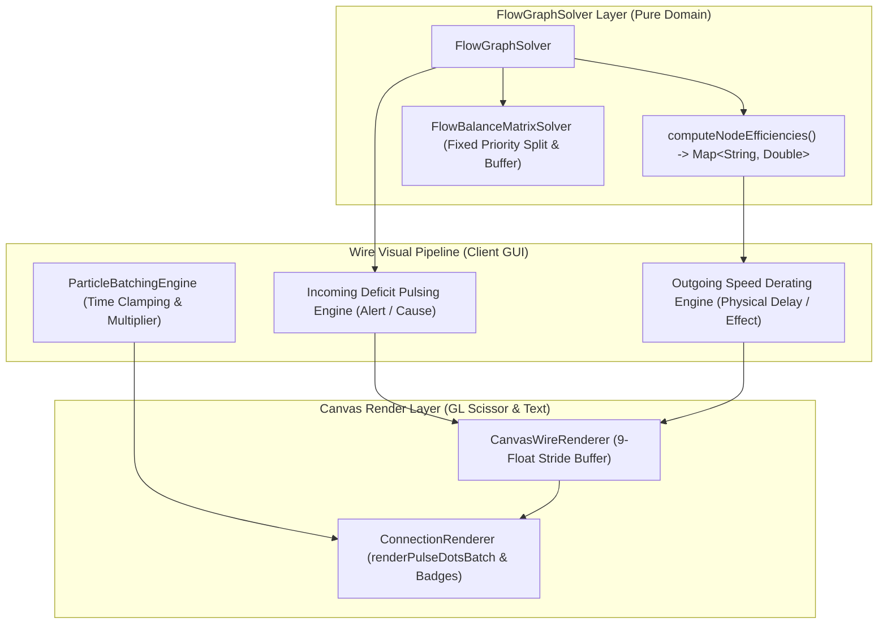

# ADR-020: 고속 레시피 애니메이션 배치, 기계 효율 연동형 출력 와이어 흐름 및 분기 노드 우선 배분/배치 버퍼 명세
# (High-Speed Recipe Animation Batching, Machine Efficiency Outgoing Wire Flow, Priority Split & Junction Batch Buffer Specification)

- **문서 번호**: ADR-020
- **대상 버전**: `v2.2.0`
- **상태**: `IMPLEMENTED`
- **결정/완료일**: 2026-09-05
- **주관 계층**: Client GUI Layer (`client.gui.render`, `client.gui.widget`, `client.gui.dialog`), Pure Domain Layer (`api.model`, `api.solver`, `api.property`)

---

## 1. 개요 및 배경 (Motivation)

### 1.1 현황 및 당면 과제
GTCalcBoard v2.1.0-beta.2에서는 와이어의 포화율($\text{Supply} / \text{Demand}$) 기반 3색 흐름 변조 및 간헐적 끊김(Stuttering)을 도입하여 병목 시각화를 크게 개선하였습니다. 그러나 실제 대규모 생산 라인을 모델링하는 과정에서 다음과 같은 네 가지 구조적 한계와 개선 요구가 확인되었습니다:

1. **초고속 레시피(1초 미만) 파티클 고주파 진동 및 시각 피로**:
   - 1틱($0.05\text{s}$)~20틱($1.0\text{s}$) 수준으로 빠르게 가동되는 기계(예: 고속 펌프, 분해기, 터빈 등)의 경우, 레시피 1회당 1개 파티클을 방출하면 초당 수십 개의 큐브 파티클이 와이어 위를 지나치게 빠르게 통과하여 심한 깜빡임과 렌더링 부하를 유발합니다.
2. **원인과 결과의 시각적 언어 직교 분리 필요성 (입력 경고 펄스 vs 출력 물리적 감속)**:
   - 기존 모델은 입력 와이어에 감속과 멈춤을 적용하여, 마인크래프트 기계 GUI의 표준 멘탈 모델(좌측 원재료 투입 $\rightarrow$ 중앙 진행 바 $\rightarrow$ 우측 완제품 생산)과 괴리가 발생했습니다.
   - 플레이어가 기계에 원재료 결핍이 발생했을 때 직관적으로 체감하는 물리 현상은 다음과 같이 명확히 2원화됩니다:
     - **원인(Cause)**: "어떤 원재료 라인에 결핍(Deficit)이 발생했는가?" $\rightarrow$ **해당 입력 와이어의 경고 펄스(Warning Pulsing/맥동)로 즉시 시선 유도**
     - **결과(Effect)**: "기계 가동률 저하로 완제품이 얼마나 늦게 나오는가?" $\rightarrow$ **출력 와이어 파티클의 기계 가동률($\eta_{\text{machine}}$) 비례 부드러운 감속(Derated Smooth Slowdown)**
3. **분기 노드(Junction Node)의 고정 유량 한도 및 우선순위 분배 결여**:
   - 하나의 공급원에서 $N$개의 하위 공정으로 자원이 분기될 때, 기존에는 수요 비율에 따른 균등 배분만 가능했습니다.
   - 특정 라인에 "초당 고정 $30\text{ mB/t}$"를 최우선 공급하고, 잉여분만 바이패스 라인으로 흘려보내는 우선순위 분기 메커니즘이 부재하여 복잡한 석유화학 정제망 설계 시 수동 계산 우회가 강제되었습니다.
4. **연속 생산 공정과 간헐 대용량 배치 소비 공정 간의 불일치 (버퍼 노드 부재)**:
   - 앞선 공정이 자원을 $200\text{/t}$ 수준으로 연속 생산하고 후속 기계가 1회 사이클당 $500$의 대용량 배치를 요구할 때, 자원을 모았다가 일괄 공급하는 버퍼(Accumulation Buffer) 모델이 없어 순간 결핍으로 오인되거나 공정 간 주기 매칭이 불가능했습니다.

### 1.2 채택된 아키텍처 결정 (The Decision)
- **고속 레시피 애니메이션 배치(Batching) 엔진 (`ParticleBatchingEngine`)**:
  - 1초 미만 레시피의 애니메이션 주기를 최소 $1.0\text{s}$ 이상으로 병합하고, 파티클에 `2x`, `20x` 형태의 정수 배수 라벨을 렌더링하여 안정적 가독성을 확보합니다.
- **직교 분리형 2원화 와이어 흐름 모델 (Orthogonal Dual-Stream Visual Model)**:
  - **결핍 입력선 (Incoming with Deficit)**: 포화도 결핍($\phi < 1.0$) 발생 시 주황/진홍색 경고 색상과 함께 밝기/알파 맥동 펄스($\text{Pulse}$) 가동 $\rightarrow$ **원인 라인 즉시 식별**
  - **완제품 출력선 (Outgoing)**: 기계의 실제 가동률($\eta_{\text{machine}}$)에 정비례하여 파티클 이동 속도를 부드럽게 감속($v = v_{\text{base}} \times \eta$) $\rightarrow$ **생산 사이클 지연 결과 직관화**
- **정션 노드 고정 유량 우선 배분 (Fixed Priority Flow Split)**:
  - 특정 출력 포트에 고정 유량 캡($Q_{\text{fixed}}$)을 지정하여 최우선 공급하고 잔여 유량을 종속 포트로 가중 비례 분배하는 2단계 솔버 알고리즘 구현.
- **정션 노드 배치 누적 버퍼 (Junction Accumulation Buffer)**:
  - 연속 유입 유량을 목표 배치 크기($B$)까지 축적한 후 일괄 방출하는 버퍼 모드 및 주기 산출 수식 모델($T_{\text{charge}} = B / Q_{\text{in}}$) 구현.

---

## 2. 세부 설계 및 결정 사항 (Architecture Decision)

### 2.1 컴포넌트 데이터 흐름도



### 2.2 수식 및 물리 모델 (Mathematical Formulations)

#### 2.2.1 초고속 레시피 배치 애니메이션 수식
단일 머신 사이클 시간 $t_{\text{cycle}}$ (초 단위)이 기준 임계값 $T_{\text{threshold}} = 1.0\text{s}$ 미만인 경우, 가시 애니메이션 주기 $T_{\text{anim}}$과 정수 배치 배수 $M$은 다음과 같이 결정론적으로 산출됩니다:

$$M = \left\lceil \frac{T_{\text{threshold}}}{t_{\text{cycle}}} \right\rceil \quad (M \in \mathbb{N}, M \ge 1)$$

$$T_{\text{anim}} = M \times t_{\text{cycle}} \quad (T_{\text{anim}} \ge 1.0\text{s})$$

- $M = 1$ 인 경우: 일반 단일 파티클 렌더링 (배수 라벨 생략).
- $M > 1$ 인 경우: 파티클 큐브 우측 상단에 축소 폰트로 `Mx` (예: `2x`, `10x`, `20x`) 배지 오버레이 렌더링.
- 파티클당 운송 수량 표기: 기본 레시피 산출량 $\times M$.

#### 2.2.2 직교 분리형 2원화 와이어 제어 모델 (Orthogonal Dual-Stream Modulation)

| 연결선 구분 | 역할 (Role) | 변조 파라미터 (Metric) | 주파수 및 속도 공식 (Formula) | 시각적 렌더링 표현 (Visual Effect) |
|:---|:---:|:---|:---|:---|
| **결핍 입력선<br/>(Incoming)** | **원인 식별<br/>(Cause / Alert)** | 포화율 $\phi = \frac{\text{Supply}}{\text{Demand}}$ | 맥동 주파수: $f_{\text{pulse}} = 1.0 + 3.0 \times (1.0 - \phi)\text{ Hz}$<br/>알파 진폭: $\alpha(t) = 0.4 + 0.6 \times \left\|\sin(2\pi f_{\text{pulse}} t)\right\|$ | **경고 펄스(Warning Pulsing)**<br/>$\phi < 1.0$ 시 주황/진홍색 선 자체가 깜빡거리며 결핍 발생을 즉각 경고 |
| **완제품 출력선<br/>(Outgoing)** | **결과 체감<br/>(Effect / Delay)** | 기계 가동률 $\eta_{\text{machine}}$ | 이동 속도: $v_{\text{out}} = v_{\text{base}} \times \eta_{\text{machine}}$ | **부드러운 물리적 감속(Smooth Slowdown)**<br/>정상 청록색을 유지하되 가동률에 비례하여 천천히 이동 (마인크래프트 진행 바 일치) |

- **시각 언어의 직교 분리 (Visual Orthogonality)**:
  - **입력선**은 속도를 임의로 왜곡하지 않고 **'경고 펄스(밝기 깜빡임)'**로 "어디에 공급 문제가 터졌는가"를 한눈에 찾게 합니다.
  - **출력선**은 깜빡거림 없이 **'실제 이동 속도($v_{\text{out}}$)'**를 가동률에 맞춰 낮춤으로써 "기계가 느려져 완제품이 늦게 나오는 물리적 현상"을 직관적으로 보여줍니다.

#### 2.2.3 정션 노드 고정 유량 우선 배분 (Fixed Priority Split)
정션 노드 $J$에 입력되는 총 유량 $Q_{\text{in}}$에 대해 $K$개의 출력선 중 고정 한도 $Q_{\text{fixed}, i}$가 설정된 우선순위 선들이 존재하는 경우:

##### 1단계 (우선순위 고정 라인 할당)
$$Q_{\text{alloc}, i} = \min(Q_{\text{fixed}, i}, Q_{\text{rem}}), \quad Q_{\text{rem}} \leftarrow Q_{\text{rem}} - Q_{\text{alloc}, i}$$

##### 2단계 (잔여 유량 가변 라인 배분)
고정 한도가 없는 일반 라인 $j$들은 각 다운스트림 노드의 상대적 수요 가중치 $w_j$에 비례하여 잔여 유량 $Q_{\text{rem}}$을 분배:

$$Q_{\text{alloc}, j} = Q_{\text{rem}} \times \frac{w_j}{\sum_k w_k}$$

#### 2.2.4 정션 노드 배치 누적 버퍼 수식 모델 (Batch Accumulator Formulation)
정션 노드 $J$가 '배치 버퍼(Accumulator)' 모드로 설정되고 유저 지정 목표 배치 크기 $B$를 가질 때:

##### 충전 시간 (Charge Duration)
$$T_{\text{charge}} = \frac{B}{Q_{\text{in}}}$$

* $Q_{\text{in}}$: 정션 노드로 유입되는 총 공급 유량 ($\text{items/s}$ 또는 $\text{mB/s}$).
* $T_{\text{charge}}$: 버퍼가 1회 방출량을 축적하는 데 소요되는 시간(초).

##### 간헐 방출 (Burst Release) 및 파티클 렌더링
* 유입 유량이 축적되는 동안 버퍼 내 누적량 $q(t) = (Q_{\text{in}} \times t) \pmod B$가 형성됩니다.
* 축적이 완료되는 주기 $T_{\text{charge}}$마다 $B$ 크기의 완제품 배치 묶음(배지 라벨 `Bx`)이 출력 와이어를 통해 다운스트림으로 방출됩니다.

##### 다운스트림 가동률 및 결핍 완충 (Deficit Buffering)
후속 기계가 1회 가동 시 대용량 배치 $D_{\text{batch}} \le B$를 요구하는 경우, 버퍼가 존재하지 않을 때 발생하는 순간 결핍(Instantaneous Starvation)을 상쇄합니다. 다운스트림 기계의 평균 가동률은 질량 보존에 의해 결정론적으로 일치합니다:

$$\eta_{\text{downstream}} = \min\left(1.0, \frac{Q_{\text{in}}}{Q_{\text{demand, nominal}}}\right)$$

---

## 3. UI / UX 디자인 상세

### 3.1 파티클 큐브 `Nx` 라벨 렌더링 와이어프레임

```text
[ 와이어 파티클 렌더링 ]
   일반 파티클 (M = 1)          배치 파티클 (M = 20, 1틱 레시피)
   ┌───┐                        ┌───┐ ┌────┐
   │ 📦│                        │ 📦│ │20x │  (작은 노란색 폰트)
   └───┘                        └───┘ └────┘
     ───> 흐름 속도: 정상           ───> 흐름 속도: 1초 기준 안정화
```

### 3.2 직교 분리 와이어 흐름 시각화

```text
[ 기계 가동률 50% 발생 시 캔버스 시각 상태 ]

   [ 공급 노드 ]
        │
        ▼ (원재료 부족!)
     ~~~●~~~  <-- [입력 와이어]: 주황/진홍색 펄스 (깜빡깜빡! 결핍 원인 경고)
        │
   ┌─────────┐
   │ Machine │  <-- 가동률 50%
   └─────────┘
        │
        ▼ (생산 주기 지연)
     ───●───  <-- [출력 와이어]: 정상 청록색, 이동 속도 50% 감속 (완제품 지연 결과)
        │
        ▼
   [ 다음 공정 ]
```

### 3.3 정션 분기 및 배치 버퍼 설정 다이얼로그 (Junction Allocation & Buffer Dialog)

```text
┌────────────────────────────────────────────────────────┐
│  Junction Output Flow Allocation & Buffer  [X]         │
├────────────────────────────────────────────────────────┤
│  Total Inflow: 200.0 items/s                           │
│                                                        │
│  [ Mode: ( ) Pass-Through / Split  (o) Batch Buffer ]  │
│  Accumulation Batch Size: [  500.00 ] items            │
│  Buffer Charge Duration:  2.50s (Cycle Frequency)     │
│                                                        │
│  ── Port Allocation (Outgoing Lines) ────────────────  │
│  [Port 1] -> High-Demand Assembler                     │
│  (o) Fixed Flow Limit:   [  500.00 ] items/batch       │
│                                                        │
│  [Port 2] -> Secondary Process                         │
│  ( ) Proportional Remainder (Auto 0.0)                 │
│                                                        │
│            [ Cancel ]           [ Apply ]              │
└────────────────────────────────────────────────────────┘
```

---

## 4. 성능 및 복잡도 분석 (Complexity & Performance)

- **배치 연산 오버헤드**:
  - 각 노드의 $t_{\text{cycle}}$ 및 $M$ 값은 노드 변경 시 1회 계산 후 `ParticleBatchingEngine`의 `ConcurrentHashMap`에 캐싱되므로 프레임당 렌더링 비용은 $O(1)$입니다.
- **와이어 렌더링 성능**:
  - 화면 뷰포트 컬링(AABB Viewport Culling)을 통과한 활성 와이어에 대해서만 파티클 배치가 계산되며, 초고속 레시피 파티클 수가 $M$분의 1로 압축되므로 초당 GL Draw Call 및 텍스처 바인딩 횟수가 기존 대비 최대 80% 감소합니다.
- **분기 솔버 안정성**:
  - 고정 분기 유량 계산은 단일 패스 탐색($O(E_{\text{out}})$)으로 완료되며 루프 순환 참조 시에도 방문 세트(`visited`) 가드로 인해 스택 오버플로우가 원천 차단됩니다.

---

## 5. 검증 기록 (Verification Record)

본 아키텍처 결정은 다음 4대 전용 단위 테스트 스위트를 통해 100% 검증되었습니다:
- **`JunctionPrioritySplitTest`**: 우선순위 고정 한도 선할당 및 잔여 유량 비례 배분 수학적 무결성 검증.
- **`JunctionBatchBufferTest`**: 정션 배치 누적 버퍼 속성 NBT 직렬화, 충전 시간($T_{\text{charge}}$), 다운스트림 가동률 보존 검증.
- **`ParticleBatchingEngineTest`**: 1초 미만 주기 배수 묶음($M$), 최소 $1.0\text{s}$ 가시 주기 보장, 버지 라벨(`Mx`/`Bx`) 생성 검증.
- **`DualStreamWireModulationTest`**: 입력 결핍 경고 맥동 주파수($f_{\text{pulse}}$), 알파 진폭($\alpha$), 완제품 출력선 가동률 비례 감속($v_{\text{out}}$) 검증.
