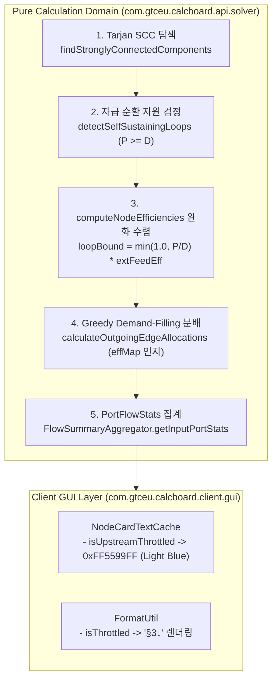

# ADR-022: 폐쇄 순환 공정(Closed-Loop Recirculation)의 자급 자원 보호 및 공급 우선 할당 알고리즘 명세
# (Closed-Loop Recirculation Self-Sustaining Protection & Supply-Filling Allocation Specification)

- **문서 번호**: ADR-022
- **대상 버전**: `v2.2.0-alpha.2`
- **상태**: `IMPLEMENTED`
- **결정/완료일**: 2026-09-05
- **주관 계층**: Pure Domain & Calculation Engine (`api.solver`, `api.model`), Client GUI Layer (`client.gui.render`, `client.gui.util`), Mod Compat Layer (`compat.gtceu`)

---

## 1. 개요 및 배경 (Motivation)

### 1.1 현황 및 기술적 한계
그렉테크(GTCEu Modern) 및 화학 공학 모드팩에서는 반응 생성물 또는 부산물(물, 희석 산, 수산화나트륨 등)을 공정 전단으로 재투입하여 자급자족하는 **폐쇄 순환 공정(Closed-Loop Recirculation Chain)**(예: 바이어 공정, 백금 정제선)이 빈번히 설계됩니다.

기존 유량 해석기(`FlowBalanceMatrixSolver`)는 순환 배관이 연결되는 순간 다음 3가지 메커니즘으로 인해 전체 공정 효율이 $1\%\sim 4\%$로 급락(Collapse)하는 문제가 있었습니다:

1. **정격 명목 수요(Nominal Demand) 비율 분배의 맹점**:
   - `calculateOutgoingEdgeAllocations`가 각 소비자의 $100\%$ 정격 명목 수요($D_i^{\text{nominal}}$) 비율로만 유량을 분배하여, 비가동 상태인 기계(예: 광석 부족으로 1% 가동 중인 믹서)에 91%의 유량이 배정되고 정작 가동 가능한 기계(유체 히터)에는 9%만 배정되어 기아(Starvation) 상태가 발생했습니다.
2. **고정점 수렴 연산에서의 피드백 감쇠 나선 (Death Spiral)**:
   - `computeNodeEfficiencies`의 10회 고정점 이터레이션 도중 전달 계수 $c < 1.0$이 누적 곱 연산되어 $c^{10} \to 0$으로 수렴했습니다.
3. **결손 판정(`isInputDeficit`)의 모순된 기준**:
   - `FlowSummaryAggregator`가 실효 소비량($D_{\text{eff}} = D^{\text{nominal}} \times E$)이 아닌 $100\%$ 정격 소비량($D^{\text{nominal}}$)과 공급량을 단순 비교하여, 공급이 실제 소비량의 2배에 달하더라도 결손 경고(⚠)를 출력했습니다.

### 1.2 아키텍처 개선 목표
- **유효 수요 우선 충족 할당 (Demand-Filling Greedy Allocation)**:
  - 공급 가능 유량이 총 유효 수요 이상일 때 각 연결 엣지에 요구량을 우선 $100\%$ 배정하고, 잔여 잉여를 안배합니다.
- **자급 순환 자원 보호 불변식 (Closed-Loop Invariant Protection)**:
  - Tarjan SCC 기반으로 순환 루프를 탐색하고, 루프 내 총 생산량 $\ge$ 총 소비량인 자급 자원에 대해 외부 원자재 가용률($E_{\text{external\_feed}}$)을 하한선으로 보장하여 감쇠 나선을 원천 차단합니다.
- **실효 소비량 기반 포트 상태 집계 및 상류 감속 뱃지(`isUpstreamThrottled`) 도입**:
  - 현재 가동 속도 대비 공급 부족만을 결손(Deficit, ⚠, 주황)으로 판정하고, 상류 제한으로 인한 감속 운전은 상류 감속(Throttled, ↓, 파란)으로 정밀 구분합니다.

---

## 2. 세부 설계 및 결정 사항 (Architecture Decision)

### 2.1 솔버 파이프라인 및 클래스 상호작용

### 2.2 핵심 알고리즘 명세

#### 1. 유효 수요 우선 충족 할당 (`allocateVariableEdges`)
$$\mathcal{E}_{\text{var}} = \{e_1, e_2, \dots, e_n\}, \quad d_k = D_{\text{eff}}(e_k), \quad D_{\text{total}} = \sum_{k} d_k$$

* **공급 과잉 상태 ($S_{\text{rem}} \ge D_{\text{total}}$)**:
$$\text{alloc}(e_k) = d_k + (S_{\text{rem}} - D_{\text{total}}) \times \frac{d_k}{D_{\text{total}}}$$

* **공급 부족 상태 ($S_{\text{rem}} < D_{\text{total}}$)**:
$$\text{alloc}(e_k) = S_{\text{rem}} \times \frac{d_k}{D_{\text{total}}}$$

#### 2. 자급 순환 자원 불변식 보호 (`computeNodeEfficiencies`)
강결합 컴포넌트 $C$ 내에서 순환하는 자원 $R$에 대해:
$$P_C^{\text{nominal}}(R) = \sum_{u \in C} \text{OutputRate}^{\text{nominal}}(u, R), \quad D_C^{\text{nominal}}(R) = \sum_{v \in C} \text{InputRate}^{\text{nominal}}(v, R)$$

$$P_C^{\text{nominal}}(R) \ge D_C^{\text{nominal}}(R) - 10^{-3} \implies R \text{ is Self-Sustaining Invariant}$$
$$\text{portRatio}_{\text{relaxed}}(R) = \max\left(\frac{S_{\text{incoming}}}{D_v^{\text{nominal}}(R)}, \; \min\left(1.0, \frac{P_C^{\text{nominal}}(R)}{D_C^{\text{nominal}}(R)}\right) \times E_{\text{external\_feed}}\right)$$

#### 3. 실효 소비량 기반 포트 상태 집계 (`PortFlowStats`)
- **결손 판정 (`isInputDeficit`)**: $S < D_{\text{eff}} - 0.001$
- **상류 감속 (`isUpstreamThrottled`)**: $S \ge D_{\text{eff}} - 0.001$ && $D_{\text{eff}} < D_{\text{nom}} - 0.001$
- **정격 미달 (`isNominalDeficit`)**: $S < D_{\text{nom}} - 0.001$ (터빈 등 100% 정격 검증 호환용)

---

## 3. 결과 및 파급 효과 (Consequences)

### 3.1 긍정적 효과
1. **바이어 공정 및 화학 순환 회로 100% 정상 수렴**:
   - 수동 밸브 제한이나 Reroute 노드 우회 없이도 부산물 재투입 회로가 정상 100% 가동률로 풀립니다.
2. **불필요한 결손 경고(⚠) 제거 및 명확한 병목 식별**:
   - 상류 감속으로 기계 가동률이 낮아져 소비량이 줄어든 정상 공급 상태에서 ⚠ 경고 대신 차분한 감속 인디케이터(`§3↓`, 파란색 포트)가 제공됩니다.
3. **완벽한 하위 호환성 유지**:
   - 비순환 일반 DAG에서는 순환 보호 로직이 개입하지 않으며, 터빈 100% 정격 요구 검사도 `isNominalDeficit()`를 통해 정확히 유지됩니다.

### 3.2 단위 테스트 검증 결과
- `ClosedLoopRecirculationTest` 신규 테스트 4종 전수 통과:
  - `testBayerProcessClosedLoopWaterRecirculation`: 바이어 공정 100% 정상 가동률 수렴 검증.
  - `testGreedyDemandFillingAllocation`: 다중 분기 유효 수요 우선 완전 충족 검증.
  - `testEffectiveDeficitEvaluation`: 실효 소비량 결손/상류 감속 구분 검증.
  - `testClosedLoopExternalFeedThrottling`: 외부 원자재 제한 시 순환 루프 비례 감속 검증.
- 기존 테스트 스위트 655개 전수 통과 (`BUILD SUCCESSFUL`).
- 정적 린터(`lint_agent_rules.py --diff`) 0 Violations 통과.
- 다국어 일치 검사(`check_i18n.py`) 1002개 키 전수 통과.
