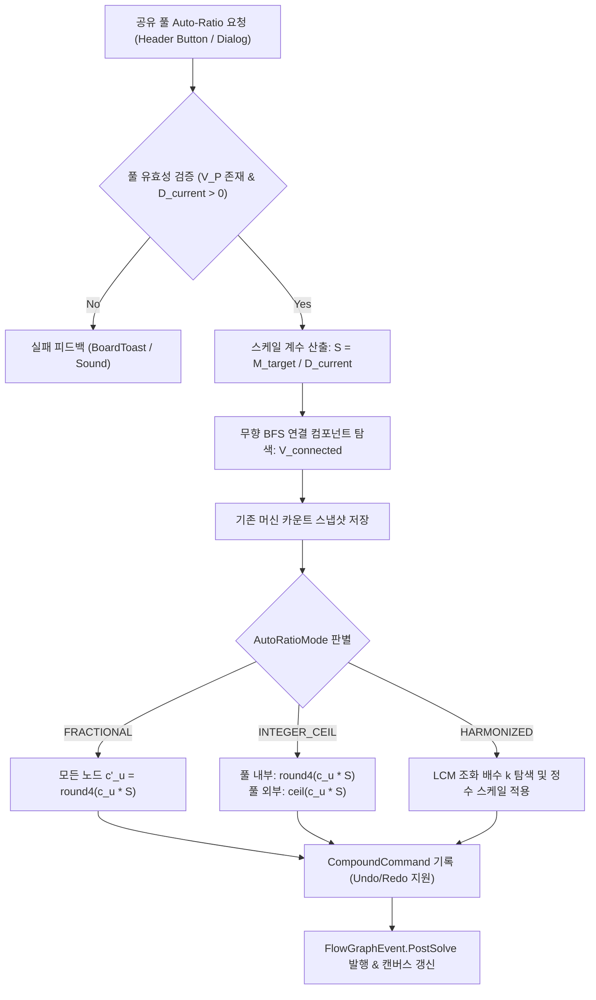

# ADR-031: 공유 기계 풀(Shared Machine Pool) 용량 기반 자동 비율 맞춤 명세
(Shared Machine Pool Capacity-Driven Auto-Ratio Architecture)

- **문서 번호**: ADR-031
- **대상 버전**: `v2.2.0-alpha.4`
- **상태**: 🟢 `IMPLEMENTED`
- **결정/완료일**: 2026-09-07
- **주관 계층**: Domain & Solver Layer (`api.model`, `api.solver`), Client GUI Layer (`client.gui.widget`, `client.gui.dialog`)

---

## 1. 개요 및 배경 (Motivation)

`GregTechCalculatorBoard`는 고가의 멀티블록 및 기계 설비를 효율적으로 운용할 수 있도록 **공유 기계 풀(Shared Machine Pool, 단축키 `Ctrl + Shift + S`)** 프레임을 제공합니다. 공유 기계 풀은 물리적 기계 1대(또는 $N$대)를 복수 레시피가 시간 분할(Time-sharing)하여 공유하도록 묶고, 내부 레시피들의 총 가동률 합계($\sum \text{Duty}_i$)와 필요 물리 기계 대수($\lceil \sum \text{Duty}_i \rceil$)를 자동 집계합니다.

그러나 기존 공정 자동 비율 계산(`FlowBalanceMatrixSolver.autoRatioFromAnchor`) 시스템은 단일 기계 노드(`RecipeNode`)만을 앵커로 삼을 수 있어 다음과 같은 한계가 존재했습니다:

1. **복수 레시피 공유 풀 기준 제약 계산 부재**:
   - 단일 노드의 생산량이나 대수에 맞춰 상/하류 기계를 역산할 수는 있으나, "복수 레시피가 포함된 공유 풀 프레임 전체의 물리적 용량 한도"를 기준점으로 삼는 계산 파이프라인이 부재했습니다.
2. **반복적인 수작업 시행착오 (Manual Twiddling)**:
   - 물리적 기계 1대를 설치하고 내부 레시피들을 100% 듀티($1.0$대) 한도 내에서 가동하고자 할 때, 플레이어는 상위 원자재 노드나 하류 완제품 노드의 수치를 수동으로 미세 조작하면서 공유 풀의 총합 듀티가 $1.0$에 수렴할 때까지 반복 대조해야 했습니다.
3. **복합 연계 공정 일괄 스케일링 필요성**:
   - 공유 풀 내부 레시피들이 외부 공정 라인과 복잡하게 연결되어 있을 때, 풀의 허용 용량(Capacity)에 맞춰 연결된 전체 서브그래프의 처리량을 일괄 비례 스케일링(Scale-to-fit)하는 수단이 요구되었습니다.

---

## 2. 세부 설계 및 결정 사항 (Architecture Decision)

### 2.1 아키텍처 다이어그램 (Architecture Workflow)

### 2.2 용량 기반 스케일링 수학 모델 (Capacity-Driven Scaling Model)

공유 기계 풀 $P$에 속한 operational 레시피 노드 집합을 $V_P = \{v_1, v_2, \dots, v_k\}$라 하고, 각 노드의 현재 기계 대수를 $c_i$라 정의합니다.

#### 1. 현재 풀 총 듀티 (Current Pool Duty)
$$D_{\text{current}} = \sum_{v_i \in V_P} c_i \quad (D_{\text{current}} > 0)$$

#### 2. 목표 스케일 계수 (Scale Factor $S$)
$$S = \frac{M_{\text{target}}}{D_{\text{current}}} \quad (M_{\text{target}} \ge 0.01)$$

#### 3. 모드별 라운딩 정책 (Rounding Policy by Mode)
* **`FRACTIONAL` (정밀 소수점 모드)**:
  모든 연결 노드: $c'_u = \text{round}_4(c_u \times S)$
* **`INTEGER_CEIL` (정수 올림 모드)**:
  * 풀 내부 노드 ($u \in V_P$): 시간 분할 운용 특성에 따라 소수점 유지: $c'_u = \text{round}_4(c_u \times S)$
  * 풀 외부 노드 ($u \notin V_P$): 실제 물리 기계 설치 대수에 맞춰 정수 올림: $c'_u = \max(1.0, \lceil c_u \times S \rceil)$
* **`HARMONIZED` (조화 정수 모드)**:
  1부터 $K_{\max}$까지 외부 노드들의 $c_u \times S \times k$가 정수에 수렴하는 최적 배수 $k$를 탐색하여 정수 조화 스케일링 적용.

### 2.3 클래스별 책임 및 구현 상세 (Component Responsibilities)

1. **`AutoRatioMode` (API Solver Layer)**:
   - 자동 비율 맞춤의 라운딩 정책(`FRACTIONAL`, `INTEGER_CEIL`, `HARMONIZED`)을 정의하는 공용 열거형.
2. **`FlowGraphTopologyAnalyzer` (API Solver Layer)**:
   - `findConnectedComponent(FlowGraph, Collection<String>)`: 무향 BFS를 통해 공유 풀 노드들과 연결된 모든 유효 서브그래프 노드 식별.
3. **`FlowBalanceMatrixSolver` & `FlowGraphSolver` (API Solver Layer)**:
   - `autoRatioFromSharedPool(FlowGraph, CanvasGroupFrame, double, AutoRatioMode)`: 풀 용량 기반 비례 스케일링 핵심 알고리즘 및 노드 카운트 일괄 갱신.
4. **`CanvasGroupFrame` & `BoardCommand` (API Model & History Layer)**:
   - `targetPoolCapacity` 필드(기본값 1.0) 및 NBT 영속화.
   - `ModifyFramePropertiesCommand` 8-파라미터 확장으로 목표 용량 변경에 대한 Undo/Redo 보장.
5. **`CanvasGroupFrameRenderer` & `CanvasFrameInteractionHandler` (Client GUI Layer)**:
   - 헤더 `[⚖]` 버튼 렌더링, 툴팁 표시 및 클릭 이벤트(일반/Alt/Shift) 처리.
   - 실행 결과 `CompoundCommand` 히스토리 스택 기록, `BoardToast` 알림 및 사운드 피드백.
6. **`FrameEditDialog` (Client GUI Layer)**:
   - 공유 기계 모드 시 `목표 기계 대수` 입력 필드 및 `[⚖ 이 용량으로 비율 맞춤]` 버튼 연동.

---

## 3. 결과 및 파급 효과 (Consequences)

### 3.1 긍정적 효과
- **공유 설비 기반 공정 역산 자동화**:
  - 단일 물리 기계를 100% 가동하거나 $N$대 병렬 풀로 운용하기 위해 수동으로 원자재/완제품 수치를 조작하던 반복 작업을 1클릭으로 완전 대체.
- **도메인 순수성 및 아키텍처 정합성 유지**:
  - `RecipeNode` 도메인 엔티티를 훼손하지 않고, 독립된 `FlowBalanceMatrixSolver`와 `FlowGraphTopologyAnalyzer`를 통해 순수 수학적 스케일링 로직을 구현.
- **완벽한 변경 가역성 (Undo/Redo)**:
  - `CompoundCommand`를 통해 비율 맞춤 전/후의 기계 대수 상태를 정확히 기록하여 즉시 되돌리기 가능.

### 3.2 단위 테스트 검증 결과
- `SharedPoolRatioTest` 6개 단위 테스트 전수 통과 (`BUILD SUCCESSFUL`):
  1. `testSharedPoolAutoRatioFractional`: 3개 레시피 공유 풀 1.0대 기준 정밀 소수점 스케일링 및 상대 비율 보존 검증.
  2. `testSharedPoolAutoRatioIntegerCeil`: 풀 내부 소수점 유지 및 풀 외부 연결 기계 정수 올림 분리 정책 검증.
  3. `testSharedPoolAutoRatioTargetCapacityTwoMachines`: 2.0대 목표 용량 스케일링 및 물리 필요 기계 2대 집계 검증.
  4. `testSharedPoolEmptyOrZeroDutyDefense`: 빈 프레임 및 중계 노드 전용 프레임에서의 방어 로직 검증.
  5. `testSharedPoolUndoRedoIntegrity`: `CompoundCommand` 기반 되돌리기/다시실행 무결성 검증.
  6. `testCanvasGroupFrameTargetCapacitySerialization`: NBT 직렬화/역직렬화 및 복제 정합성 검증.
- 기존 회귀 테스트 `SharedMachineCalculationTest`, `FractionalAutoRatioTest` 100% 통과.
- 정적 린터(`lint_agent_rules.py --diff`) 및 다국어 검증(`check_i18n.py`) 0건 위반 통과.
