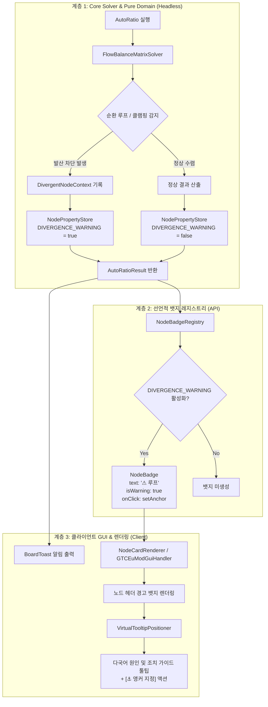

# ADR-032: 자동 비율 맞춤(Auto-Ratio) 폐순환 발산 감지, 경고 뱃지 및 상호작용형 해결 가이드 명세
*(Auto-Ratio Recirculation Divergence Detection, Node Warning Badges & Interactive Actionable Guidance Specification)*

## 1. 메타데이터 (Metadata)

* **문서 번호 (Document ID)**: `ADR-032`
* **제안 일자 (Date)**: `2026-09-07`
* **문서 상태 (Status)**: `IMPLEMENTED`
* **대상 버전 (Target Version)**: `v2.2.0-alpha.4`
* **적용 도메인 (Domain)**: Core Solver, Pure Domain Model, Client GUI / UX, Declarative Badges, i18n
* **참조 문서 (References)**:
  * [ADR-022: 폐쇄 순환 공정 자급 자원 보호 및 공급 우선 할당 명세](ADR_022_CLOSED_LOOP_RECIRCULATION_AND_SUPPLY_ALLOCATION.md)
  * [ADR-030: 노드 카드 레이아웃 바운즈 단일 출처화 및 통합 히트박스 모델 명세](ADR_030_UNIFIED_NODE_LAYOUT_BOUNDS_AND_HITBOX_MODEL.md)
  * [ADR-031: 공유 기계 풀(Shared Machine Pool) 용량 기반 자동 비율 맞춤 명세](ADR_031_SHARED_MACHINE_POOL_AUTO_RATIO.md)

---

## 2. 개요 및 배경 (Motivation & Background)

### 2.1 현상 및 배경 (Context)
Star Technology를 비롯한 대규모 복합 모드팩 환경에서는 탈황 반응(LCR $\leftrightarrow$ 전해조), 중수소/삼중수소 핵융합 재순환, 귀금속 잔재물 추출 등 **부산물이 상위 공정의 투입물로 재순환되는 폐쇄 루프(Closed Recirculation Loop)**가 필수적으로 구성됩니다.

이전 세대 솔버는 자동 비율 맞춤(Auto-Ratio) 실행 시, 외부 크래커나 루프 내부의 부분 결핍을 해소하기 위해 순환 루프 내부 기계(전기분해기 등)를 증설하고, 그 증설분이 다시 상류(LCR)로 전파되면서 매 패스마다 기계 대수가 지수적으로 복리 증폭(Exponential Runaway Loop)하는 결함이 존재했습니다.

이에 따라 솔버 레벨에서 강결합 컴포넌트(SCC) 기반의 순환 노드를 식별하여 병목 증폭 및 상류 전파를 차단하는 **순환 가드(Recirculation Guard)**가 구축되었습니다.

### 2.2 해결하려는 문제 (Problem Statement)
순환 가드가 적용됨에 따라 기계 대수의 비정상적인 폭주는 완전히 방어되었으나, 다음과 같은 **새로운 사용자 경험(UX) 상의 한계**가 발생했습니다:

1. **침묵하는 차단 (Silent Clamping & Black-Box UX)**:
   - 외부 원료 공급이 부족한 상태에서 Auto-Ratio를 실행했을 때, 순환 루프 멤버들은 증폭이 차단되어 초기 대수에 머무르게 됩니다.
   - 플레이어 입장에서는 "외부 기계에 원료가 더 필요한데 왜 기계가 증설되지 않았는가?", "자동 비율 맞춤이 고장 난 것인가?"라는 의문을 갖게 됩니다.
2. **원인과 해결책 부재**:
   - 시스템이 무엇을 감지했고(폐순환 루프 결손), 왜 멈췄으며(양성 피드백 폭주 방지), 플레이어가 인게임에서 무엇을 조치해야 하는지(외부 공급 추가 연결 또는 앵커 고정)에 대한 설명이 제공되지 않았습니다.

### 2.3 제안 목표 (Goals)
* **결정론적 발산 상태 감지**: Auto-Ratio 연산 과정에서 안전 한도 클램핑이 발생했거나, 외부 미공급 폐순환 루프에서 스케일링이 억제된 노드들을 정확히 식별하여 `AutoRatioResult`로 반환.
* **선언적 노드 경고 뱃지(`⚠`) 연동**: 억제된 기계 카드의 우측 상단에 눈에 띄는 주황색 경고 뱃지를 렌더링.
* **상세 가이드 툴팁 (Actionable Tooltip)**:
  - 1행: 경고 제목 (폐순환 루프 발산 방어됨)
  - 2행: 발산 원인 (외부 원료 공급선 결손으로 인한 증폭 억제)
  - 3행: 인게임 권장 조치 가이드 (외부 공급선 연결 또는 앵커 고정)
  - 4행: 원클릭 조치 액션 (`[⚓ 이 기계를 기준 기계로 설정]`)
* **일회성 알림 토스트 (`BoardToast`)**: 자동 맞춤 완료 시 발산 억제 노드가 감지되면 즉시 안내 토스트 노출.
* **순수 도메인 격리 및 영속화 무결성**: 솔버의 100% Headless 무결성을 보장하고, 다음 연산에서 정상 수렴 시 경고가 자동으로 해제(Auto-Clear / Self-Healing)되도록 설계.

---

## 3. 핵심 유저 스토리 (User Stories)

| 액터 (Actor) | 행동 (Action) | 기대 결과 (Expected Outcome) |
| :--- | :--- | :--- |
| **복합 공정 설계자** | 수소 재순환 탈황 공정에서 외부 수소 공급 없이 최종 정제탑을 앵커로 두고 Auto-Ratio 실행 | 기계 대수가 수백만 대로 폭주하지 않고 정상 범위로 수렴하되, 상단에 안내 토스트가 뜨고 LCR/전해조 카드에 `[⚠ 루프]` 뱃지가 표시됨 |
| **원인 규명자** | `[⚠ 루프]` 뱃지에 마우스를 호버함 | 가상 툴팁이 열리며 "외부 수소 공급이 없어 순환선만으로 추가 수요를 감당할 수 없어 증폭이 방어되었습니다"라는 명확한 원인과 2가지 해결 방안이 표시됨 |
| **신속 조작자** | 경고 뱃지를 클릭하거나 툴팁 내 `[⚓ 앵커 설정]` 안내를 확인하고 뱃지 클릭 | 해당 전해조가 즉시 앵커(Target Base)로 전환되어 금빛 테두리가 켜지고, 플레이어가 원하는 대수로 고정한 뒤 수치 균형을 맞출 수 있게 됨 |
| **공정 보완자** | 외부 수소 공급선(물 전기분해기 등)을 전해조/크래커에 연결하고 Auto-Ratio 재실행 | 모든 공정이 외부 공급선에 맞춰 완벽히 수렴하며, 이전에 켜졌던 `[⚠ 루프]` 경고 뱃지가 자동으로 완전히 사라짐 |

---

## 4. 시스템 아키텍처 명세 (Architecture Specification)

### 4.1 계층별 컴포넌트 흐름도 (Mermaid)



### 4.2 도메인 데이터 구조 (Data Models)

#### 1) `AutoRatioResult` (순수 불변 레코드)
```java
package com.gtceu.calcboard.api.solver;

import java.util.Collections;
import java.util.Set;

/**
 * Immutable execution result summary of an Auto-Ratio solver pass.
 *
 * @param totalNodesUpdated Number of machine counts mutated during the pass.
 * @param divergentNodeIds Node IDs where runaway scaling was suppressed.
 * @param clampedBySafetyLimit True if any machine hit the hard safety ceiling (100,000).
 */
public record AutoRatioResult(
        int totalNodesUpdated,
        Set<String> divergentNodeIds,
        boolean clampedBySafetyLimit
) {
    public static final AutoRatioResult EMPTY = new AutoRatioResult(0, Collections.emptySet(), false);

    public boolean hasDivergence() {
        return !divergentNodeIds.isEmpty() || clampedBySafetyLimit;
    }
}
```

#### 2) `NodeProperties` 확장 키 등록
```java
public static final NodePropertyKey<Boolean> DIVERGENCE_WARNING = register(
        NodePropertyKey.ofBoolean("divergence_warning", false)
);

public static final NodePropertyKey<String> DIVERGENCE_REASON = register(
        NodePropertyKey.ofString("divergence_reason", "")
);
```

---

## 5. 발산 감지 및 라이프사이클 알고리즘 (Algorithms & Lifecycle)

### 5.1 사전 정적 루프 이득 분석 (Pre-Solve Cycle Gain Detection)
Auto-Ratio 연산 패스를 시작하기 전($t = 0$), 위상 분석을 통해 사이클 단위의 정적 루프 이득(Loop Gain)을 검사합니다:

1. **강결합 컴포넌트(SCC) 및 단순 사이클 추출**:
   - Tarjan SCC 알고리즘으로 크기 $\ge 2$인 순환 컴포넌트와 사이클 간선 집합을 추출.
2. **사이클 단위 환원율 ($\rho_{\text{cycle}}$) 정적 산출**:
   - 사이클을 구성하는 각 유향 간선 $e_i: u \to v$에 대해 $\text{stepRatio} = \frac{\text{OutRate}(u)}{\text{InRate}(v)}$을 누적 곱셈: $\rho_{\text{cycle}} = \prod_{i} \frac{\text{OutRate}(u_i)}{\text{InRate}(v_i)}$
   - $\rho_{\text{cycle}} \ge 1.0$: 자급 또는 흑자 루프(Bayer process 등, 수렴 가능).
   - $\rho_{\text{cycle}} < 1.0$: 자원 적자 폐루프(Deficit Cycle).
3. **외부 유입선(External Feed) 결손 판정**:
   - $\rho_{\text{cycle}} < 1.0$인 적자 사이클에서, 유량 손실이 발생하는 결손 간선의 소비 포트에 대해 사이클 외부($w \notin \text{SCC}$)로부터의 공급선이 존재하는지 검사.
   - 외부 공급선이 0개라면 **사전 발산 확정(Guaranteed Divergence)**으로 판정하여 즉시 `divergenceContext`에 등록하고 경고 마킹.

### 5.2 사후 병목 클램핑 검증 (Post-Solve Unresolved Bottleneck Check)
1. **미공급 폐순환 루프 차단 (Unfed Recirculation Loop Block)**:
   - 병목 해소 패스 종료 후 순환 멤버의 미해결 결손이 잔존하는 노드를 2차 안전망으로 최종 검출.
   - 사유 코드: `recirculation_loop`
2. **안전 상한선 도달 (Hard Ceiling Clamping)**:
   - 노드 $u$의 연산 목표 대수가 `MAX_AUTO_RATIO_MACHINE_COUNT`($100,000.0$) 또는 단일 배수 $100\times$ 한계에 도달하여 수치가 클램핑된 경우.
   - 사유 코드: `safety_clamp`

### 5.3 경고 상태 라이프사이클 (State Lifecycle & Auto-Clear)
* **초기화 (Pre-Solve)**:
  - `autoRatioFromAnchor` 진입 시, 대상 그래프의 모든 노드에서 `DIVERGENCE_WARNING`을 `false`로 클리어.
* **사전 탐지 (Pre-Flight)**:
  - `detectUnfedDeficitLoops`를 통해 연산 0회차에 미공급 적자 루프 노드 선제 식별.
* **마킹 (Post-Solve)**:
  - 감지된 `divergentNodeIds`에 속한 노드들에 `DIVERGENCE_WARNING = true` 및 해당 `DIVERGENCE_REASON` 설정.
* **자동 해제 (Self-Healing)**:
  - 플레이어가 외부 원료 공급선을 추가하거나 기계를 앵커로 고정한 뒤 재실행하면, 사전 및 사후 발산 조건이 성립하지 않으므로 자연스럽게 `DIVERGENCE_WARNING`이 `false`로 유지되어 뱃지가 자동으로 소멸.

---

## 6. UI / UX 디자인 상세 (UI / UX Design Details)

### 6.1 노드 카드 헤더 경고 뱃지 와이어프레임

```text
+-------------------------------------------------------------+
| [⚡ Machine Icon]  LCR Heavy           [⚠ 루프] [⟲] [➔] [⌖] [X]|
+-------------------------------------------------------------+
| [-]  1.00  [+] [/2] [x2]                                    |
| [HV] [Std]                                                  |
| 30.0 EU/t (1A HV)                                           |
| ...                                                         |
+-------------------------------------------------------------+
```
* **뱃지 텍스트**: `⚠ 루프` (한) / `⚠ Loop` (영)
* **색상 팔레트**:
  - 배경: `0xEE3D2414` (경고용 다크 브라운-오렌지)
  - 테두리: `0xFFFB923C` (선명한 앰버-오렌지)
  - 텍스트: `0xFFFED7AA` (부드러운 밝은 오렌지)
  - 펄스 애니메이션: 가동 중단(Inactive) 붉은 테두리와 혼동되지 않도록 은은한 주황색 글로우 효과 적용.

### 6.2 상호작용형 가이드 툴팁 (Actionable Guide Tooltip)

마우스를 `[⚠ 루프]` 뱃지에 올렸을 때 [`VirtualTooltipPositioner`](file:///d:/dev-ssd/modding/minecraft/GregTechCalculatorBoard/src/main/java/com/gtceu/calcboard/client/gui/VirtualTooltipPositioner.java)를 통해 노출되는 툴팁:

```text
┌──────────────────────────────────────────────────────────┐
│ §6⚠ 폐순환 루프 발산 방어됨                            │
│ §7이 기계는 부산물이 순환되는 폐루프 공정에 속해 있어,    │
│ §7외부 수요를 감당하기 위한 무한 증폭이 방어되었습니다. │
│ ──────────────────────────────────────────────────────── │
│ §e★ 권장 조치 방안:                                     │
│ §f1. 부족한 원료(수소 등)의 외부 공급 라인을 연결하세요. │
│ §f2. 또는 이 기계를 기준 기계(Anchor)로 고정하세요.      │
│ ──────────────────────────────────────────────────────── │
│ §b[클릭]: §e⚓ 이 기계를 기준 기계(Anchor)로 즉시 설정    │
└──────────────────────────────────────────────────────────┘
```

### 6.3 뱃지 클릭 인터랙션 (`onClick`)
* `[⚠ 루프]` 뱃지를 좌클릭하면:
  1. `node.setBaseNode(true)`를 호출하여 해당 기계를 즉시 기준 기계(Anchor)로 승격.
  2. `node.getProperties().set(NodeProperties.DIVERGENCE_WARNING, false)`로 경고 해제.
  3. `BoardToast`로 알림 피드백 제공.
  4. 위젯 캐시 무효화 및 캔버스 재렌더링.

### 6.4 다국어 리소스 키 (i18n Keys)

| Key | en_us | ko_kr |
| :--- | :--- | :--- |
| `gui.gtcalcboard.node_badge.divergence_warning` | `⚠ Loop` | `⚠ 루프` |
| `gui.gtcalcboard.node_badge.divergence_title` | `Recirculation Loop Runaway Guarded` | `폐순환 루프 발산 방어됨` |
| `gui.gtcalcboard.node_badge.divergence_desc` | `This machine belongs to a closed loop. Infinite amplification was suppressed to prevent runaway scaling.` | `이 기계는 폐순환 루프에 속해 있어, 연쇄 증폭으로 인한 기계 수치 폭주가 안전하게 방어되었습니다.` |
| `gui.gtcalcboard.node_badge.divergence_hint_1` | `1. Connect an external supply line for the deficit fluid/item.` | `1. 부족한 원료에 대한 외부 공급 라인을 추가 연결하세요.` |
| `gui.gtcalcboard.node_badge.divergence_hint_2` | `2. Or pin this machine as an Anchor to fix its machine count.` | `2. 또는 이 기계를 기준 기계(Anchor)로 고정하여 대수를 수동 지정하세요.` |
| `gui.gtcalcboard.node_badge.divergence_action` | `[Click]: ⚓ Pin this machine as Anchor` | `[클릭]: ⚓ 이 기계를 기준 기계(Anchor)로 즉시 설정` |
| `message.gtcalcboard.auto_ratio_divergence_toast` | `Auto-Ratio: Suppressed loop runaway on %d machine(s). Check [⚠] badges.` | `자동 맞춤: %d개 기계에서 루프 발산이 방어되었습니다. [⚠] 배지를 확인하세요.` |

---

## 7. 대안 분석 및 결정 근거 (Alternatives & Rationale)

1. **대안 A: 단순히 에러 팝업창을 띄우고 Auto-Ratio를 중단(Rollback)하는 방식**:
   - 단점: 정상적으로 스케일링된 다른 선형 공정까지 전부 롤백되므로 플레이어의 작업 흐름이 완전히 끊김.
   - 채택 안 함: 안전하게 수렴한 기계 대수는 유지하되, 문제 기계에 뱃지를 달아주는 방식이 훨씬 유연함.
2. **대안 B: 솔버 내부에서 자동으로 가상 공급원(Virtual Infinite Supply)을 가정하는 방식**:
   - 단점: 플레이어가 실제 인게임에서 감당할 수 없는 허위 유량 수치가 계산되어 혼란을 초래함.
   - 채택 안 함.
3. **선택된 안 (ADR-032 채택)**:
   - 계산은 안전 한도 내에서 최대한 완료하고, 발산 노드에 시각적 뱃지와 원클릭 앵커 액션을 제공하여 **플레이어가 주도권을 가지고 문제를 해결하도록 지원**.
