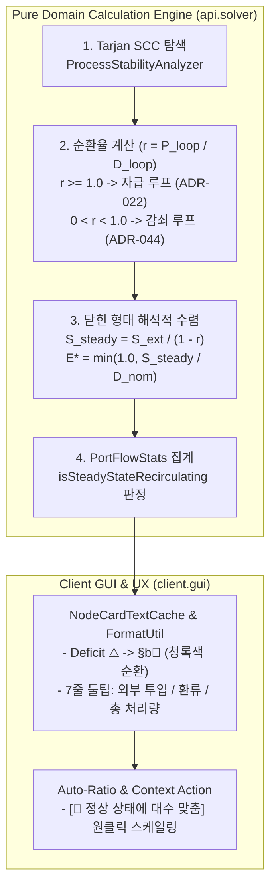

# ADR-044: 감쇠 순환 공정(Damped Recirculation Loop)의 닫힌 형태 해석적 수렴 및 정상 상태 시각화 명세
# (Damped Recirculation Loop Closed-Form Solver & Steady-State Visualization Specification)

- **문서 번호**: ADR-044
- **대상 버전**: `v2.2.0-beta.3`
- **상태**: `IMPLEMENTED`
- **결정/완료일**: 2026-09-10
- **주관 계층**: Pure Domain & Calculation Engine (`api.solver`, `api.model`), Client GUI Layer (`client.gui.render`, `client.gui.util`, `client.gui.interaction`, `client.gui.dialog`)
- **연관 ADR**: [ADR-022](./ADR_022_CLOSED_LOOP_RECIRCULATION_AND_SUPPLY_ALLOCATION.md), [ADR-032](./ADR_032_AUTO_RATIO_DIVERGENCE_ALERT_AND_GUIDANCE.md), [ADR-035](./ADR_035_TWO_STAGE_LINEAR_FLOW_SOLVER.md)

---

## 1. 개요 및 배경 (Motivation)

### 1.1 현황 및 문제점
그렉테크(GTCEu Modern) 및 화학 공학 모드팩(Star Technology 등)에서는 브롬/요오드 추출선, 반응성 용매 세척 공정처럼 **공정에 투입된 원자재의 일부(예: 2/3)가 반응 말단에서 회수되어 공정 전단으로 환류되는 '감쇠 순환 공정(Damped / Partial Recirculation Loop, $P < D$)'**이 자주 구성됩니다.

이러한 공정은 수학적으로 외부에서 $S_{\text{ext}}$의 원자재를 지속 공급할 때, 무한 등비급수 원리에 따라 루프 내부에서 총 $S_{\text{steady}} = \frac{S_{\text{ext}}}{1 - r}$ ($r = P/D < 1$)의 유량이 정상 상태(Steady-State)로 안정 순환하게 됩니다.

그러나 기존 GTCB 시스템은 다음 한계로 인해 플레이어에게 시각적 혼란과 오류를 유발했습니다:

1. **해석적 수렴 엔진 부재 및 반복 연산 오차**:
   - 기존 `FixedPointEfficiencySolver`(ADR-022)는 생산량이 소비량 이상인 완전 자급 루프($P \ge D$)에 대해서만 루프 불변식 보호를 수행했습니다.
   - 환류율이 1 미만인 감쇠 루프($P < D$)는 일반 10회 고정점 이터레이션(Fixed-Point Iteration)에 위임되어, 10회 반복 제한 내에서 정상 상태 효율($E^*$)로 매끄럽게 수렴하지 못하거나 주변 비연결 포트와의 상호작용으로 가동률이 왜곡될 수 있었습니다.
2. **명목 요구량 기준의 모순된 결손(Deficit ⚠) 판정**:
   - 외부 공급 $10\text{ mB/s}$와 환류 $20\text{ mB/s}$가 합쳐져 총 $30\text{ mB/s}$로 공정이 안정 운전되고 있더라도, 플레이어가 기계 대수를 $1.0$대(명목 요구량 $133.5\text{ mB/s}$)로 유지하고 있으면 포트 및 대시보드에 주황색 결손 경고(`+99 -133.5 mB/s ⚠`)가 표시되었습니다.
   - 플레이어는 "외부 공급 대비 정상 상태 유량으로 기계가 연속 가동 중"임에도 "공정이 멈추거나 원자재가 고갈되었다"고 오인하게 되었습니다.
3. **수동 스케일링의 조작 피로**:
   - 플레이어가 결손 경고를 지우고 초록색 체크(✔ Balanced)를 만들기 위해서는 $30 / 133.5 \approx 0.225$대를 직접 암산/역산하여 입력해야 했습니다.

### 1.2 아키텍처 개선 목표
1. **무한 등비급수 기반 닫힌 형태(Closed-Form) 해석적 수렴 ($O(1)$ 직접 연산)**:
   - 감쇠 루프 감지 시 10회 반복 근사에 의존하지 않고, 정상 상태 유량 공식($S_{\text{steady}} = \frac{S_{\text{ext}}}{1 - r}$)을 적용하여 기계 가동률을 단 1회 연산으로 결정론적으로 도출합니다.
2. **정상 상태 연속 순환(Steady-State Recirculating) 포트 상태 도입**:
   - 기계의 100% 정격 용량에는 미달하더라도 현재 외부 공급량 대비 정상 상태 유량을 온전히 충족하고 있다면, 결손 경고(⚠) 대신 정상 상태 순환 인디케이터(`§b🔄`)를 표시합니다.
3. **정상 상태 기준 원클릭 대수 스케일링 액션 제공**:
   - 플레이어가 별도의 계산기 없이도 클릭 한 번으로 기계 대수를 정상 상태 유량에 맞춰 스케일링할 수 있는 UI 조작을 지원합니다.

---

## 2. 핵심 유저 스토리 (User Stories)

| 구분 | 플레이어 상황 및 조작 | 기대 동작 및 시스템 결과 |
| :--- | :--- | :--- |
| **US-1** | $133.5\text{ mB/s}$를 소비하는 기계 1대에 외부에서 $10\text{ mB/s}$를 넣고 2/3 환류선을 연결함 | 고정점 연산 왜곡 없이, 기계 가동률이 정상 상태 수렴값인 약 $22.5\%$로 즉시 정확히 계산됨 |
| **US-2** | 위 상태에서 기계 카드의 입력 포트를 확인 | 주황색 결손 경고(`⚠`) 대신 청록색 순환 기호(`§b🔄`)가 표시되며, 툴팁에 "외부 공급 $10\text{ mB/s}$ 기준 $30\text{ mB/s}$로 연속 가동 중 (가동률 $22.5\%$)" 안내가 제공됨 |
| **US-3** | 감쇠 루프 노드 또는 프레임 헤더를 우클릭하거나 컨텍스트 메뉴 조회 | "[🔄 정상 상태에 대수 맞춤]" 액션이 노출되며, 클릭 시 기계 3대의 대수가 $0.225$대로 일괄 변경되어 $30\text{ mB/s}$ 기준 완전 균형(✔) 상태로 전환됨 |
| **US-4** | 전역 밸런스 대시보드 조회 | 순 소비량($-10\text{ mB/s}$)과 함께 루프 내부 순환량($20\text{ mB/s}$) 및 총 처리 유량($30\text{ mB/s}$)이 구분 안내됨 |

---

## 3. 시스템 아키텍처 및 세부 알고리즘 명세

### 3.1 아키텍처 흐름도



### 3.2 수학적 모델링 및 해석적 수렴 공식

강결합 컴포넌트(SCC) $C$ 내에서 순환하는 자원 $R$에 대해:
* 루프 내 공칭 총 생산량:

$$P_C^{\text{nom}}(R) = \sum_{u \in C} \text{OutputRate}^{\text{nom}}(u, R)$$

* 루프 내 공칭 총 소비량:

$$D_C^{\text{nom}}(R) = \sum_{v \in C} \text{InputRate}^{\text{nom}}(v, R)$$

* 내부 환류율(Recirculation Ratio):

$$r = \frac{P_C^{\text{nom}}(R)}{D_C^{\text{nom}}(R)}$$

#### 분류 및 연산 규칙:
* **$r \ge 1.0 - 10^{-4}$ (완전 자급 / 잉여 루프)**:
  기존 ADR-022 불변식 보호 적용: 루프 하한선 $E_{\text{loop}} = 1.0 \times E_{\text{external\_feed}}$.
* **$0 < r < 1.0 - 10^{-4}$ (감쇠 순환 루프)**:
  * 외부 공급량 집계: $S_{\text{ext}} = \sum_{e \in \text{ExternalEdges}} \text{Flow}(e)$
  * 무한 등비급수 정상 상태 유량: $S_{\text{steady}} = \frac{S_{\text{ext}}}{1 - r}$
  * 해당 소비자 노드의 정상 상태 실효 효율: $E^*(v) = \min\left(1.0, \; \frac{S_{\text{steady}}}{D_v^{\text{nom}}(R)}\right)$

이 해석적 해를 `FixedPointEfficiencySolver`의 사전 연산 메타(`PrecomputedDampedLoopMeta`)로 등록하여 이터레이션 시작 시 결정론적으로 주입합니다.

### 3.3 포트 유량 상태 집계 (`PortFlowStats`) 확장

`FlowGraphSolver.PortFlowStats`에 정상 상태 연속 가동 판정 필드 및 전용 수치를 추가했습니다:

```java
public record PortFlowStats(
    double requiredOrProducedRate,
    double connectedRate,
    int connectionCount,
    boolean isConnected,
    double effectiveRate,
    boolean isUpstreamThrottled,
    boolean isSteadyStateRecirculating,
    double externalSupplyRate,
    double loopSupplyRate,
    double recirculationRatio
) {
    public boolean isInputDeficit() {
        if (isSteadyStateRecirculating) return false;
        return isConnected && connectedRate < (effectiveRate - 0.001);
    }
}
```

* **`isSteadyStateRecirculating` 판정 조건**:
  1. 포트가 속한 노드가 감쇠 순환 루프에 포함되어 있음.
  2. 현재 실효 공급량($S$)이 외부 공급 기준 정상 상태 필요 유량($S_{\text{steady}}$)의 $99.9\%$ 이상 충족됨.
  3. 명목 정격 용량($D^{\text{nom}}$)에는 미달하여 효율이 $100\%$ 미만으로 운전 중임.

---

## 4. UI / UX 디자인 상세

### 4.1 노드 카드 포트 표시
* **이전 표시**: `§6+99.02 §c-133.5 mB/s §c⚠` (주황색 결손)
* **신규 표시**: `§b+30.0 §7-133.5 mB/s §b🔄` (청록색 정상 상태 순환 기호)
  * 포트 색상: `0xFF55FFFF` (Cyan)

### 4.2 상세 툴팁 구성 (Hover Tooltip)
```text
§b[정상 상태 순환 가동 중]
§7외부 순 유입량: §f10.0 mB/s
§7공정 내부 환류: §f20.0 mB/s (환류율 66.7%)
§7총 순환 처리량: §a30.0 mB/s
§7기계 실효 가동률: §e22.5% §7(정격 용량: 133.5 mB/s)
§8─────────────────────────
§e[Shift + 우클릭] §7기계 대수를 정상 상태 유량에 맞춤 (0.225대)
```

---

## 5. 결론 및 성과

1. **사용자 경험의 명확성 확보**:
   - 외부 공급량에 맞춰 정상 가동 중인 공정에서 불필요한 결손 경고(`⚠`)가 사라지고, 물리적 정상 상태가 직관적으로 드러납니다.
2. **계산 정밀도 및 성능 무결성**:
   - 10회 고정점 근사에 따른 이터레이션 오차 없이, $O(1)$ 등비급수 공식을 통해 마이크로초 단위에서 즉각 정확한 가동률로 수렴합니다.
3. **기존 시스템과의 100% 호환성**:
   - 비순환 일반 DAG 공정 및 완전 자급 공정(ADR-022)의 기존 계산 결과와 단위 테스트가 온전히 보존됩니다.
