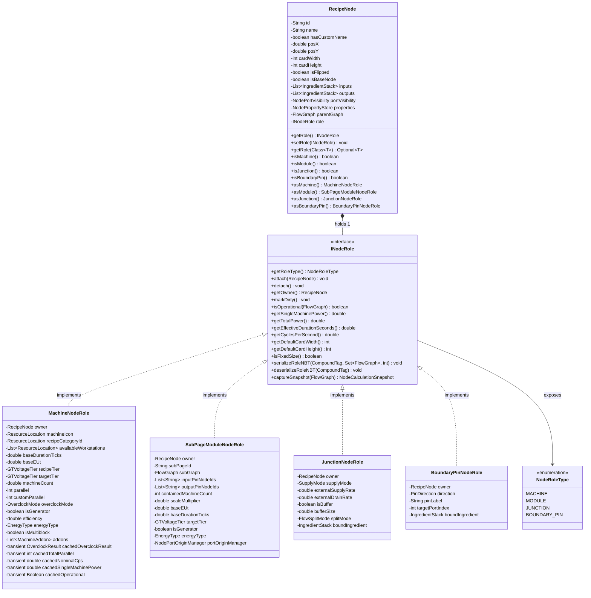
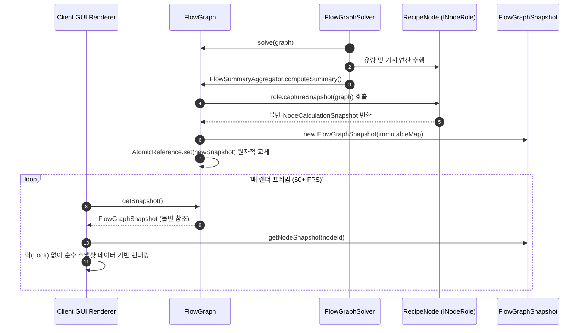

# ADR-045: RecipeNode 역할 컴포지션 분해 및 불변 계산 스냅샷 아키텍처
(RecipeNode Role Composition Decomposition & Immutable Calculation Snapshot Architecture)

- **문서 번호**: ADR-045
- **대상 버전**: `v2.2.1`
- **상태**: 🟢 `IMPLEMENTED`
- **결정/완료일**: 2026-09-13
- **주관 계층**: Pure Domain Layer (`api.model`, `api.model.role`), Storage Layer (`api.storage`), Solver Layer (`api.solver`), Client GUI Layer (`client.gui.*`)

---

## 1. 개요 및 배경 (Motivation)

### 1.1 현황 분석 및 문제점
`GregTech Calculator Board`의 핵심 도메인 모델인 [`RecipeNode.java`](../../src/main/java/com/gtceu/calcboard/api/model/RecipeNode.java)는 과거 리팩토링([ADR-004](ADR_004_CLEAN_ARCHITECTURE_AND_DOMAIN_DECOMPOSITION.md), [ADR-040](ADR_040_RUNTIME_CONCURRENCY_REFLECTION_AND_GOD_CLASS_DECOMPOSITION.md))을 통해 정적 헬퍼 유틸리티로 일부 로직을 분리하였으나, 여전히 단일 클래스에 680줄 이상의 코드와 40여 개의 필드가 집중되어 있었습니다.

캔버스 상에서 상이한 생명주기와 동작 특성을 갖는 4가지 노드 유형이 단일 클래스에 공존하면서 다음과 같은 구조적 한계가 존재했습니다:
1. **더미 필드 및 불필요한 메모리 할당**: 정션 노드(`isReroute = true`) 및 경계 핀 노드는 기계 연산과 무관함에도 오버클럭, 병렬, 전압 티어, 하드웨어 애드온 등 30개 이상의 기계 전용 필드를 메모리에 강제 할당받았습니다.
2. **불리언 플래그 기반 제어 흐름 분기**: `isReroute`, `isModule` 등의 플래그가 개별 필드로 분산되어 솔버, 렌더러, 직렬화기 곳곳에서 `if (node.isReroute()) ... else if (node.isModule()) ...` 형태의 제어 흐름 분기가 반복되었습니다.
3. **가변 transient 캐시와 동시성 취약성**: 7개의 transient 캐시가 노드 내부에 가변 상태로 유지되어, 백그라운드 솔버 스레드와 클라이언트 GUI 렌더링 스레드가 동일 인스턴스를 동시 참조할 때 화면 깜빡임 및 데이터 레이스 위험이 상존했습니다.

### 1.2 핵심 개선 목표
1. **역할 컴포지션(Role Composition) 분해**: `RecipeNode`는 캔버스 상의 순수 그래프 엔티티(식별자, 좌표, 입출력 포트 스트림, 속성 저장소, 부모 그래프)로 슬림화하고, 고유 동작은 `INodeRole` 인터페이스 기반의 컴포넌트로 분리합니다.
2. **NBT 100% 무손실 역호환성 보장**: 기존 월드 세이브 데이터 및 청사진(Blueprint) NBT 구조와의 1:1 무손실 역호환성을 보장하기 위해 듀얼 라이트(Dual-Write) 및 4단계 폴백 역직렬화를 구현합니다.
3. **불변 계산 스냅샷(`NodeCalculationSnapshot`) 연계**: 연산 결과 데이터를 불변 레코드로 캡처하여 UI 렌더링과 솔버 간의 스레드 안전성(Lock-Free Rendering)을 확보합니다.
4. **점진적 마이그레이션 지원**: 기존 코드베이스(UI, 솔버, 호환성 계층)의 컴파일 브레이킹을 방지하기 위해 `RecipeNode`에 위임 Facade 메서드를 보존합니다.

---

## 2. 세부 설계 및 결정 사항 (Architecture Decision)

### 2.1 역할 컴포지션 객체 모델

### 2.2 핵심 컴포넌트별 책임 분리 명세

1. **`RecipeNode` (Canonical Graph Entity)**:
   - 캔버스 기하 정보(`posX`, `posY`, `cardWidth`, `cardHeight`, `isFlipped`), 포트 스트림(`inputs`, `outputs`, `portVisibility`), 확장 속성(`properties`), 부모 그래프(`parentGraph`), 역할 컴포넌트(`role`)만을 보유하는 경량 엔티티로 전환되었습니다.
   - 역할 수명주기 바인딩(`attach`, `detach`) 및 안전한 다운캐스팅 헬퍼(`asMachine()`, `asModule()`, `asJunction()`, `asBoundaryPin()`)를 제공합니다.
   - 기존 외부 호출자와의 바이너리 호환성을 위해 위임 Facade 메서드를 유지하되 내부 상태는 해당 `INodeRole`로 라우팅합니다.

2. **`MachineNodeRole`**:
   - 일반 제작 기계, 발전기, 대형 터빈, EBF 등의 물리 계산과 오버클럭 상태를 캡슐화합니다.
   - 7개의 transient 연산 캐시를 클래스 내부로 격리하여 다른 역할 노드에 불필요한 메모리가 할당되지 않도록 합니다.

3. **`SubPageModuleNodeRole`**:
   - 1:1 전용 서브페이지(`subPageId`, `subGraph`), 경계 핀 식별자 목록, 집계 전력 및 스케일 배율(`scaleMultiplier`)을 관리합니다.
   - 메인 모듈 카드 배율 변경 시 서브페이지 내부로 스케일링을 전파하며, 재귀적 그래프 직렬화를 지원합니다.

4. **`JunctionNodeRole`**:
   - 배선 정리용 리라우트, 외부 공급원, 보이드 싱크(`SupplyMode`), 완충 버퍼 및 균등/우선순위 분할(`splitMode`)을 전담합니다.
   - 고정 치수(`32x32`, `isFixedSize() = true`)를 반환하며, 기계 관련 연산을 배제하고 상시 가동 상태를 유지합니다.

5. **`BoundaryPinNodeRole`**:
   - 서브페이지 경계 입/출력 핀의 방향(`PinDirection`), 핀 라벨, 포트 인덱스 및 바인딩 재료를 관리합니다.
   - 고정 치수(`32x32`, `isFixedSize() = true`)를 반환합니다.
   - 기존 `BoundaryPinNode`, `ModuleInputPin`, `ModuleOutputPin`은 호환성을 위해 유지하되 내부 상태를 `BoundaryPinNodeRole`로 위임하여 듀얼 소스 오브 트루스를 방지합니다.

### 2.3 불변 계산 스냅샷 및 락-프리 렌더링 파이프라인

- `FlowGraph`는 `AtomicReference<FlowGraphSnapshot>`을 유지하며, 솔버 연산 완료 시 단 1회의 원자적 포인터 교체로 스냅샷을 갱신합니다.
- GUI 렌더러(`NodeCardRenderer`, `NodeCardTextCache`)는 뮤텍스 락 없이 불변 스냅샷 인스턴스를 읽어 렌더링하므로 연산 도중 캐시 무효화로 인한 화면 깜빡임이 발생하지 않습니다.

### 2.4 NBT 무손실 하위 호환성 직렬화 전략
- **직렬화 (Dual-Write)**: 신규 포맷 식별 태그(`roleType = "MACHINE" | "MODULE" | "JUNCTION" | "BOUNDARY_PIN"`, `roleData = CompoundTag`)를 기록함과 동시에, 구버전 클라이언트/서버와의 호환을 위해 레거시 태그(`isReroute`, `isModule`, `machineCount`, `pinType` 등)를 함께 기록합니다.
- **역직렬화 (4-Tier Fallback)**:
  1. `roleType` 태그가 존재할 경우 해당 역할 팩토리를 통해 역직렬화.
  2. `pinType` 태그 감지 시 `BoundaryPinNodeRole`로 복원.
  3. `isReroute = true` 감지 시 `JunctionNodeRole`로 복원.
  4. `isModule = true` 감지 시 `SubPageModuleNodeRole`로 복원.
  5. 기본 폴백으로 `MachineNodeRole`로 복원.

---

## 3. 결과 및 파급 효과 (Consequences)

### 3.1 긍정적 효과
1. **메모리 풋프린트 절감**: 대규모 캔버스에서 다수의 정션 노드 및 경계 핀 노드가 생성될 때 기계 전용 필드 30여 개 및 transient 캐시가 할당되지 않아 노드당 메모리 점유가 대폭 감소했습니다.
2. **동시성 안전성 확보**: 백그라운드 솔버 연산 스레드와 GUI 렌더링 스레드가 불변 스냅샷(`FlowGraphSnapshot`, `NodeCalculationSnapshot`)을 매개로 격리되어 데이터 레이스가 차단되었습니다.
3. **단일 책임 원칙(SRP) 확립**: 기계, 모듈, 정션, 핀 노드의 고유 로직이 각 클래스로 분리되어 코드 탐색성과 확장성이 향상되었습니다.
4. **100% 무손실 호환성 유지**: 기존 월드 세이브 및 청사진 NBT 파일이 데이터 유실 없이 정상 복원됨을 검증했습니다.

### 3.2 단위 테스트 검증 결과
- **역할 컴포지션 전용 검증 (`RecipeNodeCompositionTest`)**:
  - `testDefaultRoleIsMachine`: 기본 노드 생성 시 `MachineNodeRole` 정상 장착 검증.
  - `testCreateRerouteIsJunction`: 리라우트 생성 시 `JunctionNodeRole` 및 `32x32` 고정 크기 검증.
  - `testSetModuleRole`: 모듈 전환 시 `SubPageModuleNodeRole` 정상 장착 검증.
  - `testBoundaryPinNodeRole`: 경계 핀 생성 시 `BoundaryPinNodeRole` 정상 장착 검증.
  - `testRoleSwitching`: 기계 $\leftrightarrow$ 정션 $\leftrightarrow$ 모듈 동적 역할 전환 검증.
  - `testLegacyNbtFallbackLoading`: 구버전 레거시 NBT 역직렬화 4단계 폴백 체인 검증.
  - `testRoleNbtDualWriteRoundtrip`: 신구 태그 동시 기록 및 복원 무결성 검증.
  - `testSnapshotImmutability`: 계산 스냅샷의 불변성 및 방어적 복사 검증.
- **전체 테스트 스위트 회귀 검증**:
  - `MultiblockBOMTest`, `CalculationTest`, `JunctionEqualAndPrioritySplitTest`, `CanvasGroupFrameTest`, `JunctionModuleCompressRegressionTest`, `SysteamsBoilerTest`를 포함한 전체 **1,086개 단위 테스트 100% 통과 (`BUILD SUCCESSFUL`)**.
