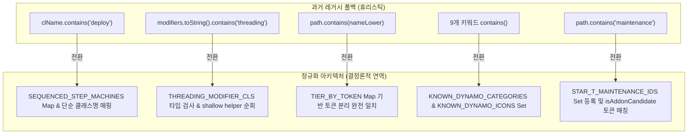

# ADR-047: 외부 모드 호환 계층 레거시 폴백 제거 및 Rule 5 결정론적 정규화
(Compat Layer Legacy Fallback Elimination & Rule 5 Deterministic Exact-Match Normalization)

- **문서 번호**: ADR-047
- **대상 버전**: `v2.2.1`
- **상태**: 🟢 `IMPLEMENTED`
- **결정/완료일**: 2026-09-13
- **주관 계층**: Mod Compatibility Layer (`compat.create`, `compat.gtceu`, `compat.thermal`, `compat.start`, `compat.systeams`), Pure Domain Catalog (`api.catalog`)

---

## 1. 개요 및 배경 (Motivation)

### 1.1 현황 분석 및 문제점
`GregTech Calculator Board`는 [`.agents/AGENTS.md`](../../.agents/AGENTS.md)의 **Rule 5 (Addon & Spec Deductive Analysis Policy)**에 따라 아이템 이름이나 ID 경로 문자열의 부분 일치(`contains`)를 통한 휴리스틱 추론을 금지하고 있습니다.

런타임 주 경로는 공식 API, 런타임 리플렉션, 및 결정론적 NBT 직접 검사를 준수하고 있으나, 오프라인 테스트 환경이나 과거 버전(`v2.0`~`v2.1`)에서 작성된 5개 레거시 폴백(Fallback) 경로에 문자열 `contains` 검사가 잔존하고 있었습니다:
1. `EnergyHatchHelper`: `path.contains(nameLower)` 부분 일치 검사로 인해 `device`, `developer` 등 특정 단어가 포함된 경로가 `EV` 티어로 오인식되는 결함 위험.
2. `ThermalAugmentHelper`: `node.getName().contains("fuel")` 등 9개 키워드 `contains` 휴리스틱으로 인해 이름에 "fuel"이 포함된 일반 공정 기계가 다이내모로 오인식되는 위험.
3. `CreateSequencedRecipeExtractor`: `clName.contains("deploy")`, `clName.contains("fill")` 등 클래스명 및 경로 문자열 부분 일치 의존.
4. `MultiblockMachineInspector`: `modifiers.toString().toLowerCase().contains("threading_machine")`과 같이 객체 문자열 변환 후 부분 일치 검사.
5. `StarTAddonCrawler` 및 `SysteamsRecipeHandler`: `path.contains("maintenance")`, `cleaned.contains("stirling")` 부분 일치 의존.

### 1.2 핵심 개선 목표
1. 5개 대상 컴포넌트의 문자열 `contains` 휴리스틱을 완전 제거합니다.
2. `ResourceLocation` 기반의 완전 일치 테이블(`Set<ResourceLocation>`, `Map<ResourceLocation, T>`) 및 언더스코어 토큰 분리(`split("[._/-]")`) 완전 일치 검사로 100% 전환합니다.
3. Create 클래스의 직접 임포트 없이 클래스 단순 이름(Simple Name) 및 `RecipeSerializer` ID 매핑 테이블을 사용하여 헤드리스 격리를 보장합니다.

---

## 2. 세부 설계 및 결정 사항 (Architecture Decision)

### 2.1 5대 컴포넌트 정규화 구조

### 2.2 컴포넌트별 상세 변경 내역

#### 1. `EnergyHatchHelper`
- `TIER_BY_TOKEN` 정적 불변 맵을 정의하여 전압 티어 문자열을 토큰 단위로 완전 일치 검색합니다.
- `DISQUALIFIED_TOKENS` 및 `isQualifiedHatchPath`를 도입하여 언더스코어/슬래시/하이픈 토큰 단위로 해치 여부를 판별합니다.
- "developer", "receiver" 등 "ev"를 부분 문자열로 포함하는 아이템이 EV 티어로 잘못 인식되지 않도록 보장합니다.

#### 2. `ThermalAugmentHelper`
- `KNOWN_DYNAMO_CATEGORIES` 및 `KNOWN_DYNAMO_ICONS` 불변 `Set<ResourceLocation>`을 정의하여 등록된 다이내모 카테고리/아이콘에 대해서만 완전 일치 검사를 수행합니다.
- `node.getName().contains("fuel")` 등 임의의 문자열 부분 일치 검사를 완전 제거합니다.

#### 3. `CreateSequencedRecipeExtractor`
- Create 모드 클래스를 직접 임포트하지 않고 `STEP_CLASS_SIMPLE_NAME_MACHINES` 맵 및 `RecipeSerializer`의 `ResourceLocation` 매핑 테이블(`SEQUENCED_STEP_MACHINES`)을 통해 기계 아이콘을 결정론적으로 도출합니다.

#### 4. `MultiblockMachineInspector`
- `modifiers.toString().toLowerCase().contains(...)` 검사를 폐기하고, 리플렉션 캐싱된 `THREADING_MODIFIER_CLS` 및 클래스 단순 이름을 검사하는 `isThreadingModifier(Object modifier)`와 shallow helper 순회 메서드로 전환했습니다.

#### 5. `StarTAddonCrawler` & `SysteamsRecipeHandler`
- `STAR_T_MAINTENANCE_IDS` 불변 `Set<ResourceLocation>`을 통해 등록된 유지보수 해치 ID에 대해서만 완전 일치 검사를 수행합니다.
- `SysteamsRecipeHandler`의 `cleaned.contains("stirling")`을 `"stirling".equals(cleaned)` 완전 일치로 전환했습니다.

---

## 3. 결과 및 파급 효과 (Consequences)

### 3.1 긍정적 효과
- **결정론적 무결성**: 모드팩 커스텀 아이템, 이름 변경, 다국어 환경에서도 부분 문자열 간섭으로 인한 오작동 위험을 원천 해소했습니다.
- **클린 코드 및 SRP 준수**: 제어 흐름 중첩을 1~2 Depth로 유지하고, 단일 책임을 갖는 간결한 헬퍼 메서드로 분리했습니다.
- **헤드리스 안전성**: Create 등의 외부 클래스를 직접 임포트하지 않아 컴파일 타임 의존성 및 런타임 클래스로딩 안전성을 확보했습니다.

### 3.2 단위 테스트 검증
- [`RFC047ExactMatchNormalizationTest.java`](../../src/test/java/com/gtceu/calcboard/compat/RFC047ExactMatchNormalizationTest.java): 5대 컴포넌트의 결정론적 완전 일치 동작 및 오인식 방지 검증 완료.
- 기존 단위 테스트 전수 통과: `EnergyHatchHelperTest`, `MachineAddonTest`, `SysteamsBoilerTest` 등 전체 호환성 스위트 100% 정상 통과.
