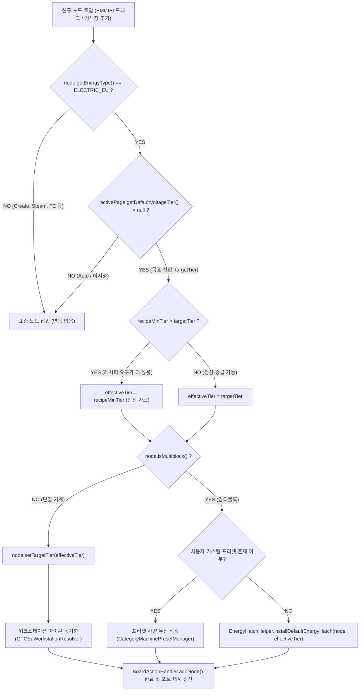
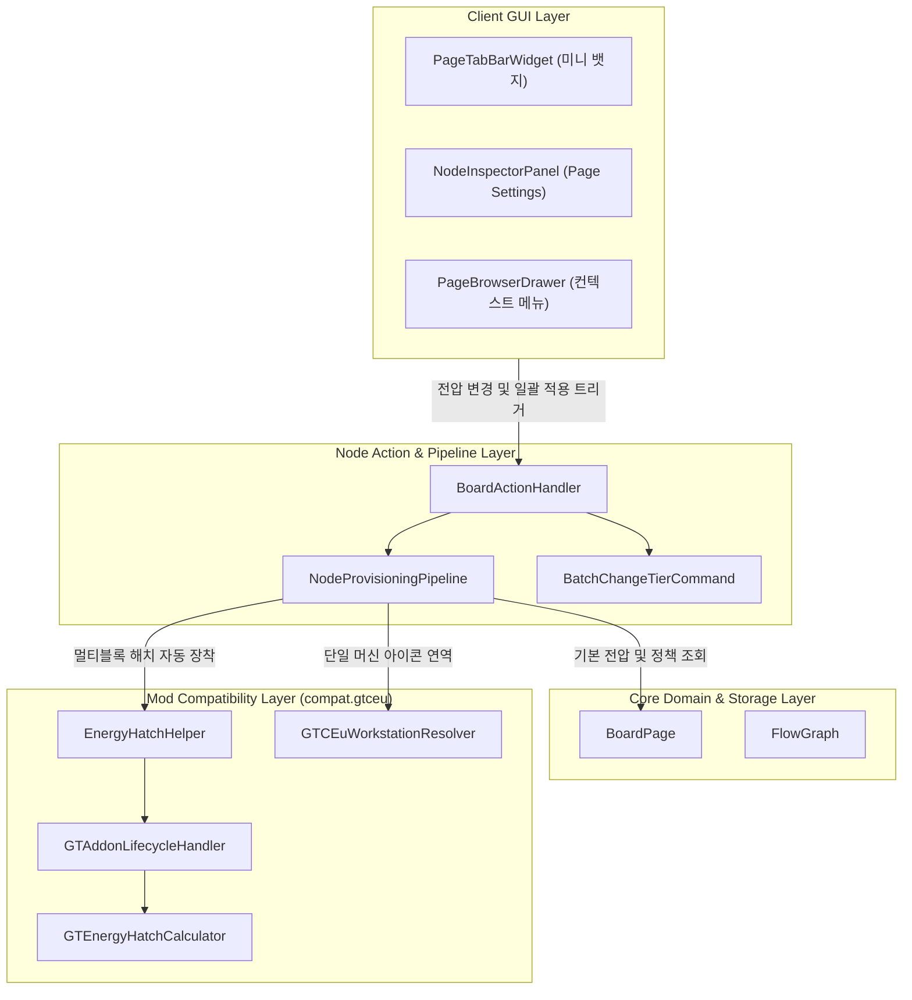

# ADR-048: 페이지별 목표 전압 티어 및 멀티블록 에너지 해치 자동 프로비저닝 명세
(Page Target Voltage Tier & Multiblock Energy Hatch Auto-Provisioning Specification)

- **문서 번호**: ADR-048
- **대상 버전**: `v2.2.1`
- **상태**: `IMPLEMENTED`
- **결정/완료일**: 2026-09-13
- **주관 계층**:
  - Core Domain & Storage Layer (`api.storage.BoardPage`, `api.model.FlowGraph`)
  - Node Insertion & Action Pipeline Layer (`client.gui.action.BoardActionHandler`, `client.gui.action.NodeProvisioningPipeline`)
  - Machine Addon & Mod Adapter Layer (`compat.gtceu.helper.EnergyHatchHelper`, `compat.gtceu.handler.GTAddonLifecycleHandler`)
  - Client GUI & Interaction Layer (`client.gui.widget.PageTabBarWidget`, `client.gui.widget.NodeInspectorPanel`, `client.gui.widget.PageBrowserDrawer`)

---

## 1. 개요 및 배경 (Motivation)

### 1.1 현황 분석 및 문제점
GregTech Calculator Board는 마인크래프트 내에서 다중 페이지(탭/시트) 단위로 독립적인 공정 흐름을 설계할 수 있는 기능을 제공합니다. 플레이어들은 실제 게임 플레이 시 공정의 성격과 시대(Tier)에 따라 시트(페이지)를 분할하여 관리합니다 (예: "LV 원목 건식 증류", "EV 폴리에틸렌 화학 공정", "IV 티타늄 제련 라인").

기존 구현에서는 레시피 노드를 캔버스에 추가할 때 다음 문제가 발생했습니다:
1. **반복적인 미세 조작 피로**:
   - 고티어(EV, IV, LuV 등) 공정 라인을 설계할 때, 레시피를 보드에 추가할 때마다 노드 컨트롤 뱃지 위에서 마우스 휠을 반복 스크롤하여 목표 전압까지 올려야 했습니다.
2. **멀티블록 기계의 전력 해치 장착 병목**:
   - 단일 기계는 `targetTier` 변경으로 승급되지만, 전기 고로(EBF)나 대형 화학 반응기(LCR) 등 멀티블록 기계는 장착된 에너지 해치(`GTEnergyHatchAddon`)에 의해 전압이 고정(`tier_locked_by_energy_hatch`)됩니다.
   - 멀티블록 노드가 생성되면 에너지 해치가 누락되거나 최소 티어로 생성되어, 매번 애드온 다이얼로그를 열고 해치를 찾아 장착하는 수동 조작이 필요했습니다.
3. **페이지 단위 목표 전압 컨텍스트 부재**:
   - 시트 단위로 "이 시트는 EV 규격 라인이다"라는 페이지 수준의 정책(Context)을 선언할 방법이 없어, 노드 단위 개별 조작에 의존했습니다.

### 1.2 설계 목표
1. **페이지 단위 목표 전압 선언 (`BoardPage.defaultVoltageTier`)**:
   - 각 페이지에 기본 목표 전압 티어(`GTVoltageTier`, 기본값 `null` = Auto) 및 멀티블록 에너지 해치 자동 장착 여부(`autoEquipEnergyHatches`, 기본값 `true`)를 도입하여 완전한 하위 호환성을 유지합니다.
2. **단일 기계 및 멀티블록 통합 자동 프로비저닝 (`NodeProvisioningPipeline`)**:
   - 단일 기계: 페이지 목표 전압으로 자동 오버클록 및 해당 티어 워크스테이션 아이콘 동기화.
   - 멀티블록 기계: 페이지 목표 전압에 부합하는 정규 1x 에너지 해치 자동 장착.
3. **결정론적 안전 가드**:
   - 레시피의 최소 요구 전압이 페이지 목표 전압보다 높은 경우 다운그레이드를 방지하고 레시피 최소 요구 조건을 보존합니다.
   - 비전기 기계(Create 회전 운동, 스팀 기계, FE, 바닐라 등)는 파이프라인에서 완전히 격리합니다.
4. **기존 노드 일괄 승급 트랜잭션 (`BatchChangeTierCommand`)**:
   - 페이지 내 이미 배치된 노드들을 단일 클릭으로 현재 페이지 전압에 맞추어 일괄 승급/교체하고 원자적 Undo/Redo를 지원합니다.
5. **시각적 비침투성 UI**:
   - 탭 바에는 명시적 설정 시에만 미니 뱃지(`[⚡ EV]`)를 표시하고, 빈 캔버스 선택 시 우측 인스펙터에 페이지 설정 패널을 제공합니다.

---

## 2. 세부 설계 및 결정 사항 (Architecture Decision)

### 2.1 자동 프로비저닝 파이프라인 흐름도

### 2.2 컴포넌트별 책임 분리

---

## 3. 상세 구현 명세 (Implementation Details)

### 3.1 도메인 모델 확장 (`BoardPage`)
- `defaultVoltageTier` (`GTVoltageTier`, 기본값 `null`): 페이지의 기본 목표 전압.
- `autoEquipEnergyHatches` (`boolean`, 기본값 `true`): 멀티블록 기계 추가 시 목표 전압 에너지 해치 자동 장착 여부.
- `serializeNBT` 및 `deserializeNBT`: NBT 직렬화/역직렬화 및 `copy()` 복제 구현.

### 3.2 멀티블록 에너지 해치 자동 프로비저닝 (`EnergyHatchHelper`)
- `getDefaultHatchIdForTier(GTVoltageTier tier)`: 티어별 1x 정규 에너지 해치 리소스 식별자(`gtceu:<tier>_energy_hatch`) 매핑 및 `STATS_CACHE` 기반 결정론적 폴백.
- `installDefaultEnergyHatch(RecipeNode node, GTVoltageTier targetTier)`:
  - 기존 에너지 해치 제거 후 해당 티어의 1A 해치 1개 장착.
  - `GTAddonLifecycleHandler.onAddonInstalled` 호출을 통해 노드의 전압 락 갱신.

### 3.3 노드 프로비저닝 파이프라인 (`NodeProvisioningPipeline`)
- `provision(RecipeNode node, BoardPage page)`:
  - 전기 EU 기계가 아니거나 페이지가 null/Auto인 경우 즉시 통과.
  - 레시피 최소 티어와 페이지 목표 티어 중 높은 티어를 `effectiveTier`로 결정.
  - 단일 기계: `setTargetTier` 및 워크스테이션 아이콘 동기화.
  - 멀티블록 기계: 커스텀 프리셋이 없으며 `autoEquipEnergyHatches`가 활성화된 경우 정규 해치 자동 장착.

### 3.4 원자적 일괄 변경 커맨드 (`BatchChangeTierCommand`)
- 대상 노드 필터링:
  - 단일 기계: EU 전기 기계이면서 현재 티어가 목표 티어와 다른 노드.
  - 멀티블록: 1x/2x 일반 에너지 해치를 장착 중이거나 해치가 없는 기계 (특수 해치인 레이저/서브스테이션/4A/16A 등은 보존 및 제외).
- `NodeTierSnapshot`: 이전 티어, 머신 아이콘, 애드온 목록을 보존하여 `undo()` 시 완벽 복원. 애드온 복원 후 티어 및 전압 락 재동기화 순서 보장.

### 3.5 UI 및 인터랙션 통합
- `PageTabBarWidget`:
  - 목표 전압 설정 시 탭 이름 우측에 `[⚡ EV]` 형태의 미니 뱃지 표시.
  - 뱃지 좌클릭 또는 마우스 휠 스크롤로 전압 티어 순환 변경 (`Auto` $\rightarrow$ `ULV` $\rightarrow$ ... $\rightarrow$ `MAX` $\rightarrow$ `Auto`).
  - 뱃지 우클릭 시 페이지 전환 및 인스펙터의 페이지 설정 패널 오픈.
- `CanvasIdleState`:
  - Shift 키 없이 빈 캔버스 클릭 시 우측 인스펙터를 `PageSettings` 모드로 전환.
- `NodeInspectorPanel`:
  - `PageSettings` 모드 지원: 페이지 이름/폴더, 4x4 전압 티어 선택 칩 그리드, 멀티블록 해치 자동 장착 토글, 기존 노드 일괄 적용 버튼 제공.
- `PageBrowserDrawer`:
  - 페이지 우클릭 컨텍스트 메뉴에 페이지 설정 열기 항목 추가.

---

## 4. 결과 및 파급 효과 (Consequences)

### 4.1 긍정적 효과
- **공정 시트 작성 효율 극대화**: 고티어 공정 설계 시 노드마다 반복하던 마우스 휠 스크롤 및 멀티블록 애드온 설정 반복 작업이 완전히 제거되었습니다.
- **도메인 무결성 및 안전성**: 레시피의 최소 요구 전압이 더 높은 경우 안전 가드가 작동하여 공정 결손이 발생하지 않으며, Undo/Redo를 통해 일괄 변경을 안전하게 되돌릴 수 있습니다.
- **모드 격리**: Create, 스팀, FE 등 비전기 기계는 전압 파이프라인에서 완전히 격리되어 기존 동작이 100% 보존됩니다.

### 4.2 단위 테스트 검증 기록
- `PageTargetVoltageAndBatchTierTest.java`:
  1. `testBoardPageTargetVoltageSerializationAndCopy`: NBT 직렬화, 역직렬화, 기본값 호환성, copy() 무결성 검증.
  2. `testNodeProvisioningPipelineSingleBlock`: 단일 기계 목표 전압 승급 및 안전 가드(다운그레이드 방지) 검증.
  3. `testNodeProvisioningPipelineMultiblock`: 멀티블록 1x 정규 에너지 해치 자동 장착 및 전압 락 동기화 검증.
  4. `testBatchChangeTierCommandUndoRedo`: 기존 노드 일괄 승급, 특수 해치 보존, 원자적 Undo/Redo 상태 복원 검증.
- 회귀 테스트: `com.gtceu.calcboard.api.storage.*`, `MultiblockEnergyHatchLockTest`, `ArchitectureTest` 전원 통과.
