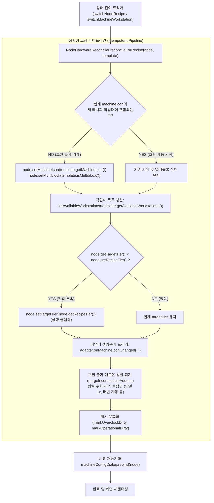

# ADR-049: 기계 및 레시피 변경 시 하드웨어 정합성 조정자 및 반응형 UI 동기화 명세
(Machine & Recipe Transition Hardware Reconciler & Reactive UI Synchronization Specification)

- **문서 번호**: ADR-049
- **대상 버전**: `v2.2.1`
- **상태**: `IMPLEMENTED`
- **결정/완료일**: 2026-09-13
- **주관 계층**:
  - Core Domain Layer (`api.model.RecipeNode`, `api.model.FlowGraph`, `api.model.NodeHardwareReconciler`)
  - Command & History Layer (`api.history.command.SwitchRecipeCommand`, `api.history.command.SetMachineIconCommand`)
  - Mod Adapter SPI Layer (`api.spi.IModAdapter`, `compat.gtceu`, `compat.create`, `compat.thermal`)
  - Client GUI Layer (`client.gui.dialog.MachineConfigDialog`, `client.gui.action.BoardActionHandler`)

---

## 1. 개요 및 배경 (Motivation)

### 1.1 현황 및 당면 과제
GregTech Calculator Board는 캔버스에 배치된 레시피 노드를 유연하게 조작할 수 있는 두 가지 핵심 변경 경로를 제공합니다:
1. **같은 레시피 내 기계 변경 (`switchMachineWorkstation`)**: 동일한 공정을 수행하는 단일블록 기계와 멀티블록 기계 간의 전환 (예: 단일 화학 반응기 $\leftrightarrow$ 대형 화학 반응기), 혹은 티어별 단일 기계 교체.
2. **레시피 변경 (`switchNodeRecipe`)**: 배선과 위치를 유지한 채 노드가 수행하는 공정 레시피 자체를 교체 (예: 온실 참나무 레시피 $\rightarrow$ 자작나무 레시피).

기존 구현에서는 레시피 전환 시 입출력 포트와 소요 시간, 기본 전력 등 7가지 필드만 덮어쓰고, 기계 아이콘(`machineIcon`), 멀티블록 여부(`isMultiblock`), 목표 티어(`targetTier`), 장착된 애드온 목록(`addons`)을 갱신하지 않아 비호환 애드온 잔존(예: EBF 코일이 달린 조합대 노드) 및 전압 부족 현상이 발생했습니다. 또한 `SwitchRecipeCommand` 스냅샷에 하드웨어 상태가 포함되지 않아 Undo/Redo 시 이전 상태가 온전히 복원되지 않았으며, `MachineConfigDialog` 내부의 클로저 캡처로 인해 기계 전환 후 병렬 입력창 및 카테고리 탭이 과거 상태에 고착되는 문제가 존재했습니다.

### 1.2 설계 목표
1. **Reconciler 패턴 기반 도메인 정합성 보장 (`NodeHardwareReconciler`)**:
   - 기계 변경 또는 레시피 변경 시 기계 호환성, 티어 클램핑, 애드온 유효성, 병렬 수치를 항상 유효한 상태로 수렴시키는 멱등성(Idempotent) 조정 파이프라인 구축.
2. **Memento 패턴 완성을 통한 원자적 Undo/Redo**:
   - `SwitchRecipeCommand.RecipeSnapshot`에 하드웨어 사양(기계, 티어, 멀티블록, 애드온, 프로퍼티)을 모두 캡슐화하여 100% 무손실 상태 복원 보장.
3. **단일 재바인딩 진입점 기반 UI 동기화 (`rebind`)**:
   - `MachineConfigDialog`의 초기화 로직을 `rebind(RecipeNode node)`로 일원화하고, 하위 모달 복귀 및 커맨드 실행 시 즉각 재바인딩을 호출하여 화면 고착 차단.
4. **모드 어댑터 생명주기 훅 확장 (`onAttach` / `onDetach`)**:
   - 모드 전환 시 이전 모드의 리소스를 안전하게 해제하고 새 모드의 기본값을 주입하는 OCP 준수 SPI 구축.

---

## 2. 세부 설계 및 결정 사항 (Architecture Decision)

### 2.1 하드웨어 정합성 조정 파이프라인 (`NodeHardwareReconciler`)



- **`reconcileForRecipe(RecipeNode node, RecipeNode template)`**:
  - 새 레시피의 작업대 목록에 현재 기계가 포함되어 있는지 검사(`isWorkstationCompatible`). 미포함 시 새 레시피의 기본 기계 및 멀티블록 플래그로 교체.
  - 레시피 요구 전압보다 현재 노드의 목표 티어가 낮을 경우 레시피 전압으로 상향 클램핑(`clampVoltageTier`).
  - 단일블록 기계일 경우 목표 티어에 부합하는 티어드 머신 아이콘으로 동기화.
  - 호환되지 않는 애드온(코일, 로터, 반사판, 해치 등) 자동 제거(`purgeIncompatibleAddons`) 및 병렬 제약 클램핑(`clampParallel`).
- **`reconcileForMachine(RecipeNode node, ResourceLocation newWs)`**:
  - 기계 작업대 변경 시 멀티블록 여부를 재설정하고, 비호환 애드온 퍼지 및 단일 기계 1x 병렬 클램핑 수행.

### 2.2 완전한 메멘토(Memento) 구축 (`SwitchRecipeCommand.RecipeSnapshot`)

`SwitchRecipeCommand.RecipeSnapshot`을 18개 필드로 확장하여 노드의 레시피 정보와 하드웨어 구성을 불변 레코드로 캡슐화:
- 레시피 도메인: `name`, `baseDurationTicks`, `baseEUt`, `recipeTier`, `recipeCategoryId`, `inputs`, `outputs`
- 하드웨어 상태: `machineIcon`, `isMultiblock`, `targetTier`, `addons`, `availableWorkstations`, `parallel`, `customParallel`, `steamMode`, `overclockMode`, `isGenerator`, `properties`
- `applyTo(RecipeNode node)`: 스냅샷 데이터를 노드에 완벽히 복원하고, 깊은 복사(`copy()`)를 통해 참조 누수를 방지하며 `graph.invalidatePortStatsCache()` 호출을 통해 유량 통계를 재동기화.

### 2.3 모드 어댑터 생명주기 훅 (`IModAdapter`)

`IModAdapter` 인터페이스에 노드 부착/탈착 훅을 추가하여 모드 간 기계 전환 시 고유 상태를 정리:
```java
public interface IModAdapter {
    default void onAttach(RecipeNode node) {}
    default void onDetach(RecipeNode node) {}
}
```
`CreateModAdapter`에서 `onDetach`를 오버라이드하여 Create kinetic boiler 전용 프로퍼티를 정리하도록 구현.

### 2.4 반응형 UI 동기화 (`MachineConfigDialog.rebind`)

1. **단일 재바인딩 진입점**:
   - `open()` 메서드가 `rebind(RecipeNode node)`로 위임하도록 리팩토링.
2. **클로저 캡처 방지**:
   - `parallelBox` 텍스트 입력 리스너 내부에서 고착된 `isCombustion` 로컬 변수 대신 `node`의 현재 상태를 동적으로 평가하여 편집 가능 여부를 결정.
3. **가용 카테고리 칩 유효성 검사**:
   - 기계/레시피 전환 후 현재 선택된 카테고리(`selectedCategory`)가 새 기계에서 가용한 카테고리 필터 칩에 존재하지 않을 경우 기본 카테고리 또는 `null`로 자동 초기화하여 빈 화면 방지.

---

## 3. 결과 및 파급 효과 (Consequences)

### 3.1 긍정적 효과 (Positive)
- **도메인 무결성 보장**: 레시피나 기계를 임의의 순서로 변경하더라도 비호환 애드온이나 불법적인 하드웨어 조합이 생성되지 않습니다.
- **원자적 Undo/Redo**: 레시피 변경 후 실행 취소(`Ctrl+Z`) 및 다시 실행(`Ctrl+Y`) 시 이전 기계, 애드온, 전압 티어가 완벽히 100% 무손실 복구됩니다.
- **반응형 UI 사용자 경험**: 기계/레시피 전환 시 설정 다이얼로그의 병렬 수치와 카테고리 탭이 실시간으로 동기화되어 stale UI 현상이 완전히 근절되었습니다.

### 3.2 단위 테스트 검증 결과
- `NodeMachineRecipeSwitchLifecycleTest`:
  - `testIncompatibleRecipeSwitchPurgesCoilAndUpdatesMachine`: 비호환 레시피 전환 시 기본 기계 전환 및 코일 퍼지 검증 완료.
  - `testCompatibleRecipeSwitchPreservesMachineAndParallel`: 동일 카테고리 내 호환 레시피 전환 시 기계 및 병렬 유지 검증 완료.
  - `testLowTierRecipeSwitchClampsTargetTierAndMachineIcon`: 고티어 레시피 전환 시 목표 티어 및 단일 머신 아이콘 상향 클램핑 검증 완료.
  - `testSwitchRecipeUndoRedoLosslessRestoration`: 레시피 전환 후 Undo/Redo 무손실 복구 검증 완료.
  - `testSwitchMachineWorkstationReconciliation`: 작업대 전환 시 멀티블록 해제, 병렬 클램핑 및 비호환 애드온 퍼지 검증 완료.
- `MachineConfigDialogRebindTest`:
  - `testMachineConfigDialogRebindOnWorkstationSwitch`: 작업대 전환 후 다이얼로그 재바인딩 시 비호환 카테고리 리셋 및 병렬 동기화 검증 완료.
  - `testMachineConfigDialogRebindOnRecipeSwitch`: 레시피 전환 후 다이얼로그 재바인딩 시 코일 카테고리 리셋 및 병렬 동기화 검증 완료.
- `RecipeSwitchTest`: 기존 포트 배선 보존 및 대안 레시피 랭킹 검증 통과.
