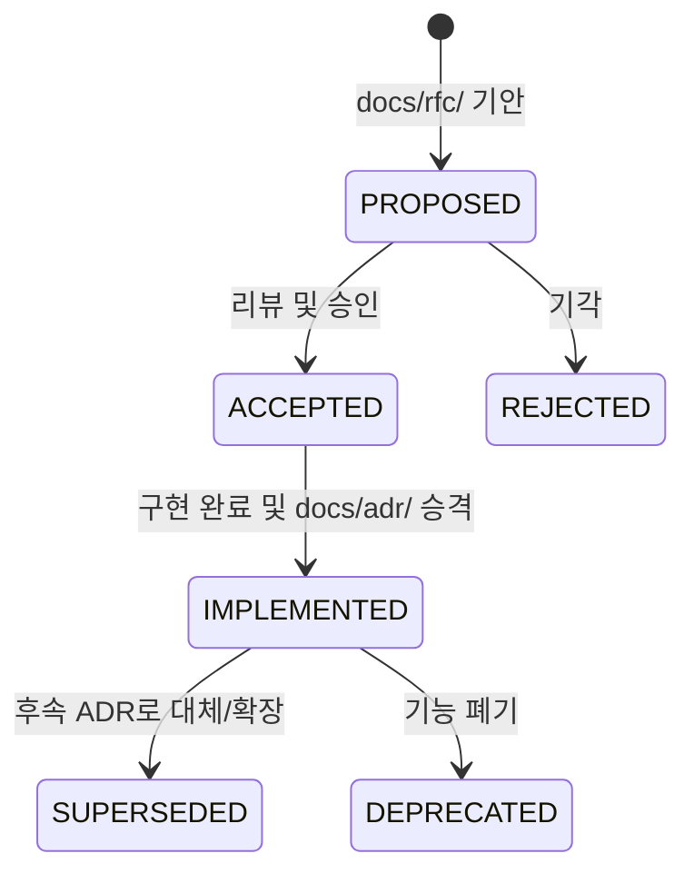
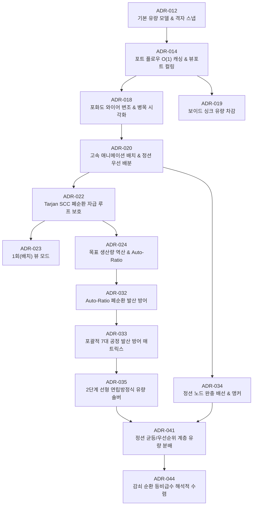
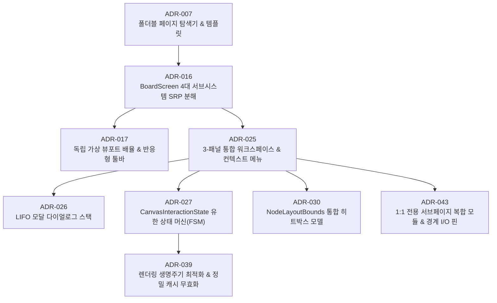
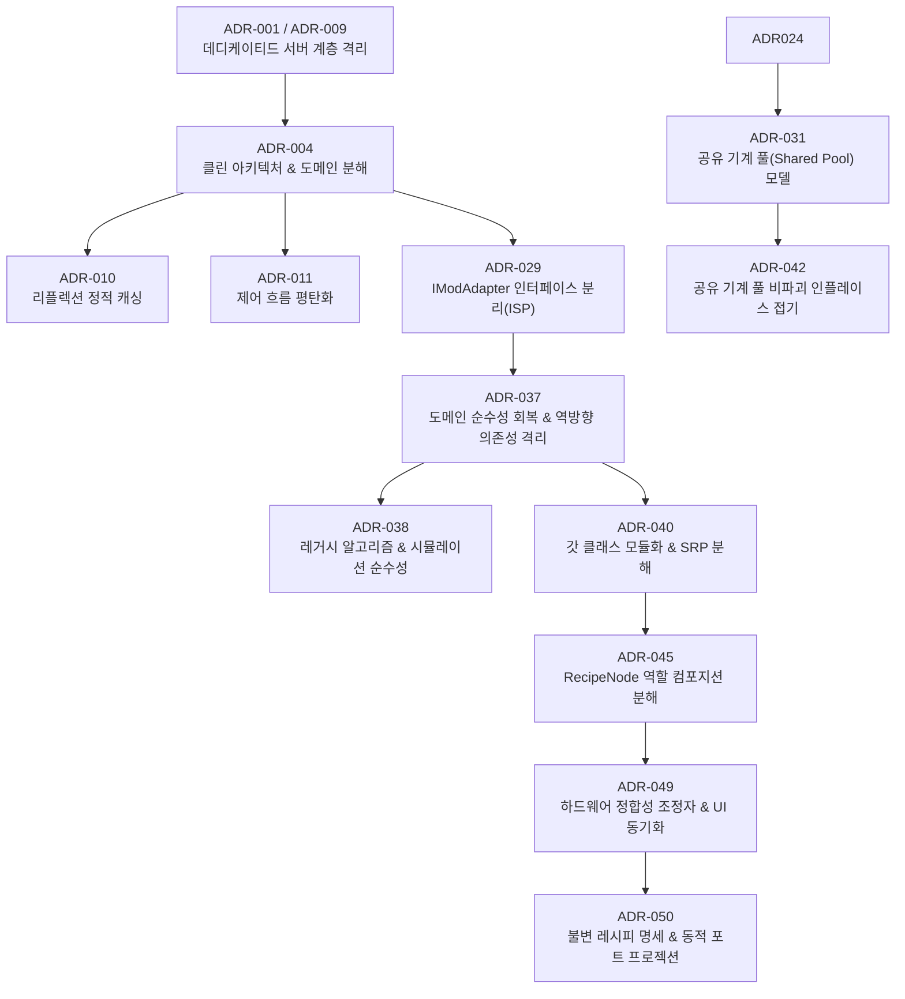

# 아키텍처 결정 기록 (Architecture Decision Records, ADRs)

본 디렉터리는 **GregTech Calculator Board (GTCalcBoard)** 프로젝트의 핵심 기술적 의사결정 맥락(Context), 채택 이유(Why), 시스템 구조(Architecture), 그리고 결과 및 파급 효과(Consequences)를 영구히 기록하고 보존하는 **공식 아키텍처 결정 기록(ADR) 보관소**이자 **기술 지식 허브(Architecture Knowledge Hub)**입니다.

---

## 🏛 ADR 생명주기 및 상태 (Lifecycle & Status)

| 상태 (Status) | 설명 |
| :--- | :--- |
| **`PROPOSED`** | 새로운 아키텍처 제안이 `docs/rfc/`에 기안되어 리뷰 및 토론 중인 상태 |
| **`ACCEPTED`** | 제안이 승인되어 향후 버전 개발 목표로 확정된 상태 |
| **`IMPLEMENTED`** | 기능 구현 및 단위 테스트가 완료되어 `docs/adr/`로 승격 영구 등록된 상태 |
| **`SUPERSEDED`** | 후속 ADR에 의해 설계나 알고리즘이 대체되거나 확장된 상태 (`SUPERSEDED by ADR-XXX`) |
| **`DEPRECATED`** | 더 이상 사용되지 않거나 폐기된 결정 |

---

## 🗺 핵심 서브시스템 진화 계보도 (Core Architecture Evolution Lineage)

복합 공정 계산 및 대규모 캔버스 인터랙션의 핵심 영역들은 여러 ADR을 거치며 점진적으로 고도화되었습니다. 신규 기능 설계 및 버그 수정 시 아래 계보도를 통해 과거 설계 맥락과 제약 조건을 신속히 파악할 수 있습니다.

### 1. 유량 솔버 및 수학 알고리즘 발전사 (Flow Solver & Mathematics)

### 2. 캔버스 GUI & 인터랙션 발전사 (Canvas GUI & Interaction)

### 3. 공유 기계 풀 및 도메인 순수성 발전사 (Machine Pooling & Domain Purity)

---

## 📂 5대 기술 도메인별 사양 매트릭스 (Technical Domain Matrix)

공식 시스템 사양서([`docs/ko_kr/spec/`](../ko_kr/spec/))의 5대 핵심 장(Chapter)과 1:1 대응되는 기술 도메인별 ADR 분류입니다.

### 01. 코어 도메인 & 아키텍처 순수성 (Core Domain & Architecture Purity)
> **연관 사양서**: [`docs/ko_kr/spec/01_CORE_DOMAIN_AND_MODELS.md`](../ko_kr/spec/01_CORE_DOMAIN_AND_MODELS.md)

| 번호 | 문서 제목 (Title) | 상태 | 대상 버전 | 핵심 기술 요약 |
| :---: | :--- | :---: | :---: | :--- |
| **[ADR-001](ADR_001_COMPAT_GUI_HANDLER_ISOLATION_AND_SERVER_SAFETY.md)** | Dedicated Server 계층 격리 및 호환성 계층 무결성 강화 | 🟢 `IMPLEMENTED` | `v2.0.0` | NoClassDefFoundError 방지를 위한 GUI 핸들러 클라이언트 패키지 완전 이전 |
| **[ADR-002](ADR_002_ARCHITECTURE_DOCS_RESTRUCTURING_AND_SPEC_MODERNIZATION.md)** | 아키텍처 및 기술 사양 문서 체계 대량 개편 및 최신화 | 🟢 `IMPLEMENTED` | `v2.0.0` | 5계층 아키텍처, 5대 그래프 솔버, 와이어 공간 분할 색인 사양서 전면 개편 |
| **[ADR-004](ADR_004_CLEAN_ARCHITECTURE_AND_DOMAIN_DECOMPOSITION.md)** | 클린 아키텍처 정립 및 잔여 갓 클래스 책임 분해 | 🟢 `IMPLEMENTED` | `v2.0.0` | RecipeNode 도메인 순수성 회복, SRP 4대 하위 클래스 분해 |
| **[ADR-009](ADR_009_HEADLESS_LAYER_ISOLATION_AND_SERVER_SAFETY.md)** | 헤드리스 계층 격리 및 데디케이티드 서버 안전성 강화 명세 | 🟢 `IMPLEMENTED` | `v2.1.0-alpha.3` | API/Compat의 클라이언트 참조 100% 해소, SearchableRecipe 도메인 승격 |
| **[ADR-010](ADR_010_STATIC_REFLECTION_CACHING_AND_CLEAN_EXCEPTION.md)** | 리플렉션 정적 캐싱 및 예외 처리 무결성 개편 명세 | 🟢 `IMPLEMENTED` | `v2.1.0-alpha.3` | 동적 리플렉션의 static final 1회 캐싱, bare catch 제거 |
| **[ADR-011](ADR_011_CONTROL_FLOW_FLATTENING_AND_SELF_DESCRIPTIVE_CODE.md)** | 제어 흐름 평탄화 및 자기 서술적 클린 코드 정비 명세 | 🟢 `IMPLEMENTED` | `v2.1.0-alpha.3` | 중첩 깊이 1~2단계 평탄화, 조기 반환 가드 적용, CanvasInteractionHandler 3대 핸들러 분해 |
| **[ADR-016](ADR_016_BOARD_SCREEN_MODULAR_DECOMPOSITION.md)** | BoardScreen 모듈화 분해 및 단일 책임 아키텍처 명세 | 🟢 `IMPLEMENTED` | `v2.1.0-beta.1` | 모놀리식 BoardScreen을 4대 서브시스템으로 분해 및 65% 경량화 |
| **[ADR-037](ADR_037_DOMAIN_PURITY_AND_DETERMINISTIC_DEDUCTION_REFACTORING.md)** | 도메인 엔티티 순수성 회복, 역방향 의존성 격리 및 결정론적 스펙 연역 무결성 개편 명세 | 🟢 `IMPLEMENTED` | `v2.2.0-beta.2` | IModAdapter를 api.spi로 이전하여 역방향 참조 0건 달성, RecipeNode 모드 필드 완전 이전 |
| **[ADR-038](ADR_038_LEGACY_CALCULATION_ALGORITHM_AND_SIMULATION_PURITY_REFACTORING.md)** | 레거시 계산 알고리즘 및 물리 시뮬레이션 순수성 개편 명세 | 🟢 `IMPLEMENTED` | `v2.2.0-beta.2` | 순수 연산 중 포트 변조 및 부수 효과 근절, UI 렌더링 중 캐시 무효화 차단 |
| **[ADR-040](ADR_040_RUNTIME_CONCURRENCY_REFLECTION_AND_GOD_CLASS_DECOMPOSITION.md)** | 런타임 동시성 무결성, 리플렉션 정적 최적화 및 갓 클래스 모듈화 명세 | 🟢 `IMPLEMENTED` | `v2.2.0-beta.3` | 카탈로그 스레드 안전화, 텍스트 캐시 리로드 훅, 251개 리플렉션 캐싱, 7대 갓 클래스 SRP 분해 |
| **[ADR-045](ADR_045_RECIPE_NODE_COMPOSITION_DECOMPOSITION.md)** | RecipeNode 역할 컴포지션 분해 및 불변 계산 스냅샷 아키텍처 | 🟢 `IMPLEMENTED` | `v2.2.1` | RecipeNode 순수 캔버스 엔티티 슬림화, 4대 역할(Machine, Module, Junction, BoundaryPin) INodeRole 컴포지션 분해, NBT 듀얼 라이트 무손실 호환 및 불변 계산 스냅샷 락-프리 렌더링 |
| **[ADR-048](ADR_048_PAGE_TARGET_VOLTAGE_AND_MULTIBLOCK_ENERGY_HATCH_PROVISIONING.md)** | 페이지별 목표 전압 티어 및 멀티블록 에너지 해치 자동 프로비저닝 명세 | 🟢 `IMPLEMENTED` | `v2.2.1` | 페이지 단위 기본 목표 전압 지정, 노드 추가 시 단일 기계 자동 오버클록 및 멀티블록 에너지 해치 자동 장착, 안전 가드, 일괄 적용 트랜잭션(Undo/Redo), 미니 뱃지 UI |
| **[ADR-049](ADR_049_MACHINE_RECIPE_TRANSITION_RECONCILER_AND_UI_SYNC.md)** | 기계 및 레시피 변경 시 하드웨어 정합성 조정자 및 반응형 UI 동기화 명세 | 🟢 `IMPLEMENTED` | `v2.2.1` | 기계/레시피 전환 멱등성 보정(NodeHardwareReconciler), 완전한 하드웨어 메멘토(SwitchRecipeCommand), IModAdapter 생명주기 및 다이얼로그 rebind UI 동기화 |
| **[ADR-050](ADR_050_IMMUTABLE_RECIPE_SPEC_AND_DYNAMIC_PORT_PROJECTION.md)** | 불변 레시피 명세 및 동적 하드웨어 포트 프로젝션 아키텍처 명세 | 🟢 `IMPLEMENTED` | `v2.2.1` | 불변 RecipeSpec 도입, 제자리 컬렉션 변조 근절, Core/Auxiliary 포트 정체성 분리 및 IPortProjectionProvider 기반 지연 캐싱 투영 |

### 02. 유량 솔버 & 그래프 수학 (Flow Balance Solver & Graph Algorithms)
> **연관 사양서**: [`docs/ko_kr/spec/02_MATH_AND_ALGORITHMS.md`](../ko_kr/spec/02_MATH_AND_ALGORITHMS.md)

| 번호 | 문서 제목 (Title) | 상태 | 대상 버전 | 핵심 기술 요약 |
| :---: | :--- | :---: | :---: | :--- |
| **[ADR-012](ADR_012_BOARD_USABILITY_AND_PRECISION_FLOW_MODELING.md)** | 보드 사용성 개선 및 정밀 플로우 모델링 사양 | 🟢 `IMPLEMENTED` | `v2.1.0-alpha.4` | 16px 격자 스냅, 커스텀 병렬 정수 지정, 외부/무한 공급원 정션 노드 확장 |
| **[ADR-014](ADR_014_CANVAS_GRAPHICS_PIPELINE_AND_FLOW_SOLVER_OPTIMIZATION.md)** | 대규모 노드 캔버스 그래픽 파이프라인 및 포트 플로우 계산 최적화 명세 | 🟢 `IMPLEMENTED` | `v2.1.0-alpha.5` | O(1) 포트 플로우 캐싱, 위젯 O(1) 해시 맵, 뷰포트 AABB 컬링 |
| **[ADR-018](ADR_018_RATE_BASED_WIRE_ANIMATION_AND_BOTTLENECK_VISUALIZATION.md)** | 처리량 포화도 기반 와이어 애니메이션 변조 및 실시간 병목 시각화 명세 | 🟢 `IMPLEMENTED` | `v2.1.0-beta.2` | 포화율(Supply/Demand) 기반 듀티 사이클 변조, 3단계 RGB 보간 및 결핍 경고 펄스 |
| **[ADR-019](ADR_019_BYPRODUCT_VOID_MANAGEMENT_AND_SINK_SYSTEM.md)** | 잉여 부산물 폐기 처리 및 보이드 싱크 시스템 명세 | 🟢 `IMPLEMENTED` | `v2.1.0-beta.2` | 캔버스 정션 보이드 싱크(VOID_SINK), 포트 단위 Mark as Void, 유량 수지 차감 연동 |
| **[ADR-020](ADR_020_HIGH_SPEED_FLOW_BATCHING_AND_EFFICIENCY_MODULATION.md)** | 고속 레시피 애니메이션 배치, 기계 효율 연동형 출력 와이어 흐름 및 분기 노드 우선 배분 명세 | 🟢 `IMPLEMENTED` | `v2.2.0` | 1초 미만 고속 레시피 파티클 묶음, 결핍 펄스 vs 기계 가동률(η) 비례 출력 감속 분리 |
| **[ADR-022](ADR_022_CLOSED_LOOP_RECIRCULATION_AND_SUPPLY_ALLOCATION.md)** | 폐쇄 순환 공정 자급 자원 보호 및 공급 우선 할당 알고리즘 명세 | 🟢 `IMPLEMENTED` | `v2.2.0-alpha.2` | Tarjan SCC 기반 자급 순환 자원 불변식 감쇠 차단, Greedy Demand-Filling 엣지 할당 |
| **[ADR-023](ADR_023_PER_CRAFT_BATCH_VIEW_AND_STOICHIOMETRIC_LOOP_VERIFICATION.md)** | 레시피 1회(배치) 기준 뷰 모드 및 화학양론적 순환 루프 검증 명세 | 🟢 `IMPLEMENTED` | `v2.2.0-alpha.2` | 시간 단위 소거형 1회(1x) 뷰 모드, 화학양론적 포트 보존 및 밸런스(✔) 인디케이터 |
| **[ADR-024](ADR_024_TARGET_OUTPUT_RATE_AND_FRACTIONAL_AUTO_RATIO.md)** | 목표 생산량 기반 기계 대수 자동 역산 및 정밀 소수점 Auto-Ratio 명세 | 🟢 `IMPLEMENTED` | `v2.2.0-alpha.2` | 출력 포트 Ctrl+클릭 목표치 기계 대수 역산, 정밀 소수점 Auto-Ratio(Alt+클릭) |
| **[ADR-031](ADR_031_SHARED_MACHINE_POOL_AUTO_RATIO.md)** | 공유 기계 풀(Shared Machine Pool) 용량 기반 자동 비율 맞춤 명세 | 🟢 `IMPLEMENTED` | `v2.2.0-alpha.4` | 물리 기계 대수/용량(기본 1.0대) 기준 공정 비례 스케일링, 프레임 헤더 원클릭 비율 맞춤 |
| **[ADR-032](ADR_032_AUTO_RATIO_DIVERGENCE_ALERT_AND_GUIDANCE.md)** | 자동 비율 맞춤 폐순환 루프 발산 방어, 경고 뱃지 및 액션 가이드 툴팁 | 🟢 `IMPLEMENTED` | `v2.2.0-alpha.4` | 폐순환 루프 발산 억제 노드 감지, [⚠] 경고 뱃지, 가상 툴팁 안내, 원클릭 앵커 지정 |
| **[ADR-033](ADR_033_COMPREHENSIVE_DIVERGENCE_DEFENSE_MATRIX.md)** | 포괄적 공정 발산 방어 매트릭스 및 상황별 진단 가이드 시스템 명세 | 🟢 `IMPLEMENTED` | `v2.2.0-alpha.4` | 증식 루프, 8자 루프, 촉매 감쇠 등 7대 발산 시나리오 자동 방어 및 5행 진단 뱃지 |
| **[ADR-034](ADR_034_JUNCTION_BUFFER_AND_ANCHOR_SYSTEM.md)** | 정션 노드 동적 잉여/결핍 완충 배선 및 Auto-Ratio 유량 앵커 시스템 | 🟢 `IMPLEMENTED` | `v2.2.0-alpha.4` | 퀵 마커 컨텍스트 드래그, Void Sink 오버플로우 스필웨이 배분, Fixed 정션 유량 앵커 |
| **[ADR-035](ADR_035_TWO_STAGE_LINEAR_FLOW_SOLVER.md)** | 2단계 선형 연립방정식 유량 솔버 및 정수 양자화 아키텍처 | 🟢 `IMPLEMENTED` | `v2.2.0-alpha.4` | 가우스 소거법 기반 1단계 연속 유량 균형 연산 및 2단계 정수 양자화 수렴 보장 |
| **[ADR-041](ADR_041_JUNCTION_EQUAL_AND_PRIORITY_SPLITTING.md)** | 정션 노드 균등 분할 및 AE2 스타일 우선순위 유량 분배 시스템 명세 | 🟢 `IMPLEMENTED` | `v2.2.0-beta.2` | 정션 노드 균등 분할(1/N) 및 우선순위 계층 연쇄 유량 분배 알고리즘, ConnectionEdge priority 확장 |
| **[ADR-042](ADR_042_SHARED_MACHINE_POOL_IN_PLACE_FOLDING_AND_RATIO_PRESERVATION.md)** | 공유 기계 풀 비파괴 인플레이스 접기 및 비율 보존형 가상 머신 카드 명세 | 🟢 `IMPLEMENTED` | `v2.2.0-beta.3` | 토폴로지 비파괴형 프레임 접기, 단일 기계 카드 축소, 내부 레시피 비율 보존 스케일링, 결손 인디케이터 연동 |
| **[ADR-044](ADR_044_DAMPED_RECIRCULATION_LOOP_SOLVER_AND_STEADY_STATE_VISUALIZATION.md)** | 감쇠 순환 공정의 닫힌 형태 해석적 수렴 및 정상 상태 시각화 명세 | 🟢 `IMPLEMENTED` | `v2.2.0-beta.3` | 무한 등비급수 $O(1)$ 해석적 수렴, 정상 상태 연속 가동 포트 상태, 원클릭 대수 맞춤 |

### 03. 캔버스 GUI & 인터랙션 (Canvas GUI & Interaction Framework)
> **연관 사양서**: [`docs/ko_kr/spec/03_UI_AND_RENDERING_PIPELINE.md`](../ko_kr/spec/03_UI_AND_RENDERING_PIPELINE.md)

| 번호 | 문서 제목 (Title) | 상태 | 대상 버전 | 핵심 기술 요약 |
| :---: | :--- | :---: | :---: | :--- |
| **[ADR-005](ADR_005_MULTIBLOCK_SELECTOR_TUTORIAL_INTEGRATION.md)** | 기계 및 멀티블록 선택 튜토리얼 통합 사양 | 🟢 `IMPLEMENTED` | `v2.1.0-alpha.3` | 11단계 튜토리얼 체계 확장, EBF 연습 노드 배치 및 멀티블록 선택 시 자동 전이 |
| **[ADR-007](ADR_007_HIERARCHICAL_PAGE_EXPLORER_AND_MACHINE_TEMPLATES.md)** | 계층형 폴더블 페이지 탐색기 및 머신 하드웨어 템플릿 시스템 | 🟢 `IMPLEMENTED` | `v2.1.0-alpha.3` | 다층 폴더 트리 사이드바, 실시간 검색, Ctrl+K 퀵 스위처, 하드웨어 스펙 보존형 레시피 복제 |
| **[ADR-017](ADR_017_RESPONSIVE_GUI_SCALE_AND_ADAPTIVE_LAYOUT.md)** | GUI 배율 독립 분리 및 멀티블록 카탈로그·툴바 반응형 레이아웃 | 🟢 `IMPLEMENTED` | `v2.1.0-beta.1` | 보드 전용 가상 뷰포트 배율 변환 엔진, 멀티블록 카탈로그 가변 행 및 적응형 툴바 |
| **[ADR-025](ADR_025_UNIFIED_CANVAS_WORKSPACE_AND_CONTEXT_DRIVEN_UI.md)** | 3-패널 통합 워크스페이스 및 컨텍스트 중심 UI/UX 현대화 명세 | 🟢 `IMPLEMENTED` | `v2.2.0-alpha.3` | 캔버스/노드 우클릭 컨텍스트 메뉴, 스마트 커넥트 추천, 노드 카드 슬림화 및 비모달 우측 인스펙터 |
| **[ADR-026](ADR_026_MODAL_DIALOG_STACK_AND_REGISTRY.md)** | 모달 다이얼로그 스택 및 레지스트리 아키텍처 | 🟢 `IMPLEMENTED` | `v2.2.0-alpha.3` | IBoardModal 공통 인터페이스, LIFO 기반 ModalStack 및 26개 다이얼로그 분기 평탄화 |
| **[ADR-027](ADR_027_CANVAS_INTERACTION_FINITE_STATE_MACHINE.md)** | 캔버스 인터랙션 유한 상태 머신 명세 | 🟢 `IMPLEMENTED` | `v2.2.0-alpha.3` | CanvasInteractionState FSM 전면 도입, 10여 개 불리언 플래그 제거, 결정론적 상태 전이 |
| **[ADR-030](ADR_030_UNIFIED_NODE_LAYOUT_BOUNDS_AND_HITBOX_MODEL.md)** | 노드 카드 레이아웃 바운즈 단일 출처화 및 통합 히트박스 모델 명세 | 🟢 `IMPLEMENTED` | `v2.2.0-alpha.4` | 중복 오프셋 제거, NodeLayoutBounds 기반 히트박스 일원화 및 슬림 모드 조작 간섭 해소 |
| **[ADR-039](ADR_039_RENDERING_LIFECYCLE_AND_PRECISION_CACHE_INVALIDATION.md)** | 렌더링 생명주기 최적화, 정밀 캐시 무효화 및 그래프 탐색 알고리즘 개편 명세 | 🟢 `IMPLEMENTED` | `v2.2.0-beta.2` | JEI 렌더 루프 리플렉션 캐싱, 스티키 노트/프레임 정밀 캐시 격리, autoConnect 인덱스 최적화 |
| **[ADR-043](ADR_043_DEDICATED_SUBPAGE_COMPOSITE_MODULE_AND_BOUNDARY_IO.md)** | 전용 서브페이지 기반 복합 공정 모듈 및 경계 I/O 핀 규격화 명세 | 🟢 `IMPLEMENTED` | `v2.2.0-beta.3` | 1:1 전용 서브페이지 격리, 더블클릭 비파괴 내비게이션, 경계 I/O 핀 노드 외부 인터페이스 규격화 |

### 04. 멀티플레이어 & 백그라운드 파이프라인 (Multiplayer Network & Concurrency)
> **연관 사양서**: [`docs/ko_kr/spec/04_MULTIPLAYER_AND_NETWORK_PROTOCOL.md`](../ko_kr/spec/04_MULTIPLAYER_AND_NETWORK_PROTOCOL.md)

| 번호 | 문서 제목 (Title) | 상태 | 대상 버전 | 핵심 기술 요약 |
| :---: | :--- | :---: | :---: | :--- |
| **[ADR-003](ADR_003_MULTIPLAYER_NETWORK_INTEGRITY_AND_SYSTEM_STABILIZATION.md)** | 멀티플레이어 네트워크 무결성, 서버 동시성 안정화 및 원자적 데이터 영속화 사양 | 🟢 `IMPLEMENTED` | `v2.0.0` | 512KB C2S 분할 스트리밍, ATOMIC_MOVE 원자적 파일 저장소, 접속 종료 시 락 즉시 해제 |
| **[ADR-015](ADR_015_BACKGROUND_INDEXING_STABILIZATION_AND_PIPELINE_OPTIMIZATION.md)** | 백그라운드 레시피 인덱싱 파이프라인 및 머신 매트릭스 베이킹 최적화 명세 | 🟢 `IMPLEMENTED` | `v2.1.0-beta.1` | Phase 3 클라이언트 프리징 해소, EMI 인덱싱 지연 베이킹, 비동기 스레드 동기화 안정화 |

### 05. 외부 모드 연동 & 확장성 (Mod Compatibility & SPI Extensions)
> **연관 사양서**: [`docs/ko_kr/spec/05_INTEGRATION_AND_I18N.md`](../ko_kr/spec/05_INTEGRATION_AND_I18N.md)

| 번호 | 문서 제목 (Title) | 상태 | 대상 버전 | 핵심 기술 요약 |
| :---: | :--- | :---: | :---: | :--- |
| **[ADR-006](ADR_006_TURBINE_AND_MACHINE_PARALLEL_ENHANCEMENT.md)** | 터빈 발전기 소모품 모델링·독립 티어 분리 및 기계 가용 병렬 산출 명세 | 🟢 `IMPLEMENTED` | `v2.1.0-alpha.3` | 로터 마모율/수명 모델링, 로터 홀더/다이나모 해치 티어 분리, 윤활유 부스트 토글 |
| **[ADR-008](ADR_008_AE2_AUTOCRAFTING_PLAN_AND_PRECISION_ETA_INTEGRATION.md)** | AE2 오토크래프팅 플랜 연동 및 패턴-페이지 기반 정밀 ETA 시스템 | 🟢 `IMPLEMENTED` | `v2.1.0-alpha.3` | BoardPage ↔ AE2 가공 패턴 1:1 바인딩, ICraftingPlan 인터셉트 및 정밀 ETA/병목 산출 |
| **[ADR-013](ADR_013_MODULAR_COMBUSTION_COMPLEX_INTEGRATION.md)** | Star Technology 모듈러 연소 복합체 및 프레임 부스팅 발전 시스템 통합 명세 | 🟢 `IMPLEMENTED` | `v2.2.1` | MCF 프레임 매크로 단일 노드 모델, 중앙 냉각수($N \times 500\text{ B/hr}$) 단일 풀 소모, 최대 8대 도킹 모듈 슬롯 관리, 프레임+모듈 Multiblock BOM 일괄 산출 및 개별 모듈 로컬 냉각수 트레이트 정규화 |
| **[ADR-021](ADR_021_GREATE_KINETIC_TIER_ADAPTER_INTEGRATION.md)** | Greate 모드 연동을 위한 AbstractKineticModAdapter 계층 분리 및 티어드 회전 운동 기계 어댑터 명세 | 🟢 `IMPLEMENTED` | `v2.2.0` | AbstractKineticModAdapter 계층 분리, GreateModAdapter 10단계 티어 매핑 |
| **[ADR-028](ADR_028_COMPOSABLE_RECIPE_SEARCH_SPECIFICATION.md)** | 합성 가능한 레시피 검색 쿼리 명세 패턴 | 🟢 `IMPLEMENTED` | `v2.2.0-alpha.3` | 검색 필터 로직 Specification Pattern 모듈화, And/Or/Not 합성 및 단락 평가 최적화 |
| **[ADR-029](ADR_029_MOD_ADAPTER_INTERFACE_SEGREGATION_AND_EXTENSIONS.md)** | IModAdapter 인터페이스 분리(ISP) 및 Extension Object 패턴 명세 | 🟢 `IMPLEMENTED` | `v2.2.0-alpha.3` | IModAdapter 824줄에서 86줄 슬림화, 6대 도메인 Provider 분리 및 Extension Object 패턴 |
| **[ADR-036](ADR_036_KINETIC_GENERATOR_AND_ENERGY_CONVERTER_TAXONOMY.md)** | 회전 운동 동력원 및 에너지 상호 변환기 분류 체계, 가변 RPM 동적 산출 및 뷰어 UI 개편 명세 | 🟢 `IMPLEMENTED` | `v2.2.0` | 4대 카테고리 분리, Windmill Bearing 가변 돛/RPM 수식 산출, EMI 자가 복제 슬롯 해소 |

---

## 📋 전체 번호순 퀵 레퍼런스 색인 (Chronological Index)

| 번호 | 문서 제목 (Title) | 상태 | 대상 버전 | 결정일 | 핵심 요약 |
| :---: | :--- | :---: | :---: | :---: | :--- |
| **[ADR-001](ADR_001_COMPAT_GUI_HANDLER_ISOLATION_AND_SERVER_SAFETY.md)** | Dedicated Server 계층 격리 및 호환성 계층 무결성 강화 | 🟢 `IMPLEMENTED` | `v2.0.0` | 2026-08-29 | 데디케이티드 서버 NoClassDefFoundError 방지를 위한 GUI 핸들러 클라이언트 완전 이전 |
| **[ADR-002](ADR_002_ARCHITECTURE_DOCS_RESTRUCTURING_AND_SPEC_MODERNIZATION.md)** | 아키텍처 및 기술 사양 문서 체계 대량 개편 및 최신화 | 🟢 `IMPLEMENTED` | `v2.0.0` | 2026-08-29 | 5계층 아키텍처, 5대 그래프 솔버, 와이어 공간 분할 색인 사양서 전면 개편 |
| **[ADR-003](ADR_003_MULTIPLAYER_NETWORK_INTEGRITY_AND_SYSTEM_STABILIZATION.md)** | 멀티플레이어 네트워크 무결성, 서버 동시성 안정화 및 원자적 데이터 영속화 사양 | 🟢 `IMPLEMENTED` | `v2.0.0` | 2026-08-29 | 512KB C2S 분할 스트리밍, ATOMIC_MOVE 원자적 파일 저장소, 접속 종료 시 락 즉시 해제 |
| **[ADR-004](ADR_004_CLEAN_ARCHITECTURE_AND_DOMAIN_DECOMPOSITION.md)** | 클린 아키텍처 정립 및 잔여 갓 클래스 책임 분해 | 🟢 `IMPLEMENTED` | `v2.0.0` | 2026-08-29 | RecipeNode 도메인 순수성 회복, SRP 4대 하위 클래스 분해 |
| **[ADR-005](ADR_005_MULTIBLOCK_SELECTOR_TUTORIAL_INTEGRATION.md)** | 기계 및 멀티블록 선택 튜토리얼 통합 사양 | 🟢 `IMPLEMENTED` | `v2.1.0-alpha.3` | 2026-09-01 | 11단계 튜토리얼 체계 확장, EBF 연습 노드 배치 및 멀티블록 선택 시 자동 전이 |
| **[ADR-006](ADR_006_TURBINE_AND_MACHINE_PARALLEL_ENHANCEMENT.md)** | 터빈 발전기 소모품 모델링·독립 티어 분리 및 기계 가용 병렬 산출 명세 | 🟢 `IMPLEMENTED` | `v2.1.0-alpha.3` | 2026-09-01 | 로터 마모율/수명 모델링, 로터 홀더/다이나모 해치 티어 분리, 윤활유 부스트 토글 |
| **[ADR-007](ADR_007_HIERARCHICAL_PAGE_EXPLORER_AND_MACHINE_TEMPLATES.md)** | 계층형 폴더블 페이지 탐색기 및 머신 하드웨어 템플릿 시스템 | 🟢 `IMPLEMENTED` | `v2.1.0-alpha.3` | 2026-09-02 | 다층 폴더 트리 사이드바, 실시간 검색, Ctrl+K 퀵 스위처, 하드웨어 스펙 보존형 레시피 복제 |
| **[ADR-008](ADR_008_AE2_AUTOCRAFTING_PLAN_AND_PRECISION_ETA_INTEGRATION.md)** | AE2 오토크래프팅 플랜 연동 및 패턴-페이지 기반 정밀 ETA 시스템 | 🟢 `IMPLEMENTED` | `v2.1.0-alpha.3` | 2026-09-02 | BoardPage ↔ AE2 가공 패턴 1:1 바인딩, ICraftingPlan 인터셉트 및 정밀 ETA/병목 산출 |
| **[ADR-009](ADR_009_HEADLESS_LAYER_ISOLATION_AND_SERVER_SAFETY.md)** | 헤드리스 계층 격리 및 데디케이티드 서버 안전성 강화 명세 | 🟢 `IMPLEMENTED` | `v2.1.0-alpha.3` | 2026-09-01 | API/Compat의 클라이언트 참조 100% 해소, SearchableRecipe 도메인 승격 |
| **[ADR-010](ADR_010_STATIC_REFLECTION_CACHING_AND_CLEAN_EXCEPTION.md)** | 리플렉션 정적 캐싱 및 예외 처리 무결성 개편 명세 | 🟢 `IMPLEMENTED` | `v2.1.0-alpha.3` | 2026-09-01 | 동적 리플렉션의 static final 1회 캐싱, bare catch 제거 |
| **[ADR-011](ADR_011_CONTROL_FLOW_FLATTENING_AND_SELF_DESCRIPTIVE_CODE.md)** | 제어 흐름 평탄화 및 자기 서술적 클린 코드 정비 명세 | 🟢 `IMPLEMENTED` | `v2.1.0-alpha.3` | 2026-09-01 | 중첩 깊이 1~2단계 평탄화, 조기 반환 가드 적용, CanvasInteractionHandler 3대 핸들러 분해 |
| **[ADR-012](ADR_012_BOARD_USABILITY_AND_PRECISION_FLOW_MODELING.md)** | 보드 사용성 개선 및 정밀 플로우 모델링 사양 | 🟢 `IMPLEMENTED` | `v2.1.0-alpha.4` | 2026-09-02 | 16px 격자 스냅, 커스텀 병렬 정수 지정, 외부/무한 공급원 정션 노드 확장 |
| **[ADR-013](ADR_013_MODULAR_COMBUSTION_COMPLEX_INTEGRATION.md)** | Star Technology 모듈러 연소 복합체 및 프레임 부스팅 발전 시스템 통합 명세 | 🟢 `IMPLEMENTED` | `v2.2.1` | 2026-09-13 | MCF 프레임 매크로 단일 노드 모델, 중앙 냉각수($N \times 500\text{ B/hr}$) 단일 풀 소모, 최대 8대 도킹 모듈 슬롯 관리, 프레임+모듈 Multiblock BOM 일괄 산출 및 개별 모듈 로컬 냉각수 트레이트 정규화 |
| **[ADR-014](ADR_014_CANVAS_GRAPHICS_PIPELINE_AND_FLOW_SOLVER_OPTIMIZATION.md)** | 대규모 노드 캔버스 그래픽 파이프라인 및 포트 플로우 계산 최적화 명세 | 🟢 `IMPLEMENTED` | `v2.1.0-alpha.5` | 2026-09-03 | O(1) 포트 플로우 캐싱, 위젯 O(1) 해시 맵, 뷰포트 AABB 컬링 |
| **[ADR-015](ADR_015_BACKGROUND_INDEXING_STABILIZATION_AND_PIPELINE_OPTIMIZATION.md)** | 백그라운드 레시피 인덱싱 파이프라인 및 머신 매트릭스 베이킹 최적화 명세 | 🟢 `IMPLEMENTED` | `v2.1.0-beta.1` | 2026-09-03 | Phase 3 클라이언트 프리징 해소, EMI 인덱싱 지연 베이킹, 비동기 스레드 동기화 안정화 |
| **[ADR-016](ADR_016_BOARD_SCREEN_MODULAR_DECOMPOSITION.md)** | BoardScreen 모듈화 분해 및 단일 책임 아키텍처 명세 | 🟢 `IMPLEMENTED` | `v2.1.0-beta.1` | 2026-09-03 | 모놀리식 BoardScreen을 4대 서브시스템으로 분해 및 65% 경량화 |
| **[ADR-017](ADR_017_RESPONSIVE_GUI_SCALE_AND_ADAPTIVE_LAYOUT.md)** | GUI 배율 독립 분리 및 멀티블록 카탈로그·툴바 반응형 레이아웃 | 🟢 `IMPLEMENTED` | `v2.1.0-beta.1` | 2026-09-03 | 보드 전용 가상 뷰포트 배율 변환 엔진, 멀티블록 카탈로그 가변 행 및 적응형 툴바 |
| **[ADR-018](ADR_018_RATE_BASED_WIRE_ANIMATION_AND_BOTTLENECK_VISUALIZATION.md)** | 처리량 포화도 기반 와이어 애니메이션 변조 및 실시간 병목 시각화 명세 | 🟢 `IMPLEMENTED` | `v2.1.0-beta.2` | 2026-09-04 | 포화율(Supply/Demand) 기반 듀티 사이클 변조, 3단계 RGB 보간 및 결핍 경고 펄스 |
| **[ADR-019](ADR_019_BYPRODUCT_VOID_MANAGEMENT_AND_SINK_SYSTEM.md)** | 잉여 부산물 폐기 처리 및 보이드 싱크 시스템 명세 | 🟢 `IMPLEMENTED` | `v2.1.0-beta.2` | 2026-09-04 | 캔버스 정션 보이드 싱크(VOID_SINK), 포트 단위 Mark as Void, 유량 수지 차감 연동 |
| **[ADR-020](ADR_020_HIGH_SPEED_FLOW_BATCHING_AND_EFFICIENCY_MODULATION.md)** | 고속 레시피 애니메이션 배치, 기계 효율 연동형 출력 와이어 흐름 및 분기 노드 우선 배분 명세 | 🟢 `IMPLEMENTED` | `v2.2.0` | 2026-09-05 | 1초 미만 고속 레시피 파티클 묶음, 결핍 펄스 vs 기계 가동률(η) 비례 출력 감속 분리 |
| **[ADR-021](ADR_021_GREATE_KINETIC_TIER_ADAPTER_INTEGRATION.md)** | Greate 모드 연동을 위한 AbstractKineticModAdapter 계층 분리 및 티어드 회전 운동 기계 어댑터 명세 | 🟢 `IMPLEMENTED` | `v2.2.0` | 2026-09-04 | AbstractKineticModAdapter 계층 분리, GreateModAdapter 10단계 티어 매핑 |
| **[ADR-022](ADR_022_CLOSED_LOOP_RECIRCULATION_AND_SUPPLY_ALLOCATION.md)** | 폐쇄 순환 공정 자급 자원 보호 및 공급 우선 할당 알고리즘 명세 | 🟢 `IMPLEMENTED` | `v2.2.0-alpha.2` | 2026-09-05 | Tarjan SCC 기반 자급 순환 자원 불변식 감쇠 차단, Greedy Demand-Filling 엣지 할당 |
| **[ADR-023](ADR_023_PER_CRAFT_BATCH_VIEW_AND_STOICHIOMETRIC_LOOP_VERIFICATION.md)** | 레시피 1회(배치) 기준 뷰 모드 및 화학양론적 순환 루프 검증 명세 | 🟢 `IMPLEMENTED` | `v2.2.0-alpha.2` | 2026-09-05 | 시간 단위 소거형 1회(1x) 뷰 모드, 화학양론적 포트 보존 및 밸런스(✔) 인디케이터 |
| **[ADR-024](ADR_024_TARGET_OUTPUT_RATE_AND_FRACTIONAL_AUTO_RATIO.md)** | 목표 생산량 기반 기계 대수 자동 역산 및 정밀 소수점 Auto-Ratio 명세 | 🟢 `IMPLEMENTED` | `v2.2.0-alpha.2` | 2026-09-05 | 출력 포트 Ctrl+클릭 목표치 기계 대수 역산, 정밀 소수점 Auto-Ratio(Alt+클릭) |
| **[ADR-025](ADR_025_UNIFIED_CANVAS_WORKSPACE_AND_CONTEXT_DRIVEN_UI.md)** | 3-패널 통합 워크스페이스 및 컨텍스트 중심 UI/UX 현대화 명세 | 🟢 `IMPLEMENTED` | `v2.2.0-alpha.3` | 2026-09-06 | 캔버스/노드 우클릭 컨텍스트 메뉴, 스마트 커넥트 추천, 노드 카드 슬림화 및 비모달 우측 인스펙터 |
| **[ADR-026](ADR_026_MODAL_DIALOG_STACK_AND_REGISTRY.md)** | 모달 다이얼로그 스택 및 레지스트리 아키텍처 | 🟢 `IMPLEMENTED` | `v2.2.0-alpha.3` | 2026-09-06 | IBoardModal 공통 인터페이스, LIFO 기반 ModalStack 및 26개 다이얼로그 분기 평탄화 |
| **[ADR-027](ADR_027_CANVAS_INTERACTION_FINITE_STATE_MACHINE.md)** | 캔버스 인터랙션 유한 상태 머신 명세 | 🟢 `IMPLEMENTED` | `v2.2.0-alpha.3` | 2026-09-06 | CanvasInteractionState FSM 전면 도입, 10여 개 불리언 플래그 제거, 결정론적 상태 전이 |
| **[ADR-028](ADR_028_COMPOSABLE_RECIPE_SEARCH_SPECIFICATION.md)** | 합성 가능한 레시피 검색 쿼리 명세 패턴 | 🟢 `IMPLEMENTED` | `v2.2.0-alpha.3` | 2026-09-06 | 검색 필터 로직 Specification Pattern 모듈화, And/Or/Not 합성 및 단락 평가 최적화 |
| **[ADR-029](ADR_029_MOD_ADAPTER_INTERFACE_SEGREGATION_AND_EXTENSIONS.md)** | IModAdapter 인터페이스 분리(ISP) 및 Extension Object 패턴 명세 | 🟢 `IMPLEMENTED` | `v2.2.0-alpha.3` | 2026-09-06 | IModAdapter 824줄에서 86줄 슬림화, 6대 도메인 Provider 분리 및 Extension Object 패턴 |
| **[ADR-030](ADR_030_UNIFIED_NODE_LAYOUT_BOUNDS_AND_HITBOX_MODEL.md)** | 노드 카드 레이아웃 바운즈 단일 출처화 및 통합 히트박스 모델 명세 | 🟢 `IMPLEMENTED` | `v2.2.0-alpha.4` | 2026-09-07 | 중복 오프셋 제거, NodeLayoutBounds 기반 히트박스 일원화 및 슬림 모드 조작 간섭 해소 |
| **[ADR-031](ADR_031_SHARED_MACHINE_POOL_AUTO_RATIO.md)** | 공유 기계 풀(Shared Machine Pool) 용량 기반 자동 비율 맞춤 명세 | 🟢 `IMPLEMENTED` | `v2.2.0-alpha.4` | 2026-09-07 | 물리 기계 대수/용량(기본 1.0대) 기준 공정 비례 스케일링, 프레임 헤더 원클릭 비율 맞춤 |
| **[ADR-032](ADR_032_AUTO_RATIO_DIVERGENCE_ALERT_AND_GUIDANCE.md)** | 자동 비율 맞춤 폐순환 루프 발산 방어, 경고 뱃지 및 액션 가이드 툴팁 | 🟢 `IMPLEMENTED` | `v2.2.0-alpha.4` | 2026-09-07 | 폐순환 루프 발산 억제 노드 감지, [⚠] 경고 뱃지, 가상 툴팁 안내, 원클릭 앵커 지정 |
| **[ADR-033](ADR_033_COMPREHENSIVE_DIVERGENCE_DEFENSE_MATRIX.md)** | 포괄적 공정 발산 방어 매트릭스 및 상황별 진단 가이드 시스템 명세 | 🟢 `IMPLEMENTED` | `v2.2.0-alpha.4` | 2026-09-07 | 증식 루프, 8자 루프, 촉매 감쇠 등 7대 발산 시나리오 자동 방어 및 5행 진단 뱃지 |
| **[ADR-034](ADR_034_JUNCTION_BUFFER_AND_ANCHOR_SYSTEM.md)** | 정션 노드 동적 잉여/결핍 완충 배선 및 Auto-Ratio 유량 앵커 시스템 | 🟢 `IMPLEMENTED` | `v2.2.0-alpha.4` | 2026-09-07 | 퀵 마커 컨텍스트 드래그, Void Sink 오버플로우 스필웨이 배분, Fixed 정션 유량 앵커 |
| **[ADR-035](ADR_035_TWO_STAGE_LINEAR_FLOW_SOLVER.md)** | 2단계 선형 연립방정식 유량 솔버 및 정수 양자화 아키텍처 | 🟢 `IMPLEMENTED` | `v2.2.0-alpha.4` | 2026-09-08 | 가우스 소거법 기반 1단계 연속 유량 균형 연산 및 2단계 정수 양자화 수렴 보장 |
| **[ADR-036](ADR_036_KINETIC_GENERATOR_AND_ENERGY_CONVERTER_TAXONOMY.md)** | 회전 운동 동력원 및 에너지 상호 변환기 분류 체계, 가변 RPM 동적 산출 및 뷰어 UI 개편 명세 | 🟢 `IMPLEMENTED` | `v2.2.0` | 2026-09-08 | 4대 카테고리 분리, Windmill Bearing 가변 돛/RPM 수식 산출, EMI 자가 복제 슬롯 해소 |
| **[ADR-037](ADR_037_DOMAIN_PURITY_AND_DETERMINISTIC_DEDUCTION_REFACTORING.md)** | 도메인 엔티티 순수성 회복, 역방향 의존성 격리 및 결정론적 스펙 연역 무결성 개편 명세 | 🟢 `IMPLEMENTED` | `v2.2.0-beta.2` | 2026-09-09 | IModAdapter를 api.spi로 이전하여 역방향 참조 0건 달성, RecipeNode 모드 필드 완전 이전 |
| **[ADR-038](ADR_038_LEGACY_CALCULATION_ALGORITHM_AND_SIMULATION_PURITY_REFACTORING.md)** | 레거시 계산 알고리즘 및 물리 시뮬레이션 순수성 개편 명세 | 🟢 `IMPLEMENTED` | `v2.2.0-beta.2` | 2026-09-09 | 순수 연산 중 포트 변조 및 부수 효과 근절, UI 렌더링 중 캐시 무효화 차단 |
| **[ADR-039](ADR_039_RENDERING_LIFECYCLE_AND_PRECISION_CACHE_INVALIDATION.md)** | 렌더링 생명주기 최적화, 정밀 캐시 무효화 및 그래프 탐색 알고리즘 개편 명세 | 🟢 `IMPLEMENTED` | `v2.2.0-beta.2` | 2026-09-09 | JEI 렌더 루프 리플렉션 캐싱, 스티키 노트/프레임 정밀 캐시 격리, autoConnect 인덱스 최적화 |
| **[ADR-040](ADR_040_RUNTIME_CONCURRENCY_REFLECTION_AND_GOD_CLASS_DECOMPOSITION.md)** | 런타임 동시성 무결성, 리플렉션 정적 최적화 및 갓 클래스 모듈화 명세 | 🟢 `IMPLEMENTED` | `v2.2.0-beta.3` | 2026-09-10 | 카탈로그 스레드 안전화, 텍스트 캐시 리로드 훅, 251개 리플렉션 캐싱, 7대 갓 클래스 SRP 분해 |
| **[ADR-041](ADR_041_JUNCTION_EQUAL_AND_PRIORITY_SPLITTING.md)** | 정션 노드 균등 분할 및 AE2 스타일 우선순위 유량 분배 시스템 명세 | 🟢 `IMPLEMENTED` | `v2.2.0-beta.2` | 2026-09-09 | 정션 노드 균등 분할(1/N) 및 우선순위 계층 연쇄 유량 분배 알고리즘, ConnectionEdge priority 확장 |
| **[ADR-042](ADR_042_SHARED_MACHINE_POOL_IN_PLACE_FOLDING_AND_RATIO_PRESERVATION.md)** | 공유 기계 풀 비파괴 인플레이스 접기 및 비율 보존형 가상 머신 카드 명세 | 🟢 `IMPLEMENTED` | `v2.2.0-beta.3` | 2026-09-10 | 토폴로지 비파괴형 프레임 접기, 단일 기계 카드 축소, 내부 레시피 비율 보존 스케일링, 결손 인디케이터 연동 |
| **[ADR-043](ADR_043_DEDICATED_SUBPAGE_COMPOSITE_MODULE_AND_BOUNDARY_IO.md)** | 전용 서브페이지 기반 복합 공정 모듈 및 경계 I/O 핀 규격화 명세 | 🟢 `IMPLEMENTED` | `v2.2.0-beta.3` | 2026-09-10 | 1:1 전용 서브페이지 격리, 더블클릭 비파괴 내비게이션, 경계 I/O 핀 노드 외부 인터페이스 규격화 |
| **[ADR-044](ADR_044_DAMPED_RECIRCULATION_LOOP_SOLVER_AND_STEADY_STATE_VISUALIZATION.md)** | 감쇠 순환 공정의 닫힌 형태 해석적 수렴 및 정상 상태 시각화 명세 | 🟢 `IMPLEMENTED` | `v2.2.0-beta.3` | 2026-09-10 | 무한 등비급수 $O(1)$ 해석적 수렴, 정상 상태 연속 가동 포트 상태, 원클릭 대수 맞춤 |
| **[ADR-045](ADR_045_RECIPE_NODE_COMPOSITION_DECOMPOSITION.md)** | RecipeNode 역할 컴포지션 분해 및 불변 계산 스냅샷 아키텍처 | 🟢 `IMPLEMENTED` | `v2.2.1` | 2026-09-13 | INodeRole 인터페이스 기반 기계/정션/모듈/핀 역할 컴포지션 분해, 듀얼 라이트 NBT 역호환성, 불변 계산 스냅샷 |
| **[ADR-047](ADR_047_COMPAT_DETERMINISTIC_EXACT_MATCH_NORMALIZATION.md)** | 외부 모드 호환 계층 레거시 폴백 제거 및 Rule 5 결정론적 정규화 | 🟢 `IMPLEMENTED` | `v2.2.1` | 2026-09-13 | Create 시퀀스 조립, 스레딩 모디파이어, 에너지 해치 오프라인 티어, 서멀 다이내모 등 5개 폴백의 문자열 contains 휴리스틱을 완전 제거하고 완전 일치 매핑 테이블 및 강타입 검사로 전환 |
| **[ADR-048](ADR_048_PAGE_TARGET_VOLTAGE_AND_MULTIBLOCK_ENERGY_HATCH_PROVISIONING.md)** | 페이지별 목표 전압 티어 및 멀티블록 에너지 해치 자동 프로비저닝 명세 | 🟢 `IMPLEMENTED` | `v2.2.1` | 2026-09-13 | 페이지 단위 기본 목표 전압 지정, 노드 추가 시 단일 기계 자동 오버클록 및 멀티블록 에너지 해치 자동 장착, 안전 가드, 일괄 적용 트랜잭션(Undo/Redo), 미니 뱃지 UI |
| **[ADR-049](ADR_049_MACHINE_RECIPE_TRANSITION_RECONCILER_AND_UI_SYNC.md)** | 기계 및 레시피 변경 시 하드웨어 정합성 조정자 및 반응형 UI 동기화 명세 | 🟢 `IMPLEMENTED` | `v2.2.1` | 2026-09-13 | 기계/레시피 전환 멱등성 보정(NodeHardwareReconciler), 완전한 하드웨어 메멘토(SwitchRecipeCommand), IModAdapter 생명주기 및 다이얼로그 rebind UI 동기화 |
| **[ADR-050](ADR_050_IMMUTABLE_RECIPE_SPEC_AND_DYNAMIC_PORT_PROJECTION.md)** | 불변 레시피 명세 및 동적 하드웨어 포트 프로젝션 아키텍처 명세 | 🟢 `IMPLEMENTED` | `v2.2.1` | 2026-09-13 | 불변 RecipeSpec 도입, 제자리 컬렉션 변조 근절, Core/Auxiliary 포트 정체성 분리 및 IPortProjectionProvider 기반 지연 캐싱 투영 |

---

## 💡 활성 RFC 제안 목록 (Active RFC Proposals in `docs/rfc/`)

구현 착수 전 기술 검토, 대안 비교 및 승인 대기 중인 활성 RFC 제안 문서 목록입니다. 구현이 완료되면 공식 ADR로 승격되어 상단 레지스트리에 영구 보존됩니다.

| 문서 번호 | RFC 제목 | 상태 (Status) | 목표 버전 | 기안일 | 핵심 제안 요약 |
| :---: | :--- | :---: | :---: | :---: | :--- |
| **[RFC-046](../rfc/RFC_046_BOARD_PAGE_PROVIDER_ABSTRACTION.md)** | 멀티 워크스페이스 통합 페이지 공급자 추상화 명세 | 🔴 `REJECTED` | `v2.3.0` | 2026-09-11 | ClientWorkspaceState 헤드리스 테스트 불필요 전제(이미 테스트 가능) 및 원격 페이지 지연 압축 해제 아키텍처를 파괴하는 메모리 결함으로 인해 영구 기각 |
