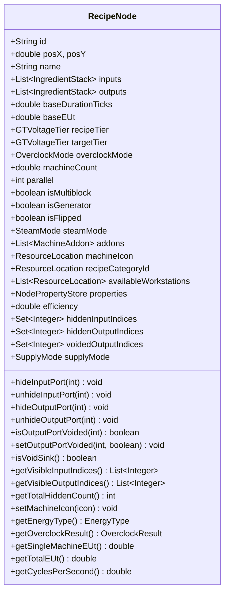
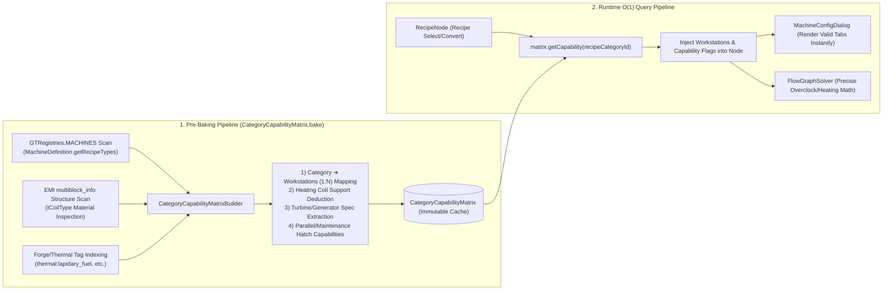
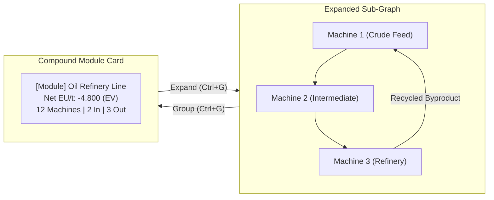

# [01] Core Domain Models & Deterministic Capability Matrix (Core Domain & Models)

> 📍 **GTCalcBoard Technical Specification Series**
> [[00] System Overview](00_OVERVIEW.md) ➔ **[01] Core Domain & Models** ➔ [[02] Math & Algorithms](02_MATH_AND_ALGORITHMS.md) ➔ [[03] UI & Rendering Pipeline](03_UI_AND_RENDERING_PIPELINE.md) ➔ [[04] Multiplayer & Network](04_MULTIPLAYER_AND_NETWORK_PROTOCOL.md) ➔ [[05] External Integration & i18n](05_INTEGRATION_AND_I18N.md)

---

## 1. Core Data Models (`com.gtceu.calcboard.api`)

### 1.1 `GTVoltageTier` (Voltage Tier Enum)
Defines all 15 voltage tiers of GregTech CEu Modern with complete formatting tokens and themes.

| Tier | Voltage (EU/t) | UI Code | Theme Color (Hex ARGB) |
| :--- | :--- | :--- | :--- |
| `ULV` | 8 | ULV | `0xFF8C8C8C` |
| `LV` | 32 | LV | `0xFFDCDCDC` |
| `MV` | 128 | MV | `0xFFFF6464` |
| `HV` | 512 | HV | `0xFFFFFF64` |
| `EV` | 2,048 | EV | `0xFF6464FF` |
| `IV` | 8,192 | IV | `0xFFFF64FF` |
| `LuV` | 32,768 | LuV | `0xFF64FFFF` |
| `ZPM` | 131,072 | ZPM | `0xFFFF6464` |
| `UV` | 524,288 | UV | `0xFF64FF64` |
| `UHV` | 2,097,152 | UHV | `0xFFFF3232` |
| `UEV` | 8,388,608 | UEV | `0xFF64B4FF` |
| `UIV` | 33,554,432 | UIV | `0xFF32FF82` |
| `UXV` | 134,217,728 | UXV | `0xFFFF82FF` |
| `OpV` | 536,870,912 | OpV | `0xFF5050FF` |
| `MAX` | 2,147,483,647 | MAX | `0xFFFF8282` |

---

### 1.2 `IngredientStack` (Ingredient Stack Model)
Encapsulates items and fluids moving through input/output port sockets.

```java
public class IngredientStack {
    private final ResourceLocation id;        // Unique identifier (e.g. gtceu:benzene)
    private final String displayName;          // Localized name (e.g. "Benzene")
    private double amount;                     // Quantity per single recipe cycle
    private final boolean isFluid;             // Fluid flag (true: mB / false: Item count)
    private double chance;                     // Base acquisition probability (0.0 ~ 1.0)
    private double tierChanceBoost;            // Added chance per tier increase (default: 0.05 = +5%)
}
```

---

### 1.3 `RecipeNode` (Pure Domain Node Model)
Holds the operational and calculation state of machines, generators, or compound modules on the canvas, delegating mod-specific behaviors to `IModAdapter`.



* **Clean Architecture & SPI Delegation (Pure Domain Model)**:
  - `RecipeNode` is a pure calculation domain entity across all supported mods (Create, Thermal, GTCEu, Vanilla, etc.).
  - Contains no hardcoded mod branches; machine icon change handling (`setMachineIcon`), physical energy type resolution (`getEnergyType`), single machine power computation (`computeSingleMachinePower`), node operational validation (`validateNode`), and multiblock BOM calculation (`buildMultiblockBOM`) are delegated dynamically via `ModAdapterRegistry.getAdapterForNode(this)`.
* **`hiddenInputIndices` / `hiddenOutputIndices`**: Set of integer port indices hidden by the user to reduce visual clutter on cards. Persisted via `RecipeNodeSerializer`. Renderers and wire solvers invoke `getVisibleInputIndices()` / `getVisibleOutputIndices()` to filter rendered and active ports.
* **`voidedOutputIndices` & `isVoidSink()` (ADR-019)**: Set of output port indices excluded from net product summary, and query method for Junction void sink (`SupplyMode.VOID_SINK`). Integrated with mass balance solvers (`FlowBalanceMatrixSolver`, `FlowSummaryAggregator`) to void surplus byproducts while prioritizing downstream consumers.
* **`isFlipped`**: Horizontally inverts the input (left) and output (right) socket ports to eliminate wire crossings in complex flowcharts.
* **`efficiency` ($\eta \in [0.0, 1.0]$)**: Machine utilization computed by solvers (`FlowGraphSolver`, `MassBalanceSolver`) subject to upstream supply limits and closed-loop cycles.
* **`calculateEffectiveOutputRates()`**: Computes per-second output flow combining machine count, parallel multiplier, overclocking, sub-tick batching, addon compounding, and byproduct tier chance boosts.

---

### 1.4 `NodePropertyStore` & `NodeProperties` (Type-Safe Dynamic Properties)
Manages mod-specific and feature-specific metadata without polluting the `RecipeNode` class fields.

```java
public class NodePropertyStore {
    private final Map<NodeProperty<?>, Object> properties = new HashMap<>();

    public <T> T get(NodeProperty<T> prop) {
        return (T) properties.getOrDefault(prop, prop.defaultValue());
    }

    public <T> void set(NodeProperty<T> prop, T value) {
        properties.put(prop, value);
    }
}
```

* **Standard Properties (`NodeProperties`)**:
  - `REQUIRED_REFLECTOR_TIER` (`Integer`, default `0`): Fusion reactor reflector tier requirement
  - `TURBINE_ROTOR_EFFICIENCY` (`Integer`, default `100`): Large turbine rotor efficiency (%)
  - `TURBINE_ROTOR_POWER` (`Integer`, default `100`): Large turbine rotor power factor (%)
  - `TURBINE_ROTOR_NAME` (`String`, default `""`): Installed rotor material display name
  - `TURBINE_HOLDER_BONUS` (`Integer`, default `0`): Rotor holder bonus efficiency (%)
  - `CLEANROOM_TIER` (`Integer`, default `0`): Cleanroom cleanliness requirement level
  - `EBF_TEMPERATURE` (`Integer`, default `0`): Electric Blast Furnace required temperature ($K$)
  - `BOILER_THROTTLE` (`Integer`, default `100`): Large boiler operational throttle percentage (25% ~ 100%)
  - `TARGET_BATCH_AMOUNT` (`Double`, default `0.0`): Terminal/reroute target batch quota
  - `TARGET_BATCH_TIME_SEC` (`Double`, default `0.0`): Target completion deadline in seconds

---

### 1.5 Dedicated Calculation & Workstation Resolvers (SRP Decomposition)

To preserve `RecipeNode` as a pure POJO domain model, rate integration and workstation lookup logic are decomposed into dedicated components:

* **`NodeRateCalculator`**:
  - Integrates per-second ingredient flow rates (`IngredientStack`) by compounding machine counts, parallels, overclocks, duration cycles, subtick CPS, addon multipliers, and tier byproduct probability boosts.
  - Dedicated yield calculations (`getSingleMachineYieldPerSecond`) and active consumption rates.
* **`NodeWorkstationResolver`**:
  - Deductively resolves workstation `ResourceLocation`s for corresponding voltage tiers from official registries and capability matrices.
  - Handles multiblock controller validation and tier variant workstation filtering.

---

### 1.6 `FlowGraph` & Immutable Collection Encapsulation

`FlowGraph` encapsulates the full canvas node network topology, strictly guarding against external state corruption.

* **Immutable View Encapsulation (`Collections.unmodifiableList`)**:
  - `getNodes()` and `getEdges()` return unmodifiable views, forcing state mutations through explicit methods (`addNode`, `removeNode`, `connect`, `disconnect`).
* **$O(1)$ Fast Node Index Synchronization (`nodeMap`)**:
  - Internal `Map<String, RecipeNode> nodeMap` is synchronized during node addition, removal, and clearing, guaranteeing $O(1)$ lookup time for `getNode(id)`.
* **`ConnectionEdge` Immutable Record (ADR-041)**:
  ```java
  public record ConnectionEdge(
      String fromNodeId,
      int outputIndex,
      String toNodeId,
      int inputIndex,
      double fixedFlowLimit,
      int priority
  )
  ```
  - `fixedFlowLimit`: Maximum flow rate cap allowed across this connection (unlimited if negative).
  - `priority`: Connection priority tier (default `0`). Higher-priority connections receive flow allocation first.

---

### 1.7 `EnergyType` & `SteamMode` (Multi-Energy & Physical Models)

* **`EnergyType`**:
  - `ELECTRIC_EU`: GregTech power (EU/t)
  - `KINETIC_SU`: Create rotational kinetic energy (SU, RPM)
  - `ELECTRIC_FE`: Thermal / Create New Age power (RF/t, FE/t)
  - `HEAT_OR_SELF`: Steam boilers and combustors (mB/s Steam generation)
  - `NONE`: Passive / unpowered recipes (0 Power)
* **`SteamMode`**:
  - `NONE`: Standard electric operation
  - `LOW_PRESSURE`: Low pressure steam processing ($2.0\times$ duration, 1 EU = 2 mB Steam)
  - `HIGH_PRESSURE`: High pressure steam processing ($1.0\times$ duration, 1 EU = 2 mB Steam)

---

### 1.8 `SupplyMode` & `FlowSplitMode` (Flow Supply & Branching Model, ADR-012, ADR-019, ADR-041)
Defines external supply/drain behavior and branching modes for Junction nodes and raw material endpoints.

```java
public enum SupplyMode {
    NONE,         // No external supply (relies entirely on connected upstream node flow)
    INFINITE,     // Infinite resource supply (blocks upstream demand propagation, satisfies 100% downstream demand)
    FIXED_RATE,   // Fixed rate supply (supplies up to externalSupplyRate items/s or mB/s)
    VOID_SINK,    // Infinite void sink (absorbs and deletes all incoming surplus byproducts)
    FIXED_DRAIN   // Fixed rate drain (enforces a fixed outflow quota downstream)
}
```

```java
public enum FlowSplitMode {
    PROPORTIONAL, // Demand-weighted proportional distribution across downstream consumers
    EQUAL         // Mechanical equal split across downstream connection count (1/N)
}
```

* **`RecipeNode` External Supply & Branching Properties**:
  - `supplyMode` (`SupplyMode`, default `NONE`): External supply mode of the node.
  - `externalSupplyRate` (`double`, default `0.0`): Fixed rate in items/s or mB/s when in `FIXED_RATE` or `FIXED_DRAIN` mode.
  - `customParallel` (`int`, default `0`): User-specified custom manual parallel count.
  - `NodeProperties.JUNCTION_SPLIT_MODE` (`FlowSplitMode`, default `PROPORTIONAL`): Branching distribution mode for Junction nodes.

---

### 1.9 `BoardPage` Hierarchical Folder & AE2 Binding Model (ADR-008, ADR-012)
Categorizes multi-canvas pages in a workspace using virtual hierarchical folder paths (`folderPath`) and supports 1:1 binding to AE2 processing pattern IDs (`ae2PatternId`).

```java
public class BoardPage {
    private final String id;
    private String name;
    private String folderPath;           // Hierarchical directory path (e.g. "Chemical/Polymers")
    private ResourceLocation ae2PatternId; // 1:1 bound AE2 processing pattern ID
    private final FlowGraph graph;
    private final List<CanvasGroupFrame> frames;
    private final List<CanvasStickyNote> stickyNotes;
}
```

* **Hierarchical Folder Path (`folderPath`)**: Slash-delimited virtual directory path integrated with `PageBrowserDrawer` for managing hundreds of pages in expandable folder trees.
* **AE2 Pattern ID Binding (`ae2PatternId`)**: Binds the entire flowchart process to an AE2 processing pattern for precision pipeline ETA evaluation and live autocrafting monitoring.

---

## 2. Deterministic Capability Matrix (`CategoryCapabilityMatrix`)

An $O(1)$ immutable global cache built during game initialization via deductive analysis to eliminate heuristic tooltip string parsing.



### 2.1 Hardware Addon Categories & Multiblock Trait Addons (`AddonCategory`, `MachineAddon`)
Classifies hardware chips expanding physical machine capabilities into standardized categories:

* **`AddonCategory`**:
  - `COIL`: Heating Coil Blocks (EBF temperature bonuses and energy discounts)
  - `PARALLEL`: Parallel Control Hatches (4x to 256x parallels)
  - `MAINTENANCE`: Maintenance Hatches (10% duration reductions, etc.)
  - `ROTOR`: Large Turbine Rotors (efficiency & flow rate multipliers)
  - `REFLECTOR`: Fusion Reflectors (tier-dependent slowdown multipliers)
  - `ENERGY_HATCH` / `HATCH_BUS`: Multiblock power and I/O buses
  - `THREADING`: Threading Helices (multi-pipeline throughput)
  - `THERMAL_AUGMENT`: Thermal Series augments and upgrade kits
  - `MULTIBLOCK_TRAIT`: GTCEu multiblock intrinsic traits
  - `CUSTOM`: User-defined custom hardware multipliers
* **GTCEu Multiblock Intrinsic Traits (`MULTIBLOCK_TRAIT`)**:
  - `THROUGHPUT_BOOSTING`: 4x Parallels, 1.6x Duration, 0.95x EU (Pyrolyse Oven, Super Cracker)
  - `BULK_PROCESSING`: 16x Parallels, 13x Duration (23% effective speedup)
  - `BATCH_MODE`: Enables multi-recipe batch processing without penalty
  - `OVERPRESSURE`: 8x Parallels, 1.5x Duration, 1.25x EU (Autoclave)

---

## 3. Compound Modules & Progressive Assembly (`FlowGraphModuleHandler`, `CompoundRecipeBuilder`)

Packages multi-node subgraphs into a single compact compound module card (`Ctrl+G`) or expands them back into full subgraphs, and builds chained cards for Create Sequenced Assembly recipes.



1. **Boundary I/O Promotion**: Intermediate wires between internal nodes are encapsulated; only external feedstock and end-products are promoted to outer card socket ports.
2. **Wire Remapping**: External `ConnectionEdge` instances are remapped to the newly created compound card ports.
3. **Proportional Scaling**: Changing machine count on the compound card proportionally scales all internal machine counts and flow rates.
4. **Distinct Sequenced Assembly Machine Icons (`CompoundRecipeBuilder.LayerSpec`)**: Automatically extracts and assigns distinct machine icons (Deployer, Spout, Mechanical Press, Mechanical Saw) for each intermediate step in Create Sequenced Assembly compound cards.

---

## 4. Serialization, Clipboard & Disk Management (`BlueprintCodec`, `BlueprintFileManager`, `NodeClipboard`)

### 4.1 `BlueprintCodec`
Serializes graph topology, coordinates, addons, voltage tiers, viewport, and metadata into NBT followed by GZIP compression and Base64 encoding. Supports optional human-readable title prefixes for chat readability while maintaining 100% backward compatibility.

$$\text{Blueprint String} = \text{"GTBOARD:"} + [\text{Title} + \text{":"}] + \text{Base64}\Big(\text{GZIP}\big(\text{BlueprintPackage.serializeNBT()}\big)\Big)$$

### 4.2 `BlueprintFileManager`
* **Storage Path**: `<gameDir>/gtcalcboard/blueprints/`
* **File Format**: `.gtcb` (Compressed NBT with Atomic File Move to prevent corruption)
* **Key Features**: Individual blueprint disk persistence, directory scanning with metadata extraction, file deletion, and native OS file explorer integration.

### 4.3 `NodeClipboard`
* Copies (`Ctrl+C`) / cuts (`Ctrl+X`) selected nodes and internal edges.
* Pastes (`Ctrl+V`) with new UUIDs and a $+20\text{px}$ offset relative to the cursor or canvas center.

---

## 5. Undo / Redo Command Architecture (`HistoryManager`, `BoardCommand`)

Maintains command deltas for all canvas operations with minimal memory overhead (<2MB for 1,000+ undo steps).

* **Supported Commands**: `MoveNodesCommand`, `AddConnectionCommand` / `RemoveConnectionCommand`, `AddNodesCommand` / `RemoveNodesCommand`, `ModifyPropertyCommand`, `GroupModuleCommand` / `ExpandModuleCommand`, `ResizeFrameCommand`.

---

## 6. Canvas Group Frames & Shared Machine Pools (`CanvasGroupFrame`)

Manages visual grouping regions and time-sharing machine pools.

* **`isSharedMachineFrame`**: Time-sharing mode where all enclosed machine recipes share a single physical machine pool.
* **Cumulative Duty Calculation**: $\text{Total Duty} = \sum \text{machineCount}_i$, Required Machines = $\lceil \text{Total Duty} \rceil$.
* **Batch Hardware Config Synchronization (`syncHardwareConfig`)**: Synchronizes voltage tiers, overclock modes, parallel limits, and equipped addons across all enclosed machines from the frame header.
* **One-Click Auto-Fit Frame (`autoFit`)**: Automatically adjusts frame bounding box to tightly enclose all contained/intersecting nodes with a 24px padding.

---

## 7. Port Reference Record (`PortRef`)

A lightweight immutable record identifying specific input/output ports on the canvas.

```java
public record PortRef(String nodeId, boolean isInput, int portIndex) {}
```

* **Multi-Port Selection**: Windows Explorer-style `Ctrl + Click` individual toggle and `Shift + Click` continuous range selection.
* **Bundle Batch Wiring**: Dragging from multiple selected ports renders real-time multi-bezier curves, spawning vertical aligned junction nodes or auto-wiring shared machine pools.

---

## 8. Category Default Machine Preset System (`CategoryMachinePreset`, `CategoryMachinePresetManager`)

Remembers preferred machine models, voltage tiers, parallel factors, overclock modes, and hardware addons per recipe category (`categoryId`), automatically applying them when placing new nodes.

* **Domain Entity (`CategoryMachinePreset`)**:
  - Encapsulates machine icon, multiblock state, target voltage tier, parallel count, overclock mode, steam mode, addons, node properties, and threading configuration bound to a recipe category.
  - `applyTo(RecipeNode node)`: Injects preset configuration into new nodes while safely preserving the minimum required voltage tier of the recipe.
* **Preset Manager (`CategoryMachinePresetManager`)**:
  - Singleton in-memory registry and NBT persistence manager (`serializeNBT` / `deserializeNBT`).
  - Provides CRUD interfaces via `BoardSettingsDialog` and `MachineConfigDialog`.

## 9. Search Domain Model & Headless Recipe Provider SPI (`SearchableRecipe`, `ILevelRecipeProvider`) (ADR-009)

Decouples recipe indexing, searching, and instantiation from the client GUI layer, enabling pure core domain and headless/dedicated server operations.

* **`SearchableRecipe` (Lightweight Search Record)**:
  ```java
  public record SearchableRecipe(
      ResourceLocation id,
      ResourceLocation categoryId,
      String displayName,
      List<IngredientStack> inputs,
      List<IngredientStack> outputs,
      double durationTicks,
      double eut,
      GTVoltageTier tier,
      Object rawRecipe
  )
  ```
* **`ILevelRecipeProvider` (Headless Recipe Provider SPI)**:
  - Abstraction interface providing `SearchableRecipe` instances from vanilla `Level.getRecipeManager()` when client-side recipe viewers (EMI/JEI) are absent or in dedicated server environments.
  - Enables zero-GUI-dependency $O(1)$ recipe indexing and domain node spawning.

---

## 10. Machine Hardware Template Model (`MachineHardwareTemplate`) (ADR-012)

Encapsulates machine hardware configurations (tier, parallel count, overclock mode, installed addons, threading config, and node properties) into an independent preset template for one-click cloning and multi-selection application across nodes.

```java
public class MachineHardwareTemplate {
    private String id;
    private String name;
    private GTVoltageTier targetTier;
    private int parallel;
    private OverclockMode overclockMode;
    private SteamMode steamMode;
    private List<MachineAddon> addons;
    private NodePropertyStore properties;
    private NodeThreadingConfig threadingConfig;

    public void applyTo(RecipeNode targetNode) { ... }
    public static MachineHardwareTemplate fromNode(String name, RecipeNode sourceNode) { ... }
}
```

* **Hardware Extraction (`fromNode`)**: Copies tier, parallel, addons, and property store from a source node to generate an immutable template.
* **Hardware Injection (`applyTo`)**: Injects hardware specifications into a target node while preserving its recipe inputs/outputs and baseline recipe tier requirement ($\text{recipeTier}$).

---

## 11. Flow Control & Visualization Enums (SupplyMode, WireAnimationMode) (ADR-018, ADR-019)

### 11.1 `SupplyMode` (Junction Node Supply Mode Enum)
Defines external supply and byproduct voiding behaviors for Junction (reroute) nodes:

| Mode (SupplyMode) | Serialized Key | Translation Key | Description |
| :--- | :--- | :--- | :--- |
| `NONE` | `NONE` | `gui.gtcalcboard.junction.supply_mode.none` | Standard pass-through relay between upstream and downstream ports |
| `INFINITE` | `INFINITE` | `gui.gtcalcboard.junction.supply_mode.infinite` | Infinite supply mode (assumes limitless external input; blocks backward demand) |
| `FIXED_RATE` | `FIXED_RATE` | `gui.gtcalcboard.junction.supply_mode.fixed_rate` | Fixed external supply rate mode (injects user-configured flow rate) |
| `VOID_SINK` | `VOID_SINK` | `gui.gtcalcboard.junction.supply_mode.void_sink` | **Void Sink Mode** (absorbs & deletes surplus flow; isolates backward demand; strictly prioritizes downstream machines in 1:N branches) |

### 11.2 `WireAnimationMode` (Wire Flow Animation Mode Enum)
Controls pulse dot rendering behaviors on canvas connection wires:

| Mode (WireAnimationMode) | Config Index | Translation Key | Behavior & Visualization |
| :--- | :--- | :--- | :--- |
| `RATE_MODULATED` | `0` | `gui.gtcalcboard.wire_anim.rate_modulated` | **Rate Modulated (Default)**: Speed modulation, duty cycle stutter/stall, and 3-stage RGB interpolation (Cyan $\to$ Amber $\to$ Crimson) based on saturation ratio ($R = \text{Supply}/\text{Demand}$). Pulsing amber glow on starved machines |
| `UNIFORM` | `1` | `gui.gtcalcboard.wire_anim.uniform` | **Uniform Pulse**: Constant travel speed and single color irrespective of flow rates |
| `DISABLED` | `2` | `gui.gtcalcboard.wire_anim.disabled` | **Disabled**: Pulse dot rendering skipped on wires |

---

## 12. Flowsheet Control & Target Quantity Anchor Domain Models (`TargetAnchor`, `SharedMachinePool`) (ADR-030, ADR-032)

### 12.1 Junction & Node Flow Target Anchors (`TargetAnchor`)
Serves as fixed boundary conditions for flow scaling across cyclic loops and terminal batch evaluations:

* **Anchor Properties & Determination**:
  - `isTargetAnchor()`: Identifies whether a node has been pinned by the user with a fixed rate or target batch quantity.
  - `targetBatchAmount`, `targetBatchTimeSec`: Target batch production quantity and completion deadline constraints for terminal nodes.
  - The 2-stage linear flow solver (`TwoStageLinearFlowSolver`) adopts these anchors as strict boundary conditions to solve for unique, consistent flow rates.
* **Conflict Detection (`AnchorConflict`)**:
  - Sets a conflict flag and activates the `[⚠ Conflict]` badge if multiple mutually inconsistent flow anchors reside in the same connected subgraph component.

### 12.2 Shared Machine Pool Frame Domain Model (`SharedMachinePool`)
A frame-based domain model grouping multiple heterogeneous recipe nodes to run on a time-shared physical machine cluster:

#### Duty Allocation & Machine Count Calculation
$$\text{Total Duty} = \sum_{i=1}^N \text{machineCount}_i$$
$$\text{Required Physical Machines} = \lceil \text{Total Duty} \rceil$$
* **BOM & Power Aggregation Integration**:
  - When generating a Bill of Materials (`GTCEuBOMHelper`), fractional machine counts are not rounded up individually; only $\lceil \text{Total Duty} \rceil$ hulls and multiblock structures are requested for the pooled cluster.
  - Generates zero idle power loss, computing effective dynamic electrical load proportional to active utilization ($\text{Total Duty} / \text{Required Physical Machines}$).

---

> ➡ **Next Chapter**: [[02] Mathematical Engine & Graph Analysis Algorithms](02_MATH_AND_ALGORITHMS.md)
