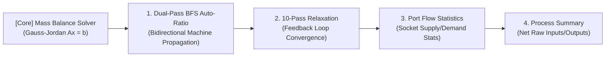

# [02] Mathematical Solver Engine & Graph Algorithms (Math & Algorithms)

> 📍 **GTCalcBoard Technical Specification Series**
> [[00] System Overview](00_OVERVIEW.md) ➔ [[01] Core Domain Models](01_CORE_DOMAIN_AND_MODELS.md) ➔ **[02] Math & Algorithms** ➔ [[03] UI & Rendering Pipeline](03_UI_AND_RENDERING_PIPELINE.md) ➔ [[04] Multiplayer & Networking](04_MULTIPLAYER_AND_NETWORK_PROTOCOL.md) ➔ [[05] External Integration & i18n](05_INTEGRATION_AND_I18N.md)

---

## 1. Overclocking & Specialized Machine Physics

GTCalcBoard strictly computes physical energy and recipe duration formulas for GregTech CEu Modern and integrated tech mods.

### 1.1 Voltage Tier Delta ($\Delta\text{Tier}$)
$$
\Delta\text{Tier} = \begin{cases} 
\max(0, \, \text{TargetTier.ordinal} - \text{RecipeTier.ordinal} - 1) & (\text{RecipeTier} = \text{ULV}) \\
\max(0, \, \text{TargetTier.ordinal} - \text{RecipeTier.ordinal}) & (\text{otherwise})
\end{cases}
$$

---

### 1.2 Overclock Mode Duration & Power Formulas

When $\Delta\text{Tier} > 0$, Energy and Speed Factors are determined as follows:

$$
\text{Energy Factor} = 4.0^{\Delta\text{Tier}}
$$

$$
\text{Speed Factor} = \begin{cases} 
2.0^{\Delta\text{Tier}} & \text{(STANDARD Mode)} \\
4.0^{\Delta\text{Tier}} & \text{(PERFECT Mode)} \\
1.0 & \text{(LOSSLESS Mode)}
\end{cases}
$$

* **STANDARD Mode**: Standard singleblock and multiblock machines ($4\times\text{power}, 2\times\text{speed per tier}$)
* **PERFECT Mode**: Perfect overclocking multiblocks ($4\times\text{power}, 4\times\text{speed per tier}$)
* **LOSSLESS Mode**: Speed unchanged, energy conserved ($1\times\text{power}, 1\times\text{speed per tier}$)

$$
\text{Calculated Duration (ticks)} = \frac{\text{BaseDurationTicks}}{\text{Speed Factor}}
$$

$$
\text{Calculated EU/t} = \text{BaseEUt} \times \text{Energy Factor}
$$

---

### 1.3 Sub-tick Batching & Single/Multiblock Overclock Branching ($< 1.0\text{ Tick}$)

When aggressive overclocks push calculated recipe durations below $1.0\text{ tick}$ ($0.05\text{ s}$), processing branches according to singleblock and multiblock hardware capabilities:

1. **Singleblock Machines (Early Break)**:
   Singleblock machines do not support sub-tick parallel processing. When the overclock loop reaches a duration of $1.0\text{ tick}$ or lower ($\text{duration} \le 1.0$), the overclock calculation terminates immediately (Early Break). Duration is clamped at $\max(1.0, \, \lfloor \text{duration} \rfloor) = 1.0\text{ tick}$, preventing uncontrolled power factor growth ($\text{Energy Factor}$) or EU/t spikes:

$$\text{BatchesPerTick} = 1.0, \quad \text{Effective Duration} = 1.0\text{ tick} \quad (0.05\text{ s})$$
$$\text{Cycles Per Second (CPS)} = 20.0 \times \text{Parallel} \times \text{MachineCount}$$

2. **Multiblock Machines (Subtick Parallel)**:
   Multiblocks continue to support sub-tick batching for voltage tiers exceeding the $1.0\text{ tick}$ threshold:

$$\text{BatchesPerTick} = \frac{1.0}{\text{Calculated Duration (ticks)}}, \quad \text{Effective Duration} = 1.0\text{ tick}$$
$$\text{Effective EU/t} = \text{Calculated EU/t} \times \text{BatchesPerTick}$$
$$\text{Cycles Per Second (CPS)} = 20.0 \times \text{BatchesPerTick} \times \text{Parallel} \times \text{MachineCount}$$

---

### 1.4 Hardware Addon Compounding

For all installed addons $a \in \text{InstalledAddons}$, duration and power multipliers compound multiplicatively:

$$\text{Total Duration} = \text{Effective Duration} \times \prod_{a \in \text{Addons}} a.\text{getDurationMultiplier}()$$
$$\text{Total EU/t} = \text{Effective EU/t} \times \prod_{a \in \text{Addons}} a.\text{getEutMultiplier}()$$

#### Heating Coil Machine-Specific Bonus Deduction

##### Electric Blast Furnace (EBF)
Given recipe temperature $T_{\text{recipe}}$ and coil temperature $T_{\text{coil}}$:

$$\Delta T_{\text{excess}} = \max(0, \, T_{\text{coil}} - T_{\text{recipe}})$$
$$\text{EUt Multiplier} = 0.95^{\lfloor \Delta T_{\text{excess}} / 900 \rfloor}$$

*(5% compounding power reduction per 900K excess temperature)*

##### Pyrolyse Oven
$$\text{Duration Multiplier} = \frac{100.0}{\text{PyrolyseSpeedPercent}}$$

##### Cracking Unit
$$\text{EUt Multiplier} = \frac{\text{CrackingEnergyPercent}}{100.0}$$

##### Large Chemical Reactor (LCR / ECR / ICR)
$$\text{Duration Multiplier} = \frac{100.0}{\text{ChemicalSpeedPercent}}, \quad \text{EUt Multiplier} = \frac{\text{ChemicalEnergyPercent}}{100.0}$$

##### Multi Smelter
$$\text{Parallel} = \text{SmelterParallel} \quad (32\text{x}, 64\text{x}, 128\text{x}\dots)$$

#### Large Steam/Gas/Plasma Turbine Rotor, Decoupled Tiers & Durability Formulas (ADR-006)

##### 1. Decoupled Rotor Holder & Dynamo Hatch Tiers
Given Rotor Holder tier voltage $V_{\text{holder}}$, Dynamo Hatch tier voltage $V_{\text{dynamo}}$, and amperage $A_{\text{dynamo}}$:

$$\text{Cap}_{\text{holder}} = V_{\text{holder}} \times 2.0 \quad (\text{EU/t, Flow Rate Limit})$$
$$\text{Cap}_{\text{dynamo}} = V_{\text{dynamo}} \times A_{\text{dynamo}} \quad (\text{EU/t, Power Generation Ceiling})$$
$$P_{\text{max, turbine}} = \min(\text{Cap}_{\text{holder}}, \, \text{Cap}_{\text{dynamo}})$$

##### 2. Turbine Rotor Efficiency & Generation Calculation
Given rotor efficiency $E_{\text{rotor}}$, rotor power $P_{\text{rotor}}$, rotor holder tier bonus $B_{\text{holder}} = \max(0, (\text{HolderTier} - \text{BaseTier}) \times 10\%)$, and lubricant boost multiplier $M_{\text{boost}} \in \{1.0, 1.25, 1.50\}$:

$$\text{RotorEffMult} = \max\left(1.0, \, \frac{E_{\text{rotor}}}{100.0} \times \left(1.0 + \frac{B_{\text{holder}}}{100.0}\right) \times M_{\text{boost}}\right)$$
$$\text{Calculated Output EU/t} = \min\left(P_{\text{max, turbine}}, \, \text{BaseRecipeEUt} \times \frac{P_{\text{rotor}}}{100.0} \times M_{\text{boost}}\right)$$
$$\text{Total Parallel} = \left\lfloor \frac{\text{Calculated Output EU/t}}{\text{BaseRecipeEUt}} \right\rfloor$$

##### 3. Rotor Durability Wear Rate & Lifetime ($T_{\text{lifespan}}$) Formulas
Given base durability $D_{\text{rotor}}$ and loss rate per second $\text{Loss}_{\text{sec}}$:

$$\text{Loss}_{\text{sec}} = \text{BaseLossRate} \times \left(\frac{\text{ActualFlowRate}}{\text{OptimalFlowRate}}\right) \times \frac{1.0}{M_{\text{boost}}}$$
$$T_{\text{lifespan}} = \frac{D_{\text{rotor}}}{\text{Loss}_{\text{sec}}} \quad (\text{seconds})$$
$$\text{Rotor Replacement Rate (Items/hour)} = \frac{3600.0}{T_{\text{lifespan}}} \times \text{MachineCount}$$

#### Power Supply Based Maximum Available Machine Parallel ($P_{\max}$) Formula
Given equipped Energy Hatch voltage $V_{\text{hatch}}$, amperage $A_{\text{hatch}}$, and single recipe power $E_{\text{recipe}}$:
$$P_{\max} = \min\left(\text{ConfiguredParallel}, \, \left\lfloor \frac{V_{\text{hatch}} \times A_{\text{hatch}}}{E_{\text{recipe}}} \right\rfloor\right)$$
If $\text{ConfiguredParallel} > P_{\max}$, a hardware capacity warning badge is rendered on the canvas node card.
For multiblock structures with single energy hatch limits ($\text{energyHatchSlotCount} = 1$, such as Rock Filtrator), at most one energy hatch may be installed and dual-hatch tier skip overclocking is disallowed.

---

### 1.5 Byproduct Tier Chance Boost

$$\text{Effective Chance} = \min\Big(1.0, \, \text{BaseChance} + (\Delta\text{Tier} \times \text{TierChanceBoost})\Big)$$
$$\text{Single Machine Expected Output Rate (per sec)} = \text{Amount} \times \text{Effective Chance} \times \text{CPS}$$

---

### 1.6 Steam Boilers & Throttle ($\theta \in [0.25, 1.0]$)

- **Small Boilers**: LP Bronze ($120\text{ L/s} = 6\text{ mB/t}$), HP Steel ($360\text{ L/s} = 18\text{ mB/t}$)
- **Large Boilers**: Bronze ($16\text{k/s}$), Steel ($36\text{k/s}$), Titanium ($64\text{k/s}$), Tungstensteel ($128\text{k/s}$)

$$\text{Effective Speed Multiplier} = \text{TierSpeedMultiplier} \times \theta$$
$$\text{Steam Rate (mB/t)} = \text{BaseSteamRate} \times \text{Effective Speed Multiplier}$$
$$\text{Water Rate (mB/t)} = \frac{\text{Steam Rate (mB/t)}}{160.0} \quad (1\text{mB Water} \rightarrow 160\text{mB Steam})$$

---

### 1.7 GTCEu & Star Technology Multiblock Trait Physics Formulas (`MULTIBLOCK_TRAIT`)

Physics formulas for intrinsic multiblock processing modifiers and traits:

1. **Throughput Boosting (Pyrolyse Oven, Super Cracker, etc.)**:
   - Multipliers: Parallel $P_{\text{trait}} = 4$, Duration $D_{\text{mult}} = 1.6$, Power $E_{\text{mult}} = 0.95$
   - Effective Duration: $T_{\text{eff}} = T_{\text{base}} \times 1.6 \text{ (ticks)}$
   - Effective Cycles Per Second (CPS): $\text{CPS} = \frac{20}{T_{\text{eff}}} \times (P_{\text{hatch}} \times 4) = \text{CPS}_{\text{base}} \times 2.5 \quad (2.5\times \text{ speed acceleration})$
   - Single Machine Power: $\text{EUt}_{\text{single}} = \text{EUt}_{\text{base}} \times 0.95$ (Constant power parallel: $P_{\text{trait}}$ does not increase power draw)
2. **Bulk Processing (Bulk Processing Array, LOAF, etc.)**:
   - Multipliers: Parallel $P_{\text{trait}} = 16$, Duration $D_{\text{mult}} = 13.0$
   - Effective Duration: $T_{\text{eff}} = T_{\text{base}} \times 13.0 \text{ (ticks)}$
   - Effective Cycles Per Second (CPS): $\text{CPS} = \frac{20}{T_{\text{eff}}} \times (P_{\text{hatch}} \times 16) = \text{CPS}_{\text{base}} \times \frac{16}{13} \approx \text{CPS}_{\text{base}} \times 1.2308 \quad (23.08\% \text{ speed acceleration})$
3. **Overpressure Autoclave**:
   - Multipliers: Parallel $P_{\text{trait}} = 8$, Duration $D_{\text{mult}} = 1.5$, Power $E_{\text{mult}} = 1.25$
   - Effective Cycles Per Second (CPS): $\text{CPS} = \frac{20}{T_{\text{eff}}} \times (P_{\text{hatch}} \times 8) = \text{CPS}_{\text{base}} \times \frac{8}{1.5} \approx \text{CPS}_{\text{base}} \times 5.333 \quad (5.33\times \text{ speed acceleration})$
4. **Multiblock Trait Stacking**:
   For endgame multiblocks combining multiple traits (e.g. LOAF, Ultimate EBF):

$$\text{Total Parallel} = P_{\text{hatch}} \times \prod_{k} P_{\text{trait}, k}$$
$$\text{Combined Duration Multiplier} = \prod_{k} D_{\text{mult}, k}$$

   Example: `Throughput Boosting` ($4\times \text{ Par, } 1.6\times \text{ Dur}$) + `Bulk Processing` ($16\times \text{ Par, } 13.0\times \text{ Dur}$) = $64\times \text{ Parallel, } 20.8\times \text{ Duration} \Rightarrow \frac{64}{20.8} \approx 3.077\times \text{ overall speedup}$.

---

## 2. Modular Solver Architecture & Core Algorithms

Following Single Responsibility principles, the solver engine is structured around the `FlowGraphSolver` facade delegating to 4 specialized sub-solvers:
- `MassBalanceSolver`: Closed-loop Gauss-Jordan mass conservation linear system solver.
- `FlowBalanceMatrixSolver`: 10-pass fixed-point bottleneck relaxation, bidirectional AutoRatio BFS propagation, and integer harmonized scaling.
- `FlowGraphTopologyAnalyzer`: Directed graph topological sorting, cycle detection (`CycleDetector`), and upstream/downstream subgraph traversal.
- `FlowSummaryAggregator`: Net process balance summaries (`BalanceSummary`), total energy/power deltas, and socket flow statistics.

---

### [Core Engine] Closed-Loop Mass Conservation Linear Solver (`MassBalanceSolver`)

Calculates exact machine count vectors $\mathbf{x} = [x_1, x_2, \dots, x_N]^T$ satisfying the **Mass Conservation Law** in closed-loop recycling circuits (e.g. hydrogen recycling in ethylbenzene lines or platinum group refining cycles) using rigorous numerical linear algebra.

#### 1. Linear System Formulation
For each intermediate/final material $i$ ($1 \le i \le M$), the net balance between external demand $d_i$ and machine production/consumption matrix $S \in \mathbb{R}^{M \times N}$ is formulated as:

$$\sum_{j=1}^N S_{ij} x_j = d_i \quad \Longleftrightarrow \quad A\mathbf{x} = \mathbf{b}$$

where $S_{ij}$ denotes the net per-second output ($>0$) or input ($<0$) of material $i$ produced by a single machine $j$.

#### 2. Gauss-Jordan Elimination with Partial Pivoting
For numerical stability, the pivot row $p$ with the largest absolute value in column $k$ is selected and swapped at each elimination step $k$:

$$p = \arg\max_{i \ge k} |A_{ik}|$$

If $|A_{pk}| < \epsilon$ ($10^{-9}$), the system is diagnosed as singular or under-determined and seamlessly transitions to least-squares approximation or BFS heuristic fallbacks.

Elimination updates ($O(N^3)$):
$$A_{ij} \leftarrow A_{ij} - \frac{A_{ik}}{A_{kk}} A_{kj}, \quad b_i \leftarrow b_i - \frac{A_{ik}}{A_{kk}} b_k \quad (\forall i \ne k)$$

---

### [Algorithm 1] 10-Pass Fixed-Point Bottleneck Relaxation

Iteratively converges machine steady-state utilization efficiencies ($\eta_v \in [0.0, 1.0]$) under upstream supply limits.

1. **Initialization**: Set $\eta_v^{(0)} = 1.0$ for all $v \in V$.
2. **Relaxation Iteration ($k = 1 \dots 10$)**:
   Upstream supplier effective output is $\text{Supply}_{P_j} = \text{NominalOutputRate}_{P_j} \times \eta_{P_j}^{(k-1)}$, and proportionally distributed incoming supply is calculated as:

$$\text{IncomingSupply}_i = \sum_{P_j} \min\left(\text{NominalDemand}_{C, i}, \, \text{Supply}_{P_j} \times \frac{\text{NominalDemand}_{C, i}}{\text{TotalDemand}_{P_j}}\right)$$

   Consumer machine efficiency update: $\eta_C^{(k)} = \min_{i} \left(\frac{\text{IncomingSupply}_i}{\text{NominalDemand}_{C, i}}, \, 1.0\right)$
3. **Early Termination**: Halts immediately when $\max_{v} |\eta_v^{(k)} - \eta_v^{(k-1)}| < 10^{-4}$.

---

### [Algorithm 2] Port Flow Statistics (`PortFlowStats`)

- **Input Sockets**: Deficit (`isInputDeficit`, Supply < Demand $-0.001$), Balanced (`isBalanced`, $\pm 0.001$), Surplus (`isInputSurplus`, Supply > Demand $+0.001$)
- **Output Sockets**: Surplus (`isOutputSurplus`, Production > Downstream Demand $+0.001$), Deficit (`isOutputDeficit`, Production < Downstream Demand $-0.001$)

---

### [Algorithm 3] Dual-Pass BFS Auto-Ratio

Locks the user-selected anchor node count and propagates machine counts upstream (satisfying feedstock demand) and downstream (handling byproduct production), protected by cycle safety guards ($\max(50, |V| \times 5)$, visits $\le 3$).

---

### [Algorithm 4] Process Summary & Net Balance (`BalanceSummary`)

$$\text{Net EU/t} = \sum_{g \in \text{Generators}} g.\text{getEffectiveEUt}() - \sum_{m \in \text{Consumers}} m.\text{getEffectiveEUt}()$$

$$\Delta_{\text{material}} = \sum \text{Output Rates} - \sum \text{Input Rates}$$

---

### [Algorithm 5] Target Batch ETA & Stock Depletion Time (DT) (`ProductionETACalculator`)

#### 1. Estimated Completion Time (ET)
For a terminal or reroute node with target quota $A_{\text{target}}$, net inflow rate $\text{Rate}_{\text{in}}$, and maximum upstream cycle duration $T_{\text{cycle}}$:

##### Continuous Flow Model ($T_{\text{cycle}} \le 0$)
$$T_{\text{ET}} = \frac{A_{\text{target}}}{\text{Rate}_{\text{in}}} \quad [\text{seconds}]$$

##### Discrete Machine Cycle Quantization Model ($T_{\text{cycle}} > 0$)
For single-cycle production capacity $\text{Cap}_{\text{cycle}} = \text{Rate}_{\text{in}} \times T_{\text{cycle}}$, an epsilon guard ($\epsilon = 10^{-7}$) prevents false cycle increments caused by double-precision division rounding:

$$N_{\text{cycle}} = \left\lceil \frac{A_{\text{target}}}{\text{Cap}_{\text{cycle}}} - 10^{-7} \right\rceil, \quad T_{\text{ET}} = N_{\text{cycle}} \times T_{\text{cycle}} \quad [\text{seconds}]$$

##### Total Batch Energy & Feedstock Aggregation
$$E_{\text{total}} = \sum_{n \in \text{UpstreamNodes}} \left( n.\text{getTotalEUt}() \times n.\text{getEfficiency}() \times 20 \times T_{\text{ET}} \right) \quad [\text{EU}]$$
$$C_{\text{raw}}(M) = \text{UnconnectedInputRate}(M) \times T_{\text{ET}} \quad [\text{Items / mB}]$$

#### 2. Raw Material Stock Depletion Time (DT)
For an unconnected raw feedstock junction buffer with stock amount $A_{\text{buffer}}$, total downstream outflow rate $\text{Rate}_{\text{out}}$, and downstream cycle duration $T_{\text{cycle, down}}$:

$$N_{\text{drain}} = \left\lceil \frac{A_{\text{buffer}}}{\text{Rate}_{\text{out}} \times T_{\text{cycle, down}}} - 10^{-7} \right\rceil, \quad T_{\text{DT}} = N_{\text{drain}} \times T_{\text{cycle, down}} \quad [\text{seconds}]$$

---

### [Algorithm 6] Infinite/Fixed External Supply Flow Modeling (`FlowBalanceMatrixSolver`, `FlowSummaryAggregator`) (ADR-012)

When external resource supply modes (`SupplyMode`) are configured on junction or source nodes, upstream demand backpropagation is deterministically controlled and raw deficits are neutralized:

##### 1. Infinite Supply Mode (`SupplyMode.INFINITE`)
Blocks upstream demand propagation regardless of downstream demand $D_{\text{down}}$, preventing unwarranted upstream machine scaling:

$$\text{Demand}_{\text{upstream}} = 0$$

##### 2. Fixed Rate Supply Mode (`SupplyMode.FIXED_RATE`)
Propagates only the remaining demand exceeding the fixed per-second feed rate $R_{\text{ext}}$:

$$\text{Demand}_{\text{upstream}} = \max(0.0, \, D_{\text{down}} - R_{\text{ext}})$$

##### 3. Summary Deficit Offset (`FlowSummaryAggregator`)
When compiling total unconnected raw material deficits ($\text{RawDeficit}$), subtracts effective supply from external nodes ($\min(D_{\text{down}}, R_{\text{ext}})$ or $\text{INFINITE}$) to account only for genuine net deficits.

---

### [Algorithm 7] AE2 Autocrafting Plan Evaluation & Critical Path Pipeline ETA (`Ae2CraftingPlanEvaluator`) (ADR-008)

For multi-page flowchart graphs bound to AE2 crafting patterns, calculates exact parallel execution times and pipeline latency over an $O(K)$ topologically sorted DAG:

##### 1. Single Node Batch Duration ($T_{\text{batch}}$) & Run Count ($N_{\text{runs}}$)
$$\text{EffectiveParallel} = \text{node.getParallel}() \times \text{node.getMachineCount}()$$
$$N_{\text{runs}} = \left\lceil \frac{\text{RequiredQuantity}}{\text{RecipeOutputAmount} \times \text{EffectiveParallel}} \right\rceil$$
$$T_{\text{node}} = N_{\text{runs}} \times \text{node.getEffectiveDurationSeconds}()$$

##### 2. Critical Path & Pipeline Staggering ($T_{\text{pipeline}}$)
For upstream predecessor set $\text{Pred}(u)$:

$$T_{\text{start}}(u) = \max_{p \in \text{Pred}(u)} \left( T_{\text{start}}(p) + \text{FirstBatchDuration}(p) \right)$$
$$T_{\text{finish}}(u) = T_{\text{start}}(u) + T_{\text{node}}(u)$$
$$\text{Total ETA} = \max_{u \in \text{TerminalNodes}} T_{\text{finish}}(u)$$

---

### [Algorithm 8] Hierarchical Compound Module BOM Aggregation & Machine Scaling (`MultiblockBOMCalculator`)

Accurately aggregates Bill of Materials (BOM) for flowcharts containing deeply nested compound modules (`isModule()`) and Shared Machine Pool frames (`isSharedMachineFrame()`) in a single flattened resolution pass:

##### 1. Recursive Parent Multiplier Propagation (`flattenNodesAndFrames`)
When descending from root nodes into subgraphs $G_{\text{sub}}$, the parent multiplier $P$ is compounded with the module machine count $M_{\text{module}}$:

$$P_{\text{child}} = P_{\text{parent}} \times \max(1.0, \, M_{\text{module}})$$

Upon reaching leaf node $n$, its effective machine count is scaled to $n.\text{getMachineCount}() \times P$, ensuring module container cards are excluded from BOM parts while internal operational machines scale faithfully.

##### 2. Shared Machine Frame Duty Aggregation & Ceiling Quantization
For machine nodes $\{n_1, n_2, \dots, n_k\}$ enclosed in a Shared Machine Frame, cumulative duty cycle is computed and quantized to an integral physical machine count:

$$M_{\text{req}} = \max\left(1, \, \left\lceil \sum_{i=1}^{k} n_i.\text{getMachineCount}() - 10^{-5} \right\rceil\right)$$

$M_{\text{req}}$ is assigned to the primary master node, while dependent slave nodes are pruned from duplicate BOM counts.

##### 3. Singleblock Tiered Resolution & Traceability (`usedByMachines`)
Singleblock machines resolve into tier-specific item IDs (e.g. `gtceu:lv_rock_breaker`) matching their target voltage tier, and record contributing machine labels and counts in the `usedByMachines` trace list.

---

### [Algorithm 9] Byproduct Void Sink & Port Void Mass Balance Formulations (`FlowBalanceMatrixSolver`, `FlowSummaryAggregator`) (ADR-019)

Integrates physical Junction void sinks (`SupplyMode.VOID_SINK`) and direct port-level void marking (`isOutputPortVoided`) to purge surplus byproducts generated in petrochem, acid refining, and catalytic loops:

##### 1. Mass Balance Formulation with Void Sinks
For any material $s$ in the process flow graph:

$$\Delta(s) = P(s) - C(s) - V(s)$$

* $P(s) = \sum \text{Produced}(s)$: Total production rate
* $C(s) = \sum \text{Consumed}(s)$: Total consumption rate
* $\text{netSurplus}(s) = \max(0, \, P(s) - C(s))$: Net surplus exceeding consumption
* $V(s) = \min\Big(\text{netSurplus}(s), \, V_{\text{marked}}(s) + V_{\text{sink}}(s)\Big)$: Effective voided flow rate
* $\text{NetOutput}(s) = \text{netSurplus}(s) - V(s)$: Final net production rate displayed in `SummaryOverlay`

##### 2. Deficit Exemption ($P(s) < C(s)$)
Materials in deficit are strictly exempt from voiding. Downstream consumers maintain absolute first-priority access to available supply; only net surplus ($\text{netSurplus} > 0$) is eligible for voiding up to $V(s)$.

##### 3. 1:N Branch Priority Isolation (`getConnectedConsumerDemand`)
In topologies where a single output port splits concurrently into normal machines and a `VOID_SINK` junction:
- `FlowBalanceMatrixSolver.getConnectedConsumerDemand()` enforces a return value of **strictly 0.0** for consumers where `consumer.isVoidSink()` is true.
- The void sink is completely excluded from the output port's total demand sum (`totalPortDemand`), mathematically preventing it from siphoning flow away from or starving (Input Starvation) legitimate downstream machines.
- Only surplus remaining after satisfying downstream consumers ($P - \sum C_{\text{normal}}$) is absorbed by the void sink ($V_{\text{sink}}$).

---

### [Algorithm 10] Shared Machine Pool Capacity-Driven Auto-Ratio (`CanvasGroupFrame`, `HarmonizedRatioOptimizer`) (ADR-031)

Proportionally scales processes sharing a physical machine frame to match a designated target machine capacity:

##### 1. Sum Current Operational Duty
For node set $N = \{n_1, n_2, \dots, n_k\}$ enclosed within the shared frame:

$$D_{\text{current}} = \sum_{i=1}^{k} n_i.\text{getMachineCount}()$$

##### 2. Compute Scaling Multiplier ($S$)
Given target physical capacity $M_{\text{target}}$ (default $1.0$):

$$S = \frac{M_{\text{target}}}{D_{\text{current}}}$$

##### 3. Machine Count Updates
- **Continuous Mode (Default Click)**: Preserves decimal precision via $n_i.\text{setMachineCount}(n_i.\text{getMachineCount}() \times S)$.
- **Integer Ceiling Mode (Alt+Click)**: Quantizes to full physical machine units via $\lceil n_i.\text{getMachineCount}() \times S \rceil$.

---

### [Algorithm 11] Comprehensive Process Stability & Divergence Defense Matrix (`ProcessStabilityAnalyzer`) (ADR-032, ADR-033)

Detects 7 potential operational instability scenarios across closed recirculation loops and external feeds, preventing calculation runaway while attaching diagnostic metadata:

1. **Unfed Deficit Recirculation Loop**:
   When Auto-Ratio is executed on a closed cycle with self-sufficiency ratio $\rho_{\text{cycle}} < 1.0$ lacking external inputs, machine count runaway is suppressed, operational scale is frozen safely, and an amber `[⚠ Loop]` warning badge is displayed.
2. **Positive Feedback Growth Loop**:
   Detects cycles where byproduct generation exceeds consumption ($\rho_{\text{cycle}} > 1.0$), displaying a `[⚠ Growth]` badge suggesting connection to an overflow drain.
3. **Catalyst Decay Loop**:
   Identifies closed loops with fractional stoichiometric catalyst decay lacking replenishment, presenting `[⚠ Catalyst]`.
4. **Anchor Contradiction**:
   Resolves conflicting reference anchors situated along the same path by prioritizing the primary anchor and presenting `[⚠ Conflict]` with 1-click dismissal actions.
5. **Micro-Yield Defense**:
   Prevents floating-point precision overflow on recipes yielding $< 10^{-5}$ units per craft, activating `[⚠ Yield]`.

---

### [Algorithm 12] Junction Dynamic Buffer Wiring, Spillway Allocation & Rate Anchoring (`FlowEdgeAllocator`, `CanvasContextMenuManager`) (ADR-034)

Supports contextual wire-drag buffer instantiation and rate-anchored inverse scaling:

1. **Contextual Buffer Creation (Port Drag)**:
   Dragging a wire from an output port onto empty canvas space displays quick flyout actions to create surplus drain junctions (`SupplyMode.SURPLUS_DRAIN`), deficit supply junctions (`SupplyMode.DEFICIT_SUPPLY`), or void sinks (`SupplyMode.VOID_SINK`) with pre-calculated rates in one click.
2. **Two-Stage Spillway Flow Allocation**:
   In 1:N split graphs, supply is allocated with first priority to productive downstream machines. Only residual surplus is routed to continuous drain junctions, avoiding starvation on productive lines.
3. **Junction Flow Rate Anchoring**:
   Pinning a fixed-rate junction node as an Anchor scales connected upstream producers or downstream consumers to match the target flow rate $R_{\text{fixed}}$.

---

### [Algorithm 13] Two-Stage Linear Flow Balance Solver & Integer Quantization (`TwoStageLinearFlowSolver`, `GaussJordanEliminator`) (ADR-035)

Guarantees single-click deterministic mass balance convergence across coupled recirculation loops, anchors, and shared pools:

1. **Stage 1: Continuous Flow Balance Linear System ($A\mathbf{x} = \mathbf{b}$)**:
   - Constructs an augmented matrix $[A | \mathbf{b}]$ mapping unknown machine scale vector $\mathbf{x}$ against mass conservation equations $\sum_i C_{ji} x_i = 0$ and anchor constraints $x_{\text{anchor}} = S_{\text{fixed}}$.
   - Applies partial pivoting Gauss-Jordan elimination for robust numerical stability, resolving continuous scale vector $\mathbf{x}^*$ in $O(N^3)$ time.
2. **Stage 2: Integer Quantization**:
   - Applies ceiling quantization ($\lceil x_i^* \rceil$) with bottleneck-preserving scaling when integer machine counts are required.
   - Ensures multi-step closed loops converge deterministically on the first click without requiring repeated button presses.

---

> ➡ **Next Chapter**: [[03] UI & Canvas Rendering Pipeline](03_UI_AND_RENDERING_PIPELINE.md)
