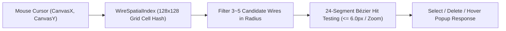

# [03-01] 2D Canvas Viewport & Node Card Rendering (Canvas & Node Cards)

> 📍 **GTCalcBoard Technical Specification Series**
> [[00] System Overview](00_OVERVIEW.md) ➔ [[01] Core Domain](01_CORE_DOMAIN_AND_MODELS.md) ➔ [[02] Math Engine](02_MATH_AND_ALGORITHMS.md) ➔ **[03-01] Canvas & Node Cards** ➔ [[03-02] Machine Config & Addons](03_02_MACHINE_CONFIG_AND_ADDONS.md) ➔ [[03-03] Page Summary & Dashboard](03_03_PAGE_SUMMARY_AND_DASHBOARD.md) ➔ [[03-04] Search & Toolbar](03_04_RECIPE_SEARCH_AND_TOOLS.md) ➔ [[04] Multiplayer](04_MULTIPLAYER_AND_NETWORK_PROTOCOL.md) ➔ [[05] External Integration](05_INTEGRATION_AND_I18N.md)

---

## 1. 2D Viewport Coordinate Transformation (`BoardScreen`)

Transforms between screen pixel coordinates and infinite 2D canvas coordinates.

$$\text{CanvasX} = \frac{\text{ScreenX} - \text{PanX}}{\text{Zoom}}, \quad \text{CanvasY} = \frac{\text{ScreenY} - \text{PanY}}{\text{Zoom}}$$
$$\text{ScreenX} = (\text{CanvasX} \times \text{Zoom}) + \text{PanX}, \quad \text{ScreenY} = (\text{CanvasY} \times \text{Zoom}) + \text{PanY}$$

* **Zoom Range**: $0.25 \times \dots 2.5 \times$ (Exponential mouse-wheel scaling)
* **Pan Control**: Right-click drag or middle-wheel drag
* **Grid Spacing**: $20\text{px} \times \text{Zoom}$ dot grid rendering

### 1.2 Dedicated Virtual Viewport Transform (ADR-017)
To apply a board-specific virtual scale ($B$) decoupled from Minecraft's global GUI scale ($G$), `BoardViewportTransform` executes two-step coordinate projection:

$$S = \frac{B}{G}, \quad x_{\text{virtual}} = \frac{x_{\text{raw}}}{S}, \quad y_{\text{virtual}} = \frac{y_{\text{raw}}}{S}$$
$$W_{\text{virtual}} = \frac{W_{\text{window}}}{S}, \quad H_{\text{virtual}} = \frac{H_{\text{window}}}{S}$$

* **Mouse Unprojection**: Unprojects raw window mouse coordinates $(m_x, m_y)$ to virtual coordinates $(m_x / S, m_y / S)$ before projecting onto canvas space $(CanvasX, CanvasY)$.
* **Scale Modes**: `AUTO(0)` (auto-computed based on window resolution), `SCALE_1X(1)` through `SCALE_4X(4)` fixed zoom factors.

### 1.3 16px Precision Grid Snapping & Coordinate Quantization (ADR-012)
Applies $16\text{px}$ coordinate quantization during node, frame, and sticky note dragging and resizing.

$$x_{\text{snapped}} = \text{round}\left(\frac{x}{16.0}\right) \times 16.0, \quad y_{\text{snapped}} = \text{round}\left(\frac{y}{16.0}\right) \times 16.0$$

* **HUD Toggle & Keybind**: Toggle grid snap via `G` key or the lower-left HUD status checkbox.
* **Preference Persistence**: Saved in `BoardSettingsDialog` and persistent client NBT configuration.

---

## 2. Cubic Bézier Wire Rendering (`ConnectionRenderer`)

Renders directed spline connections from output port $(x_1, y_1)$ to input port $(x_2, y_2)$.

### 2.1 Control Points & Curve Formulation
$$dx = |x_2 - x_1|, \quad \text{offset} = \max\left(40.0, \, \frac{dx}{2.0}\right)$$
$$P_0 = (x_1, y_1), \quad P_1 = (x_1 + \text{offset}, y_1), \quad P_2 = (x_2 - \text{offset}, y_2), \quad P_3 = (x_2, y_2)$$
$$B(t) = (1-t)^3 P_0 + 3(1-t)^2 t P_1 + 3(1-t) t^2 P_2 + t^3 P_3 \quad (t \in [0.0, 1.0])$$

### 2.2 Wire Status Colors
* **Balanced**: `0xFF38BDF8` (Cyan), animated flow pulses
* **Deficit**: `0xFFEF4444` (Red), feedstock shortage pulsing warning
* **Surplus**: `0xFF10B981` (Emerald), safe surplus

### 2.3 Rate-Based Wire Flow Modulation & Duty Cycle Stutter (ADR-018)
Modulates pulse dot animations traveling across connection wires based on the supply saturation ratio ($R_e = \text{Supply} / \text{Demand}$) to visualize bottlenecks in real time:

#### 1. Saturation Ratio ($R_e$) Formulation
$$
R_e = \begin{cases} 
1.0 & \text{if } \text{DemandRate} \le 0.0001 \\
0.0 & \text{if } \text{SupplyRate} \le 0.0001 \\
\min\left(1.0, \, \frac{\text{SupplyRate}}{\text{DemandRate}}\right) & \text{otherwise}
\end{cases}
$$

#### 2. Duty Cycle Stutter & Stall
Global period $T = 1600\text{ ms}$, base time $\tau = (t_{\text{now}} \pmod T) / T \in [0, 1)$:

$$
t_{\text{eff}} = \begin{cases} 
\frac{\tau}{R_e} & \text{if } \tau < R_e \quad (\text{Normal Flow Motion}) \\
1.0 & \text{if } \tau \ge R_e \quad (\text{Starvation Stall Interval})
\end{cases}
$$

#### 3. Dynamic 3-Stage RGB Interpolation
$$
C(R_e) = \begin{cases} 
(0.22, 0.74, 0.97) \quad [\text{Cyan Blue}] & \text{if } R_e \ge 1.0 \\
\text{Lerp}\left(\text{Amber}, \text{Cyan}, \frac{R_e - 0.5}{0.5}\right) & \text{if } 0.5 \le R_e < 1.0 \\
\text{Lerp}\left(\text{Crimson}, \text{Amber}, \frac{R_e}{0.5}\right) & \text{if } 0.0 < R_e < 0.5
\end{cases}
$$

---

## 3. High-Performance Rendering & Spatial Indexing

### 3.1 Two-Pass Z-Order Rendering & `glClear` Depth Buffer Isolation (ADR-014)
* **Zero Z-Clipping Depth Isolation**: Enforces per-node `bufferSource().endBatch()` and `RenderSystem.clear(GL11.GL_DEPTH_BUFFER_BIT, Minecraft.ON_OSX)` to completely isolate 3D item models from 2D background surfaces.
* **Two-Pass Z-Order Rendering**: Renders unselected nodes in the first pass, then renders active/dragged nodes (`isNodeSelected`) from a deferred queue in the second pass to guarantee strict visual layering.
* **$O(1)$ Port Flow & Text Cache (`NodeCardTextCache`)**: Precomputes card titles, port values, and power labels via dirty flags to minimize per-frame text formatting overhead.

### 3.2 $128 \times 128$ AABB Uniform Grid Spatial Index (`WireSpatialIndex`)
Optimizes wire hover and click hit-testing across 1,000+ wire networks from $O(E)$ exhaustive search down to **$O(\log E)$ spatial grid lookups**.

---

## 4. Node Card UI Wireframes (`NodeCardRenderer`)

### 4.1 Standard Recipe Node Card

  <!-- Card Container -->
  

    <!-- 1. Card Header -->
    

      

        ★
        Large Chemical Reactor
      

      

        🎯
        ✕
      

    

    <!-- Card Body -->
    

      <!-- 2. Machine Count & Mini Addons Row -->
      

        

          Count:
          <button style="background: #181d26; border: 1px solid #3d4455; border-radius: 3px; color: #cbd5e1; width: 18px; height: 18px; line-height: 14px; text-align: center; cursor: pointer; font-size: 11px;">-</button>
          
1.00

          <button style="background: #181d26; border: 1px solid #3d4455; border-radius: 3px; color: #cbd5e1; width: 18px; height: 18px; line-height: 14px; text-align: center; cursor: pointer; font-size: 11px;">+</button>
          <button style="background: #181d26; border: 1px solid #3d4455; border-radius: 3px; color: #94a3b8; padding: 1px 4px; font-size: 10px; cursor: pointer;">/2</button>
          <button style="background: #181d26; border: 1px solid #3d4455; border-radius: 3px; color: #94a3b8; padding: 1px 4px; font-size: 10px; cursor: pointer;">x2</button>
        

        <!-- Mini Addons Tray -->
        

          🧲
          ⚡
        

      

      <!-- 3. Tier, Overclock & Config Row -->
      

        LV
        Standard OC
        ⚙ 4x (+2)
      

      <!-- 4. Power & Timing Summary -->
      

        ⚡ -480 EU/t (100%)
        1.25s (0.80/s)
      

      

      <!-- 5. Input & Output Sockets -->
      

        <!-- Left: Inputs -->
        

          

            

            Benzene
            100 mB/s
          

          

            

            Hydrogen
            2.0k mB/s
          

        

        <!-- Right: Outputs -->
        

          

            100 mB/s
            Cyclohexane
            

          

        

      

    

  

---

### 3.2 Compound Module Card

  <!-- Module Card Container -->
  

    <!-- 1. Header -->
    

      

        📦
        Oil Refining & Distillation Line
      

      

        ⤢
        🎯
        ✕
      

    

    <!-- Body -->
    

      <!-- 2. Controls & Machines Count Badge -->
      

        

          Scale:
          <button style="background: #2a1c42; border: 1px solid #581c87; border-radius: 3px; color: #e9d5ff; width: 18px; height: 18px; line-height: 14px; text-align: center; cursor: pointer; font-size: 11px;">-</button>
          
1.00

          <button style="background: #2a1c42; border: 1px solid #581c87; border-radius: 3px; color: #e9d5ff; width: 18px; height: 18px; line-height: 14px; text-align: center; cursor: pointer; font-size: 11px;">+</button>
          <button style="background: #2a1c42; border: 1px solid #581c87; border-radius: 3px; color: #d8b4fe; padding: 1px 4px; font-size: 10px; cursor: pointer;">/2</button>
          <button style="background: #2a1c42; border: 1px solid #581c87; border-radius: 3px; color: #d8b4fe; padding: 1px 4px; font-size: 10px; cursor: pointer;">x2</button>
        

        📦 18 Machines Inside
      

      <!-- 3. Power & Module Tag -->
      

        ⚡ -4,800 EU/t (EV Peak Load)
        [ 📦 Compound Module ]
      

      

      <!-- 4. Promoted Boundary I/O -->
      

        <!-- Left: Net External Inputs -->
        

          

            

            Crude Oil
            1.0k mB/s
          

        

        <!-- Right: Net External Outputs -->
        

          

            400 mB/s
            Diesel
            

          

          

            200 mB/s
            LPG
            

          

        

      

    

  

---

## 4. Page Tab Bar Overflow Navigation (`PageTabBarWidget`)

Provides smooth horizontal scrolling and clickable navigation when multiple board pages exceed the screen width.

* **Left / Right Overflow Indicators**:
  - Clicking the left `«` indicator scrolls left towards previous tabs (`scrollX -= 80px`).
  - Clicking the right `»` indicator scrolls right towards following tabs (`scrollX += 80px`).
* **Mouse Wheel Scrolling**: Hovering over the tab bar allows fast horizontal scrolling via mouse wheel up/down.
* **Scissor & End-Padding**: 16px right padding ensures the final page tab and `[+]` new page creation button remain fully visible without being obscured by the right overflow arrow.

---

## 5. Unused I/O Port Hiding & Selective Restore (`HiddenPortsPopup`)

Eliminates visual clutter by hiding unwanted inputs or byproduct outputs on complex machine cards.

* **Port Hiding Interaction**: **Right-clicking** any input/output port severs connected wires and hides that specific port.
* **Hidden Ports Pill Badge**:
  - Renders a pill badge (`%d Output hidden`, `%d Input hidden`, or `%d Ports hidden`) at the bottom right of the card.
  - Hovering displays an outline highlight; clicking toggles the dropdown modal below the node card.
* **Hidden Ports Popup Modal (`HiddenPortsPopup`)**:
  - Provides a list view containing `[IN]` / `[OUT]` tags, ingredient icons, localized item/fluid names, and an unhide (👁) button.
  - Clicking any entry restores that port back onto the card and immediately updates the widget layout.

---

## 6. Smart Inline Text Editing Engine (`InlineTextEditor`)

All inline editable text fields (`NodeNameEditor`, `NodeCountEditor`, `NodeParallelEditor`, `NodeTargetBatchEditor`) extend a unified `InlineTextEditor` core engine.

* **Cursor Positioning & Selection**:
  - Precise character-level cursor positioning and text range selection via mouse click and drag.
  - Keyboard range selection with `Shift + Left/Right` and `Shift + Home/End`.
  - `Ctrl + A`: Select all text.
* **Word-Level Navigation**:
  - `Ctrl + Left/Right`: Rapid word break jumping.
  - `Ctrl + Backspace / Delete`: Word-level deletion.
* **Clipboard Support**:
  - Supports `Ctrl + C` (Copy), `Ctrl + X` (Cut), and `Ctrl + V` (Paste).
  - Built-in fallback clipboard buffer for headless test environments.
* **Shortcut Isolation**: Key presses while editing are fully consumed and prevented from bubbling up to canvas global hotkeys.

---

## 7. Input Starvation Outline & Byproduct Void Rendering (ADR-018, ADR-019)

### 7.1 Input Starvation Machine Bottleneck Outline
- **Condition**: Triggers when a machine is actively operating ($\text{machineCount} > 0$) but at least one visible input port experiences a supply saturation ratio $R_e < 1.0$.
- **Visual Feedback**: Renders an amber pulsing glow outline (`0xFFF59E0B`, Amber Pulse) around the node card, highlighting bottlenecks across the canvas.
- **Tooltip**: Displays a `Bottleneck: Feedstock Shortage` warning badge when hovering over starved cards.

### 7.2 Void Sink Junction & Port Void Rendering
- **`VOID_SINK` Junction Node**: Renders card borders in purple (`0xFFA855F7`) with a prominent header `VOID` badge.
- **Voided Output Ports (`isOutputPortVoided`)**:
  - Highlights the socket in purple (`0xFFA855F7`) with an emphasized border.
  - Converts slot text and rate labels to purple (`0xFFC084FC`).
- **Shortcuts & Interaction**:
  - **`Alt + Right-Click`**: `Alt + Right-Click` on an output port to toggle void marking instantly without severing connected wires.
  - **Hover Tooltip**: Displays current feedstock saturation (%), void status (`[∅] Voided`), and the `[Alt+Right-Click]: Toggle Void Marking` shortcut prompt.

---

## 8. Unified Node Layout Bounds Model (`NodeLayoutBounds`) (ADR-030)

Provides a single-source-of-truth immutable layout model to decouple the rendering pipeline from event hit-testing logic:

* **Immutable Bounds Record (`NodeLayoutBounds`)**:
  - Encapsulates exact rectangular bounds (`RectBounds`) for visual segments: `headerBounds()`, `bodyBounds()`, `portBoundsMap()`, `resizeHandleBounds()`, etc.
* **Layout Calculator (`NodeLayoutCalculator`)**:
  - Implements early-return branch calculation for standard and slim reroute card modes (`computeStandardLayout()`, `computeRerouteLayout()`), computing layout coordinates in $O(1)$ time.
  - Ensures hitboxes, mouse interactions, and wire socket anchor coordinates stay synchronized even when vertically resizing cards.

---

## 9. Contextual Instability Warning Badges & Diagnostic Action Guides (ADR-032, ADR-033, ADR-034)

Visualizes divergence, conflict, and loop anomalies across complex flowsheets, offering instant resolution guides:

* **5 Contextual Instability Badges (`NodeBadgeRegistry`)**:
  - `[⚠ Loop]`: Closed self-contained loop lacking external makeup inputs, suppressing infinite scale explosion.
  - `[⚠ Growth]`: Positive-feedback amplification loop where flow scales multiplicatively per cycle.
  - `[⚠ Catalyst]`: Catalyst regeneration loop experiencing micro-fractional decay.
  - `[⚠ Conflict]`: Conflicting flow rates imposed by multiple inconsistent target anchors.
  - `[⚠ Yield]`: Sub-ppm micro-yield recipe requiring extreme production scaling ($< 10^{-5}$).
* **5-Line Interactive Diagnostic Tooltip**:
  - Displays a structured 5-line diagnostic breakdown on hover: `Cause Summary`, `In-Game Mechanism`, `Recommended Fix 1`, `Recommended Fix 2`, and `[Click] Action Shortcut`.
  - Clicking the badge directly clears conflicting anchors or locks the node as a primary anchor in a single action.
* **Contextual Port Drag Flyout Menu**:
  - Dragging a connection wire from an input/output port into empty canvas space presents a quick-action flyout menu to instantiate surplus drains (`[+ Surplus Drain]`), deficit supplies (`[+ Deficit Supply]`), void sinks (`[+ Void Sink]`), or infinite sources (`[+ Infinite Source]`) at exact required flow rates.

---

> ➡ **Next Sub-Specification**: [[03-02] Machine Configuration & Addon Rack UI](03_02_MACHINE_CONFIG_AND_ADDONS.md)
