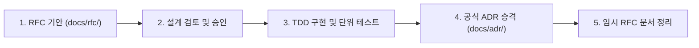

# 활성 아키텍처 제안 (Active RFCs)

본 디렉터리는 **GregTech Calculator Board (GTCalcBoard)**의 새로운 주요 기능 기획, 아키텍처 대안 탐색 및 승인을 위한 **과도기적 제안 문서(Request for Comments, RFC)** 보관소입니다.

---

## 🏛 RFC 생명주기 및 승격 규칙 (Lifecycle & Promotion)

1. **기안 (`PROPOSED`)**: 새로운 주요 기능이나 아키텍처 개편을 추진할 때 `RFC_<NUMBER>_<NAME>.md` 형식으로 작성합니다.
2. **승인 (`ACCEPTED`)**: 설계 리뷰를 거쳐 구현 목표 버전과 방향이 확정됩니다.
3. **구현 및 승격 (`docs/adr/`)**:
   - 단위 테스트 통과 및 기능 구현이 완료되면 공식 **아키텍처 결정 기록(ADR)**으로 승격되어 [`docs/adr/`](../adr/)에 영구 보존됩니다.
   - 승격 상세 절차는 [`.agents/skills/rfc-implementation/SKILL.md`](../../.agents/skills/rfc-implementation/SKILL.md)를 참조하십시오.

---

## 📋 현재 활성 RFC 목록

| 문서 번호 | RFC 제목 | 상태 (Status) | 목표 버전 | 기안일 | 핵심 제안 요약 |
| :---: | :--- | :---: | :---: | :---: | :--- |
| **[RFC-046](RFC_046_BOARD_PAGE_PROVIDER_ABSTRACTION.md)** | 멀티 워크스페이스 통합 페이지 공급자 추상화 명세 | 🔴 `REJECTED` | `v2.3.0` | 2026-09-11 | ClientWorkspaceState 헤드리스 테스트 불필요 전제(이미 테스트 가능) 및 원격 페이지 지연 압축 해제 아키텍처를 파괴하는 메모리 결함으로 인해 영구 기각 |
