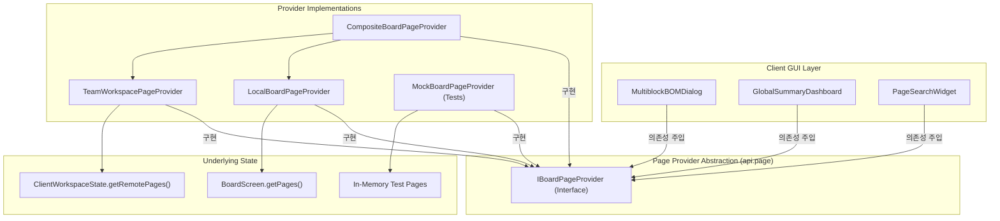
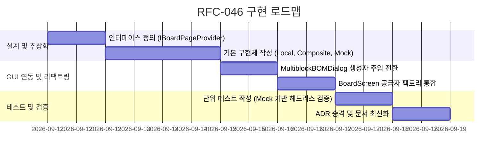

# RFC-046: 멀티 워크스페이스 통합 페이지 공급자 추상화 명세
# (Multi-Workspace Unified Board Page Provider Abstraction Specification)

- **문서 번호**: RFC-046
- **대상 버전**: `v2.3.0`
- **상태**: `REJECTED` (2026-09-13 기각: ClientWorkspaceState는 순수 자바로 구현되어 이미 헤드리스 JUnit 테스트가 완벽히 동작 중이며, IBoardPageProvider의 List<BoardPage> 반환 강제는 TeamWorkspacePage의 원격 압축 지연 해제 아키텍처를 파괴하여 메모리 낭비를 유발하므로 영구 기각)
- **작성일**: 2026-09-11
- **최종 갱신일**: 2026-09-13
- **주관 계층**: Client GUI Layer (`client.gui.dialog`, `client.gui.widget`), Client State Layer (`client.team`), API Provider Layer (`api.page`)

---

> [!CAUTION]
> **RFC 기각 사유 (Rejection Rationale)**:
> 1. **허위 전제(False Motivation)**: `ClientWorkspaceState`는 `net.minecraft.client.Minecraft` 참조가 0건이며, 이미 순수 헤드리스 환경(`MultiblockBOMTest`, `WorkspaceCollaborationSyncTest`)에서 Mocking 없이 100% 테스트되고 있습니다.
> 2. **아키텍처 구조적 결함**: `IBoardPageProvider.getAllPages()`가 `List<BoardPage>`를 요구하여, 원격 페이지 엔티티(`TeamWorkspacePage`)가 유지하는 압축 바이트 배열(`compressedGraphData`)의 지연 로딩/압축 해제(Lazy Decompress) 체계를 파괴하고 불필요한 전체 역직렬화와 메모리 팽창을 초래합니다.
> 3. **과잉 추상화(YAGNI)**: 이를 소비하는 UI는 `MultiblockBOMDialog` 단 1곳뿐입니다.

---

## 1. 개요 및 배경 (Motivation)

### 1.1 현황 분석
`v2.2.0-beta.4`에서 멀티플레이 팀 워크스페이스의 자재 집계를 지원하기 위해 [`MultiblockBOMDialog`](file:///d:/dev-ssd/modding/minecraft/GregTechCalculatorBoard/src/main/java/com/gtceu/calcboard/client/gui/dialog/MultiblockBOMDialog.java)가 원격 페이지들을 자재 산출 대상에 포함하도록 개선되었습니다.

그러나 현재 구현 방식은 다이얼로그 내부에서 싱글톤 객체인 [`ClientWorkspaceState.getInstance().getRemotePages()`](file:///d:/dev-ssd/modding/minecraft/GregTechCalculatorBoard/src/main/java/com/gtceu/calcboard/client/team/ClientWorkspaceState.java)를 직접 정적으로 참조하여 원격 페이지 목록을 수집하고 있습니다.

### 1.2 문제점 분석
1. **정적 싱글톤 결합도 증가**:
   - GUI 다이얼로그(`MultiblockBOMDialog`, 추후 대시보드 및 전역 검색 위젯)가 특정 싱글톤 상태 클래스(`ClientWorkspaceState`)에 직접 의존하여 결합도가 높아집니다.
2. **단위 테스트(Headless Testing)의 어려움**:
   - `ClientWorkspaceState`는 마인크래프트 클라이언트 환경(`Minecraft.getInstance()`)과 패킷 송수신 상태를 내포하고 있어, 순수 자바 헤드리스 단위 테스트에서 Mocking하기 어렵습니다.
3. **페이지 출처별 책임 분산**:
   - 현재 보드 캔버스에 열려 있는 로컬 페이지 목록(`BoardScreen.getPages()`)과 서버로부터 수신한 팀 공유 페이지 목록(`remotePages`)이 분리 관리되어, 페이지 접근이 필요한 신규 기능(예: 전역 유량 대시보드, 전체 페이지 자동 연결)마다 중복 수집 로직이 작성될 위험이 있습니다.

### 1.3 설계 목표
- 로컬 페이지와 원격 팀 공유 페이지를 투명하고 일관되게 제공하는 **`IBoardPageProvider` 추상 인터페이스**를 정의합니다.
- 다이얼로그 및 위젯이 구현체를 직접 알지 못하도록 의존성 주입(Dependency Injection) 구조로 전환합니다.
- 싱글플레이 오프라인 모드, 멀티플레이 팀 모드, 헤드리스 단위 테스트 모드 각각에 적합한 공급자 구현체를 분리합니다.

---

## 2. 핵심 유저 스토리 (User Stories)

| 구분 | 플레이어 및 시스템 액션 | 기대 결과 |
|---|---|---|
| **US-01** | 플레이어가 싱글플레이 환경에서 멀티블록 BOM 다이얼로그(`B`)를 엽니다 | `LocalBoardPageProvider`를 통해 현재 활성 로컬 페이지만 집계 대상에 포함됩니다 |
| **US-02** | 플레이어가 멀티플레이 팀 보드에서 BOM 다이얼로그를 엽니다 | `CompositeBoardPageProvider`가 로컬 및 팀 원격 페이지를 투명하게 집계하여 누락 없이 표시합니다 |
| **US-03** | 엔지니어가 헤드리스 환경에서 다이얼로그 자재 집계 회귀 테스트를 작성합니다 | `MockBoardPageProvider`를 주입하여 클라이언트 런타임 의존성 없이 $100\%$ 순수 자바 단위 테스트를 검증합니다 |

---

## 3. 시스템 아키텍처 명세 (Architecture Specification)

### 3.1 계층 구조 다이어그램



---

## 4. 상세 인터페이스 규격 (API Design)

### 4.1 `IBoardPageProvider` 인터페이스

```java
package com.gtceu.calcboard.api.page;

import com.gtceu.calcboard.api.model.BoardPage;
import java.util.List;
import java.util.Optional;

/**
 * Unified provider interface supplying board pages across local and remote workspaces.
 */
public interface IBoardPageProvider {

    /**
     * Retrieves all accessible pages for calculation and display.
     *
     * @return unmodifiable list of available board pages
     */
    List<BoardPage> getAllPages();

    /**
     * Finds a page by its unique identifier.
     *
     * @param pageId the page identifier
     * @return optional containing the page if found
     */
    Optional<BoardPage> getPageById(String pageId);

    /**
     * Checks whether the specified page originates from a remote team workspace.
     *
     * @param pageId the page identifier
     * @return true if the page is remote, false if local
     */
    boolean isRemotePage(String pageId);

    /**
     * Returns a user-friendly display name for the page, including workspace origin.
     *
     * @param page the board page
     * @return localized display string
     */
    String getPageDisplayName(BoardPage page);
}
```

### 4.2 `MultiblockBOMDialog` 생성자 주입 리팩토링

```java
public class MultiblockBOMDialog extends Screen {
    private final IBoardPageProvider pageProvider;
    private final Consumer<Set<String>> onPageSelectionChanged;

    public MultiblockBOMDialog(Screen parent, IBoardPageProvider pageProvider, ...) {
        super(Component.translatable("gui.gtcalcboard.bom.title"));
        this.pageProvider = Objects.requireNonNull(pageProvider, "pageProvider cannot be null");
        // ...
    }

    private List<BoardPage> collectEligiblePages() {
        return this.pageProvider.getAllPages();
    }
}
```

---

## 5. 구현 로드맵 (Phased Implementation)


